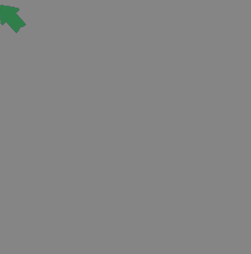
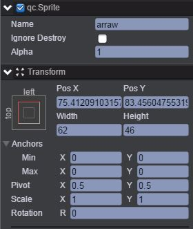
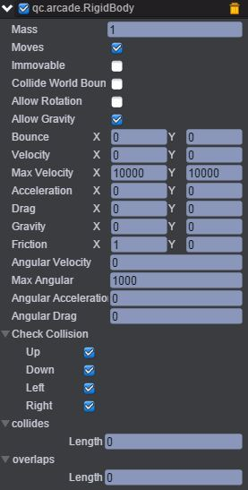
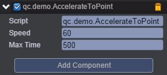

# AccelerateToPoint    

* 本范例演示物理插件Arcade Physics的加速到指定位置的功能。运行时，箭头会尝试追逐鼠标的位置，效果图如下:<br>    

  

## UI
* 创建一个Sprite节点并取名arraw，该节点信息设置如下图：  
  
* 将物理插件Arcade Physics挂载到arraw节点上，具体步骤是：首先点击菜单栏上“Plugins\PluginManager”，此时Inspector面板出现如下界面：  
  
* 把Arcade Physics勾选上，然后点击__Add Component__，再选择Plugins\Arcade\RigidBody即添加插件完成，设置其属性值如下图所示：  
  
具体的属性信息，请查阅文档：[手册](http://docs.zuoyouxi.com/manual/Plugin/Arcade.html)  
* 在Scripts文件夹下创建脚本__AccelerateToPoint.js__，并把该脚本挂载到arraw节点，如下图：  
      

* 代码如下:<br>        


```javascript       


/**
 * 移动到目标点
 */
var AccelerateToPoint = qc.defineBehaviour('qc.demo.AccelerateToPoint', qc.Behaviour, function() {
    this.speed = 60;
    this.maxTime = 500;
}, {
    speed: qc.Serializer.NUMBER,
    maxTime: qc.Serializer.NUMBER
});

AccelerateToPoint.prototype.awake = function() {
    this.rigidbody = this.getScript('qc.arcade.RigidBody');
};

// 帧调度
AccelerateToPoint.prototype.update = function() {
    var self = this;
    self.gameObject.rotation = this.rigidbody.moveToObject(self.game.input.cursorPosistion, self.speed, self.maxTime);
};       
```