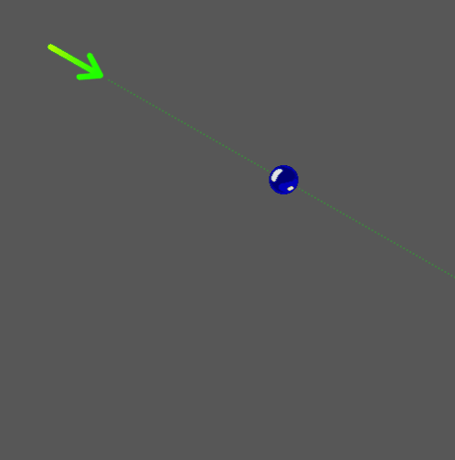
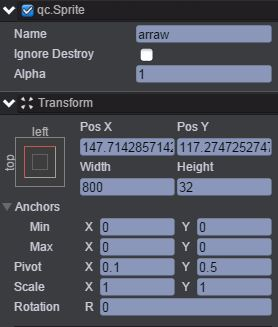
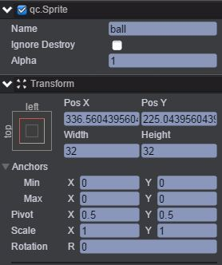
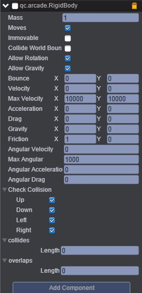
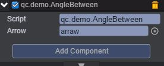

# AngleBetween    
* 本范例介绍RigidBody插件的angleBetween，用于计算两个物体之间的夹角，运行时，效果图如下：<br>       

      

## UI
* 创建一个Sprite节点并命名为arraw，节点信息设置如下图所示：<br>      

      

* 同样创建另一个Sprite节点并取名ball，节点信息设置如下图：<br>       

     

* 在arrow节点下挂载Arcade Physics插件，首先点击菜单栏上“Plugins\PluginManager”，此时Inspector面板出现如下界面：<br>     

     

* 把Arcade Physics勾选上，然后点击 Add Component，再选择Plugins\Arcade\RigidBody即添加插件完成，设置其属性值如下图所示：<br>      

     
* 具体的属性信息，请查阅文档：[手册](http://docs.zuoyouxi.com/manual/Plugin/Arcade.html) 。<br>         

* 在Scripts文件夹下创建脚本AngleBetween.js，把该脚本挂载到ball节点上，并把arraw节点拖入到Arrow选项框中，如下图：<br>    

       

* 代码如下：<br>   

```javascript
/**
 * 面向目标
 */
var AngleBetween = qc.defineBehaviour('qc.demo.AngleBetween', qc.Behaviour, function() {
    this.arrow = null;
}, {
    arrow: qc.Serializer.NODE
});

AngleBetween.prototype.awake = function() {
    this.rigidbody = this.arrow.getScript('qc.arcade.RigidBody');
    this.arrow.rotation = this.rigidbody.angleBetween(this.gameObject);
};

// 开始拖拽的处理
AngleBetween.prototype.onDragStart = function(e) {
    var self = this,
        o = self.gameObject;
    self.oldPos = new qc.Point(o.x, o.y);
    self.drag = true;
};

// 拖拽中的处理
AngleBetween.prototype.onDrag = function(e) {
    var self = this,
        o = self.gameObject;
    if (self.drag) {
        // 改变节点的目标位置
        var p = o.getWorldPosition();
        p.x += e.source.deltaX;
        p.y += e.source.deltaY;
        p = o.parent.toLocal(p);
        o.x = p.x;
        o.y = p.y;

        // 箭头指向本节点
        self.arrow.rotation = self.rigidbody.angleBetween(self.gameObject);
    }
};

// 拖拽结束的处理
AngleBetween.prototype.onDragEnd = function(e) {
    delete this.drag;
};     
```