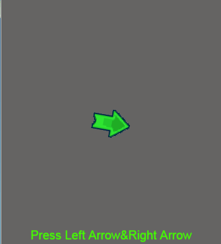
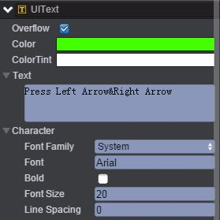
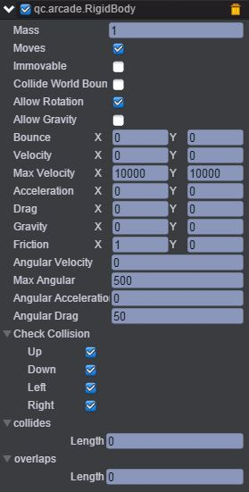
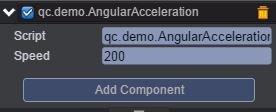

# AngularAcceleration     
本范例演示物理插件Arcade Physics的AngularAcceleration（角加速度），运行时，按下右键不放则arrow节点的AngularVelocity（角速率）从零开始往上增加，AngularAcceleration直接从零变到200从而加速arrow节点的角速度，而按下左方向键则相反。效果图如下：<br>      

     

## UI
* 创建一个Text节点并取名UIText，该节点用于放置文本信息。文本信息为Press Left Arrow&Right Arrow，如下图所示：<br>   

     

* 创建一个Sprite节点并命名为arrow。在该节点下挂载Arcade Physics插件，首先点击菜单栏上“Plugins\PluginManager”，此时Inspector面板出现如下界面：<br>     

     

* 把Arcade Physics勾选上，然后点击 Add Component，再选择Plugins\Arcade\RigidBody即添加插件完成，设置其属性值如下图所示：<br>     

     

* 具体的属性信息，请查阅文档：[手册](http://docs.zuoyouxi.com/manual/Plugin/Arcade.html)。<br>         

* 在Scripts文件夹下创建脚本AngularAcceleration.js，并把该脚本挂载到arrow节点上，如下图：<br>      

   

* 代码如下：<br>    

```javascript
/**
 * 角加速度示例
 */
var AngularAcceleration = qc.defineBehaviour('qc.demo.AngularAcceleration', qc.Behaviour, function() {
    this.speed = 200;
}, {
    speed: qc.Serializer.NUMBER
});

//帧调度
AngularAcceleration.prototype.update = function() {
    var self = this,
        rigidbody = this.getScript('qc.arcade.RigidBody');

    rigidbody.angularAcceleration = 0;
    if (self.game.input.isKeyDown(qc.Keyboard.LEFT)) {
        rigidbody.angularAcceleration -= self.speed;
    }
    else if (self.game.input.isKeyDown(qc.Keyboard.RIGHT)) {
        rigidbody.angularAcceleration += self.speed;
    }
};   
```