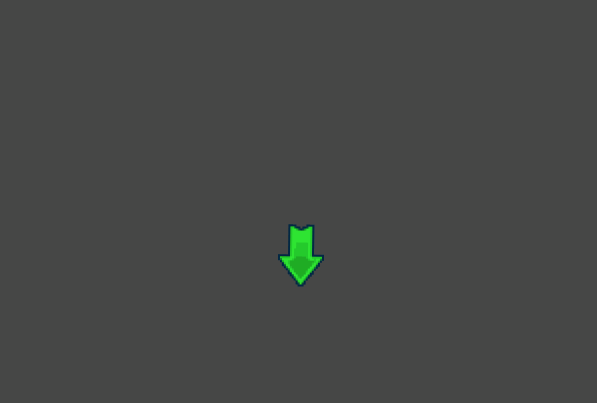
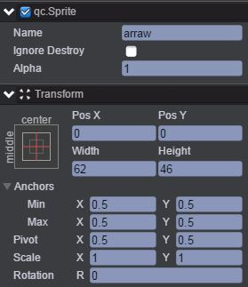
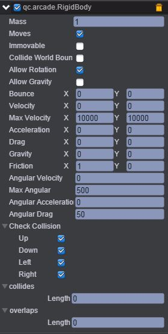
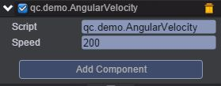

# AngularVelocity（角速率）    
* 本范例演示添加插件及使用插件的功能，运行时，按键盘上的右方向键可以使arrow节点速度加200向右转动，连续按右方向键则角速率加快，而按方向键左键则速度减200，效果图如下：<br>      

    

## UI    

* 创建Sprite节点并命名arraw，该节点信息设置如下图所示：<br>     

     
     
* 在arraw节点下挂载插件，具体步骤是首先点击菜单栏上“Plugins\PluginManager”，此时Inspector面板出现如下界面：<br>      

    

* 把Arcade Physics勾选上，然后点击 Add Component，再选择Plugins\Arcade\RigidBody即添加插件完成，设置其属性值如下图所示：<br>    

       

* 具体的属性信息，请查阅文档：[手册](http://docs.zuoyouxi.com/manual/Plugin/Arcade.html)。<br>    

* 在Script文件夹下创建脚本AngularVelocity.js，并将该脚本挂载到arraw节点下，如下图：<br>        

    

* 代码如下：<br>   

```javascript
/**
 * 角速度示例
 */
var AngularVelocity = qc.defineBehaviour('qc.demo.AngularVelocity', qc.Behaviour, function() {
    this.speed = 200;
}, {
    speed: qc.Serializer.NUMBER
});

AngularVelocity.prototype.update = function() {
    var self = this,
        rigidbody = this.getScript('qc.arcade.RigidBody');

    rigidbody.angularAcceleration = 0;
    //左键减速
    if (self.game.input.isKeyDown(qc.Keyboard.LEFT)) {
        rigidbody.angularVelocity -= self.speed;
    }
    //右键加速
    else if (self.game.input.isKeyDown(qc.Keyboard.RIGHT)) {
        rigidbody.angularVelocity += self.speed;
    }
};    
```