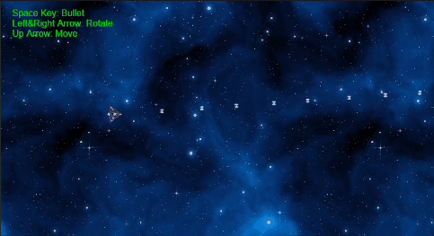
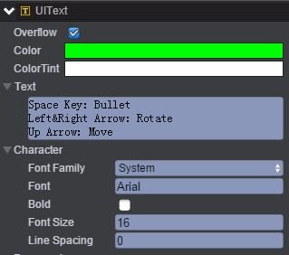
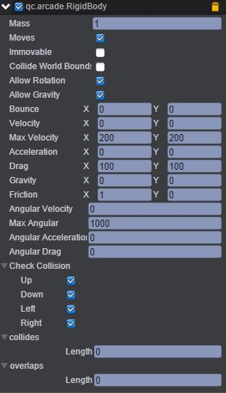
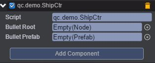
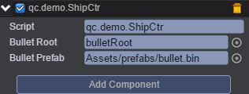

# AsteroidsMovement    
* 本范例演示通过键盘方向键实现飞机的上下左右移动和子弹发射，运行时，左方向键与右方向键实现飞机的左右旋转，上方向键控制飞机的移动，空格键实现子弹的发射，效果图如下：<br>      

        

## UI    

* 创建一个Image节点并取名background，该节点放置背景图片。<br>       

* 创建一个Text节点并命名UIText，该节点的文本信息设置为如下图所示：<br>        

     

### bulletRoot      

* 创建一个Empty Node节点并命名bulletRoot，在该节点下创建Sprite节点并取名bullet，bullet节点用于做子弹预制。<br>         

#### 创建子弹预制      

* 创建子弹预制可参考[《创建子弹预制》](http://docs.zuoyouxi.com/manual/Prefab/index.html)，在bullet节点下挂载TweenPosition动画，实现子弹的移动。设置子弹飞行时间Duration为2秒。如下图：<br>      

      

## ship    

* 创建一个Sprite并命名ship，将物理插件Arcade Physics挂载到ship节点上，具体步骤是首先点击菜单栏上“Plugins\PluginManager”，此时Inspector面板出现如下界面：<br>    

     

* 把Arcade Physics勾选上，然后点击 Add Component，再选择Plugins\Arcade\RigidBody即添加插件完成，设置其属性值如下图所示：<br>     

      

* 具体的属性信息，请查阅文档：[手册](http://docs.zuoyouxi.com/manual/Plugin/Arcade.html)。<br>    

* 在Scripts文件夹下创建脚本ShipCtr.js，把该脚本挂载到ship节点上，如下图：<br>     

     

* 将bulletRoot节点与子弹预制文件分别拖入到Bullet Root、BulletPrefab选项方框中，如下图所示：<br>    

      

* 该脚本代码负责通过键盘控制飞机的移动和子弹的移动，代码如下：<br>     

```javascript    

/**
 * 飞船的控制
 */
var ShipCtr = qc.defineBehaviour('qc.demo.ShipCtr', qc.Behaviour, function() {
    this.bulletRoot = null;
    this.bulletPrefab = null;
    this._fireTime = 0;
}, {
    bulletRoot: qc.Serializer.NODE,
    bulletPrefab: qc.Serializer.PREFAB
});

//帧调度
ShipCtr.prototype.update = function() {
    var self = this,
        rigidbody = this.getScript('qc.arcade.RigidBody');

    rigidbody.angularAcceleration = 0;
    if (self.game.input.isKeyDown(qc.Keyboard.UP)) {
        rigidbody.velocityFromRotation(self.gameObject.rotation, 200, rigidbody.acceleration);
    }
    else {
        rigidbody.acceleration.set(0, 0);
    }

    if (self.game.input.isKeyDown(qc.Keyboard.LEFT)) {
        rigidbody.angularVelocity = -300;
    }
    else if (self.game.input.isKeyDown(qc.Keyboard.RIGHT)) {
        rigidbody.angularVelocity = 300;
    }
    else {
        rigidbody.angularVelocity = 0;
    }

    if (self.game.input.isKeyDown(qc.Keyboard.SPACEBAR)) {
        self.fire();
    }
};

ShipCtr.prototype.fire = function() {
    var self = this,
        rigidbody = this.getScript('qc.arcade.RigidBody');
    if (self.game.time.now - self._fireTime < 50) return;
    self._fireTime = self.game.time.now;

    // 复制出一个子弹
    var bullet = self.game.add.clone(self.bulletPrefab, self.bulletRoot);
    bullet.x = self.gameObject.x;
    bullet.y = self.gameObject.y;
    bullet.rotation = self.gameObject.rotation;

    // 让子弹运动
    var tp = bullet.getScript('qc.TweenPosition');
    tp.from = new qc.Point(bullet.x, bullet.y);
    tp.to = rigidbody.velocityFromRotation(bullet.rotation, 3000, tp.to);
    tp.resetToBeginning();
    tp.onFinished.addOnce(function() {
        bullet.destroy();
    });
    tp.playForward();
};   
```