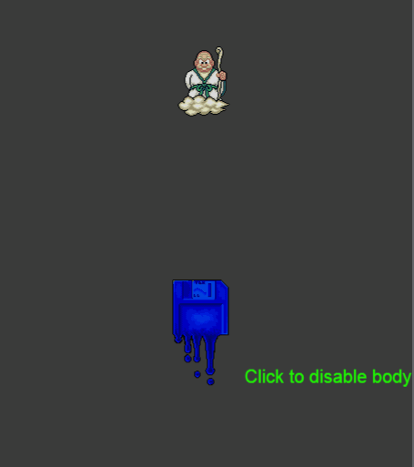
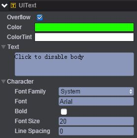
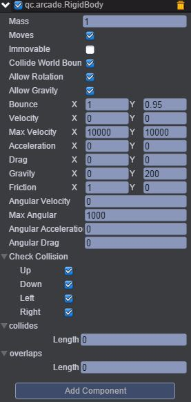
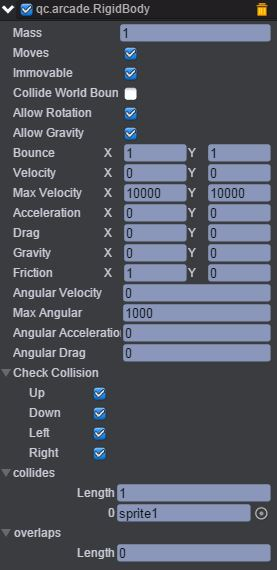
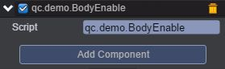

# BodyEnable      

* 本范例演示物理插件Arcade Physics的collides（碰撞）属性，运行时，sprite1节点碰撞到sprite2节点将会发生反弹，如果用鼠标点击sprite2节点，则sprite2不具有碰撞效果，也即sprite1节点不会与sprite2发生碰撞效果，效果图如下：<br>    

     

## UI    

* 创建一个Image节点并命名background，该节点用于放置背景图。<br>      

* 创建一个Text节点并取名clue，该节点为文本信息。文本信息设置为Click to disable body，如下图：<br>      

      

* 创建两个Sprite节点分别取名sprite1、sprite2。<br>   

* 在sprite1节点下挂载Arcade Physics插件，首先点击菜单栏上“Plugins\PluginManager”，此时Inspector面板出现如下界面：<br>     

      

* 把Arcade Physics勾选上，然后点击 Add Component，再选择Plugins\Arcade\RigidBody即添加插件完成，设置其属性值如下图所示：<br>    

     

* 具体的属性信息，请查阅文档：[手册](http://docs.zuoyouxi.com/manual/Plugin/Arcade.html)。<br>     

* 同样在sprite2节点下也挂载Arcade Physics插件（方法同sprite1挂载插件），设置其属性值如下图：<br>    

    

* 在Scripts文件夹下创建脚本BodyEnable.js，将该脚本挂载到sprite2节点上，如下图：<br>      

     

* 代码如下：<br>        

```javascript
/**
 * 物理的控制
 */
var BodyEnable = qc.defineBehaviour('qc.demo.BodyEnable', qc.Behaviour, function() {
}, {
});

//点击响应
BodyEnable.prototype.onClick = function() {
    var rigidBody = this.getScript('qc.arcade.RigidBody');
    rigidBody.enable = !rigidBody.enable;
};     
```