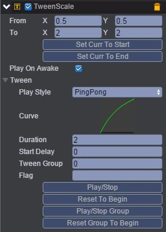

# BodyScale   

* 本范例演示物理插件Arcade Physics与Tween动画的TweenScale相结合，运行时，sprite1节点的缩放比从0.5到2，而sprite2节点往左边移动，碰到sptire1节点时发生碰撞效果，效果图如下：<br>     

   

## UI   

* 创建一个Image节点并命名background，该节点放置背景图片。<br>     

* 创建两个Sprite节点并分别取名sprite1、sprite2。<br>      

* 在sprite1节点下挂载TweenScale动画，具体可参考[《TweenScale动画编辑》](http://docs.zuoyouxi.com/manual/Tween/index.html)，如下图：<br>     

    

* 上述参数表示：缩放比从0.5到2，持续的时间是2秒，播放类型为PingPong（来回播放），Curve为动画编辑曲线。<br>     

* 在sprite1节点下挂载Arcade Physics插件，具体步骤是首先点击菜单栏上“Plugins\PluginManager”，此时Inspector面板出现如下界面：<br>     

      

* 把Arcade Physics勾选上，然后点击 Add Component，再选择Plugins\Arcade\RigidBody即添加插件完成，设置其属性值如下图所示：<br>      

    

* 具体的属性信息，请查阅文档：[手册](http://docs.zuoyouxi.com/manual/Plugin/Arcade.html)。<br>         

* 同样在sprite2节点下挂载插件（方法类似sprite1挂载插件），挂载完插件属性值设置如下图：<br>      

     

* 在Scripts文件夹下创建脚本BodyScale.js，并把该脚本挂载到sprite2节点上，如下图：<br>    

    

* 代码如下：<br>     

```javascript
var BodyScale = qc.defineBehaviour('qc.demo.BodyScale', qc.Behaviour, function() {
}, {
});

//帧调度
BodyScale.prototype.update = function() {
    var rigidBody = this.getScript('qc.arcade.RigidBody');
    rigidBody.velocity.x = -200;
};     
```