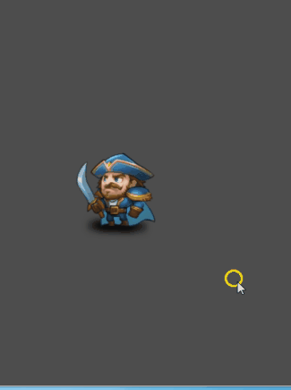
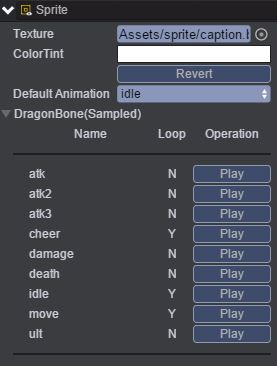
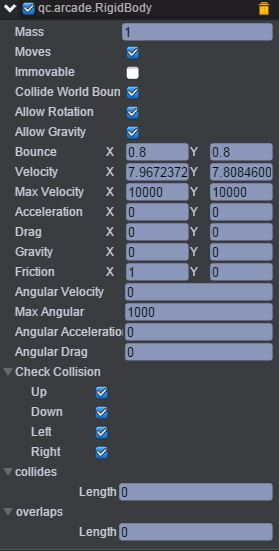
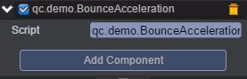

# BounceAcceleration    

* 本范例演示物理插件Arcade Physics的BounceAcceleration（反弹加速），运行时，Sprite节点的速度比较慢，碰到世界边界时会进行反弹效果，反弹的速度比较慢，当我们按下按下键盘方向键时，Sprite节点会加速移动，碰到世界边界时，反弹的速度会很快，效果图如下：<br>    

    

## UI    

* 创建Sprite节点，通过Inspector面板将帧动画添加到Sprite节点的Sprite属性，如下图所示，编辑帧动画请参考[《编辑帧动画》](http://docs.zuoyouxi.com/manual/FrameAnimation/index.html)。<br>     

      

* 在Sprite节点下挂载Arcade Physics插件，具体步骤是首先点击菜单栏上“Plugins\PluginManager”，此时Inspector面板出现如下界面：<br>     

      

* 把Arcade Physics勾选上，然后点击 Add Component，再选择Plugins\Arcade\RigidBody即添加插件完成，设置其属性值如下图所示：<br>    

   

* 具体的属性信息，请查阅文档：[手册](http://docs.zuoyouxi.com/manual/Plugin/Arcade.html)。<br>     

* 在Scripts文件夹下创建脚本BounceAcceleration.js，并把该脚本挂载到Sprite节点，如下图：<br>    

    

* 代码如下：<br>    

```javascript
var BounceAcceleration = qc.defineBehaviour('qc.demo.BounceAcceleration', qc.Behaviour, function() {
}, {
});

//帧调度
BounceAcceleration.prototype.update = function() {
    var self = this,
        rigidBody = self.getScript('qc.arcade.RigidBody');

    if (self.game.input.isKeyDown(qc.Keyboard.UP)) {
        rigidBody.acceleration.y = -600;
        self.gameObject.playAnimation('move');
    }
    else if (self.game.input.isKeyDown(qc.Keyboard.DOWN)) {
        rigidBody.acceleration.y = 600;
        self.gameObject.playAnimation('move');
    }
    else if (self.game.input.isKeyDown(qc.Keyboard.LEFT)) {
        rigidBody.acceleration.x = -500;
        self.gameObject.playAnimation('move');
    }
    else if (self.game.input.isKeyDown(qc.Keyboard.RIGHT)) {
        rigidBody.acceleration.x = 500;
        self.gameObject.playAnimation('move');
    }
    else {
        self.gameObject.playAnimation('idle');
        rigidBody.acceleration.setTo(0, 0);
    }

    self.gameObject.scaleX = rigidBody.velocity.x > 0 ? 1 : -1;
};       
```
