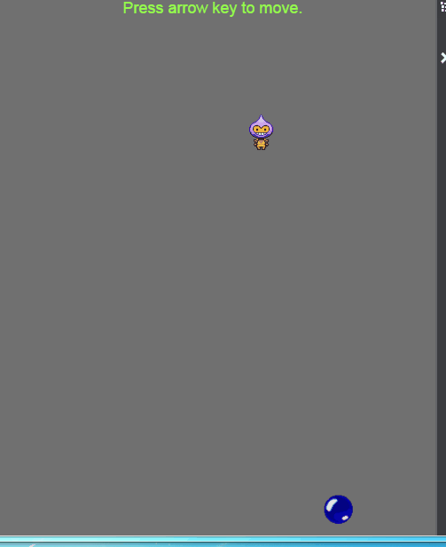
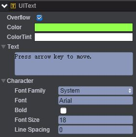
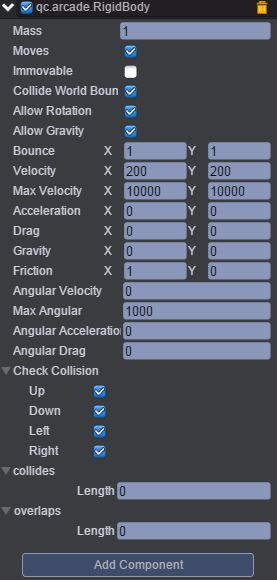
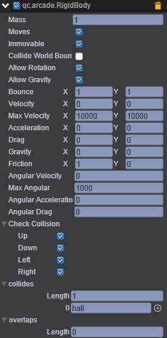
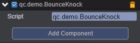

# BounceKnock    

* 本范例在运行时，通过键盘方向键控制knocker节点的上下左右移动，从而可以与ball节点发生碰撞效果以锁定ball的反弹方向，效果图如下：<br>    

    

## UI    

* 创建一个Text文本，文本信息设置为Press arrow key to move，如下图：<br>    

    

* 创建两个Sprite节点并分别命名ball、knocker。<br>    

* 在ball节点挂载Arcade Physics插件，具体步骤是首先点击菜单栏上“Plugins\PluginManager”，此时Inspector面板出现如下界面：<br>   

    

* 把Arcade Physics勾选上，然后点击 Add Component，再选择Plugins\Arcade\RigidBody即添加插件完成，设置其属性值如下图所示：<br>   

     

* 具体的属性信息，请查阅文档：[手册](http://docs.zuoyouxi.com/manual/Plugin/Arcade.html)。<br>     

* 同样在koncker节点挂载Arcade Physics插件（方法类似ball节点挂载插件），如下图：<br>    

     

* 在Scripts文件夹下创建BounceKnock.js，将该脚本挂载到knocker节点下，如下图：<br>    

     

* 代码如下：<br>       

```javascript
var BounceKnock = qc.defineBehaviour('qc.demo.BounceKnock', qc.Behaviour, function() {
}, {
});

//帧调度
BounceKnock.prototype.update = function() {
    var self = this,
        rigidBody = self.getScript('qc.arcade.RigidBody');

    if (self.game.input.isKeyDown(qc.Keyboard.UP)) {
        rigidBody.velocity.y = -300;
    }
    else if (self.game.input.isKeyDown(qc.Keyboard.DOWN)) {
        rigidBody.velocity.y = 300;
    }
    else if (self.game.input.isKeyDown(qc.Keyboard.LEFT)) {
        rigidBody.velocity.x = -300;
    }
    else if (self.game.input.isKeyDown(qc.Keyboard.RIGHT)) {
        rigidBody.velocity.x = 300;
    }
    else {
        rigidBody.velocity.setTo(0, 0);
    }
};     
```