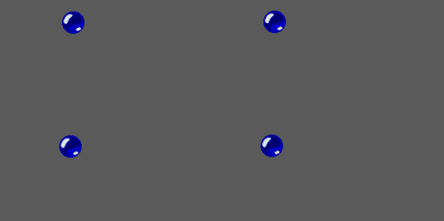
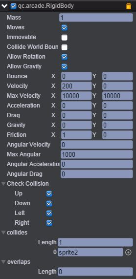
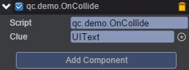
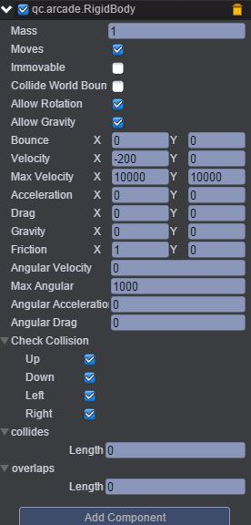
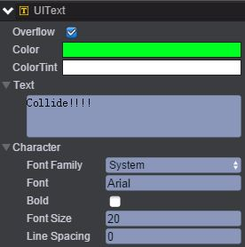
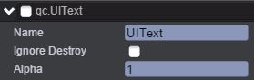
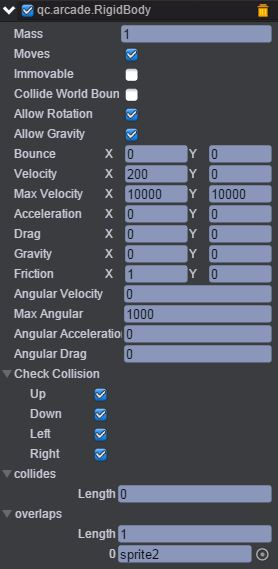
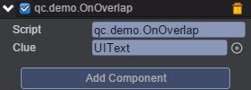
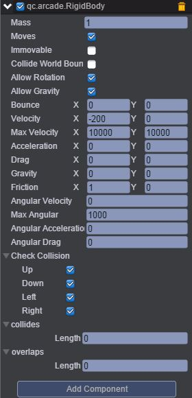
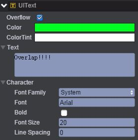

# OnCallback     

* 本范例演示物理插件Arcade Physics的collides（碰撞）与overlaps（重叠）属性，运行时，collide节点下的sprite1与sprite2碰撞时会发生碰撞效果，而overlap节点下的sprite1与sprite2发生碰撞时会发生重叠的效果，效果图如下：<br>      

    

## UI   

### collide    

* 创建一个Empty Node节点并取名为collide。<br>     

* 在collide节点下创建两个Sprite节点分别命名为sprite1、sprite2。<br>      

* 在sprite1节点下挂载Arcade Physics插件，设置插件的属性值如下图：<br>      

       

* 具体的属性信息，请查阅文档：[手册](http://docs.zuoyouxi.com/manual/Plugin/Arcade.html)。<br>          

* 在Scripts文件夹下创建脚本OnCollide.js，并将该脚本挂载到sprite1节点，如下图：<br>        

    

* 代码如下：<br>       

```javascript

var OnCollide = qc.defineBehaviour('qc.demo.OnCollide', qc.Behaviour, function() {
    this.clue = null;
}, {
    clue: qc.Serializer.NODE
});

//回调函数
OnCollide.prototype.onCollide = function(o1, o2) {
    this.clue.visible = true;
};
```      

* 在sprite2节点下挂载Arcade Physics插件，设置插件的属性值如下图：<br>     

     

* 在collide节点下创建Text并取名UIText，其文本信息设置为Collide!!!，如下图：<br>    

       

* 将qc.UIText勾选去掉，这样做的目的是运行时发生碰撞才显示文本信息，如下图：<br>     

       

### overlap      

* 创建一个Empty Node节点并取名为overlap。<br>     

* 在overlap节点下创建两个Sprite节点分别命名为sprite1、sprite2。<br>       

* 在sprite1节点下挂载Arcade Physics插件，设置插件的属性值如下图：<br>     

     

* 在Scripts文件夹下创建脚本OnOverlap.js，并将该脚本挂载到sprite1节点，如下图：<br>     

     

* 代码如下：<br>      

```javascript
var OnOverlap = qc.defineBehaviour('qc.demo.OnOverlap', qc.Behaviour, function() {
    this.clue = null;
}, {
    clue: qc.Serializer.NODE
});

//回调函数
OnOverlap.prototype.onOverlap = function(o1, o2) {
    this.clue.visible = true;
};
```         

* 在sprite2节点下挂载Arcade Physics插件，设置插件的属性值如下图：<br>    

     

* 在collide节点下创建Text并取名UIText，其文本信息设置为Overlap!!!，如下图：<br>     

      

* 将qc.UIText勾选去掉，这样做的目的是运行时发生重叠才显示文本信息，如下图：<br>        

