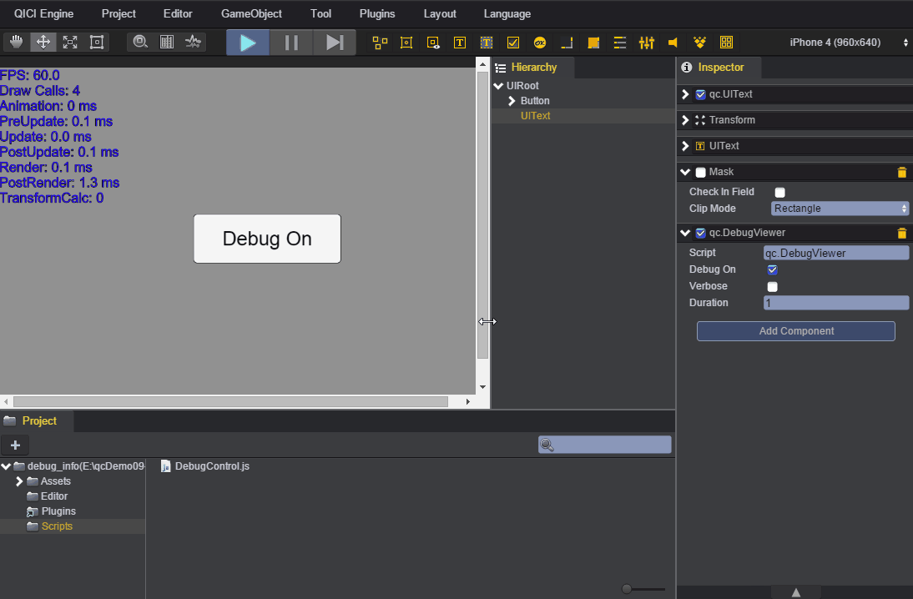
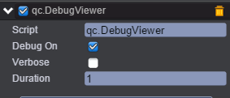

# 性能信息

* 本范例演示DebugViewer组件的使用，查看性能信息。在DebugOn关闭的状态下，PostUpdate、Render、PostRender和TransformCalc都不会检测刷新。如下图：<br>
    

* 创建一个Text用来显示当前性能信息；<br>     

* 在UIText节点上添加DebugViewer组件；默认DebugOn属性为开启。如下图：<br>    

     

* 在根节点下创建一个Button，点击按钮切换DebugOn开启或者关闭状态。<br>     

* 创建脚本DebugControl.js，负责点击按钮实现DebugOn状态切换。<br>     

* 代码如下：<br>    

```javascript
/**
 * Debug控制
 */
var DebugControl = qc.defineBehaviour('qc.demo.DebugControl', qc.Behaviour, function() {
	
}, {});

Object.defineProperties(DebugControl.prototype, {
	/**
	 * @property 
	 * @type {Object}
	 */
	debugOn: {
		get: function() {
			return this.game.debug.on;
		},

		set: function(v) {
			var self = this;
			self.game.debug.on = v;
			self.gameObject.text.text = self.debugOn ? 'Debug On' : 'Debug Off';
		}
	}
});

DebugControl.prototype.onStart = function() {
	var self = this;

	// 监听事件
	self.gameObject.onDown.add(self.onDown, self);

	// 修改按钮的显示文字
	self.gameObject.text.text = self.debugOn ? 'Debug On' : 'Debug Off';
};

DebugControl.prototype.onDown = function() {
	var self = this;
	self.debugOn = !self.debugOn;
	//self.game.log.enableTrace = false;
	//self.game.debug.on = false;

	self.game.log.trace('self.game.log.trace: self.game.log.enableTrace=%s',self.game.log.enableTrace);
	console.log('console.log:self.game.log.enableTrace=%s',self.game.log.enableTrace);
};     
```