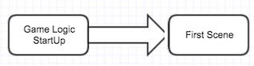
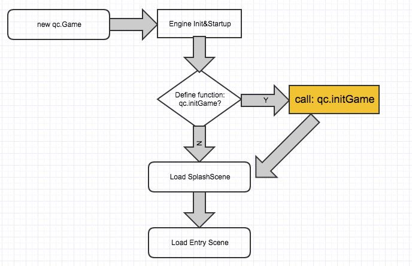
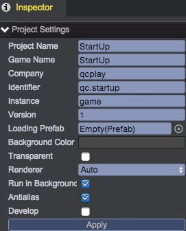
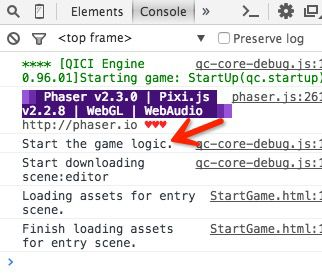
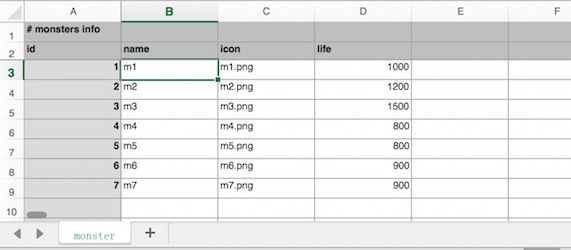
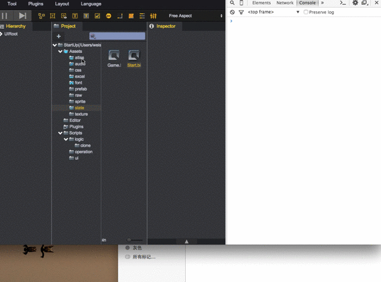

请先阅读：[Hello World](http://engine.zuoyouxi.com/demo/GetStart/HelloWorld/index.html)  

# 游戏编程
## 界面(View)与游戏数据(Model&Control)的分离
界面的表现与具体的游戏逻辑，不应该糅杂在一起，否则不容易维护而且极容易引发BUG。在编程过程中，应该时刻谨记这一点。  

## 游戏的启动流程
首先初始化游戏的逻辑数据，然后再初始化界面信息（例如加载游戏资源、显示登录界面等），如下：  
  

# 引擎的启动流程
在[Hello World]()工程中，我们已经初步介绍了下引擎的启动流程，这里给出一个更详细的流程图：  
  

## qc.initGame
注意图片黄色底的部分，如果外部定义了函数：qc.initGame，那么引擎会在自身初始化完毕后自动调用。  
在此函数里面我们可以完成游戏逻辑部分的初始化（切记：不能在此方法中加载界面资源、创建场景对象等），后续我们会给出示范。

# 示例工程
本工程实现一个简单的游戏：屏幕中定期出现随机怪物，点击后消失并增加分数。如下：  
<video controls="controls" src="video/game.mp4"></video> 

以下开始演示实现步骤。
## 步骤1：创建新的工程
工程名：StartUp

## 步骤2：配置工程
如下图：  
  

## 步骤3：建立代码结构
如下图：  
  
* logic：所有的游戏逻辑代码
* ui：所有的界面表现代码
* operation：所有的操作指令

## 步骤4：入口脚本
在Scripts目录下，创建脚本StartUp.js。代码如下：
````javascript   
	// 定义本工程的名字空间
	qc.startup = {};

	// 用来存放所有的全局数据（函数、变量等）
	window.G = qc.startup.G = {};

	// 初始化逻辑
	qc.initGame = function(game) {
	    game.log.trace('Start the game logic.');
	    
		// 将game实例的引用记录下来，方便在其他逻辑脚本模块中访问
	    G.game = game;
	    
	    // TODO: 其他逻辑待补充
	};
````
将此脚本设置为第一个加载的脚本，其他所有脚本都依赖于本脚本。设置方法如下：  
<video controls="controls" src="video/script_entry.mp4"></video>       

运行之，在控制台将会看到如下的打印信息，证明qc.initGame方法自动被调用了。  
    

## 步骤5：管理“我”的信息
在Scripts/logic目录下，创建脚本：Me.js。代码如下：
````javascript   
	/**
	 * 管理游戏玩家的数据
	 */
	var Me = qc.startup.Me = function() {
		var self = this;
	    
	    /**
	     * @property {qc.Signal} onFieldChanged
	     *   当玩家的数据发生变更时，派发本事件
	     */ 
		self.onFieldChanged = new qc.Signal();
	    
	    // 将玩家的数据反序列化出来
	    self.restore();
	};

	Object.defineProperties(Me.prototype, {
	    /**
	     * @property {number} score - 玩家的分数
	     */
	    score: {
	        get: function() { return this._score; },
	        set: function(v) {
	            if (this._score === v) return;
	            this._score = v;
	            this.onFieldChanged.dispatch('score');

	            // 将数据保存到磁盘
	            this.save();
	        }
	    }
	});

	/**
	 * 将“我”的数据还原出来
	 */
	Me.prototype.restore = function() {
	    // 我当前的分数
	    var score = G.game.storage.get('score');
	    if (score) this.score = score;
	    else this.score = 0;
	};

	/**
	 * 将玩家数据保存到磁盘
	 */
	Me.prototype.save = function() {
	    G.game.storage.set('score', this.score);
	};
````
Me类功能很简单，负责维护玩家的分数。修改StartUp.js的代码，添加创建Me对象的逻辑(在qc.initGame方法中)：
````javascript   
	qc.initGame = function(game) {
	    game.log.trace('Start the game logic.');
	    
		// 将game实例的引用记录下来，方便在其他逻辑脚本模块中访问
	    G.game = game;

	    // 我的数据
	    G.me = new qc.startup.Me();
	    
	    // TODO: 其他逻辑待补充
	};
````

## 步骤6：配置怪物数据
屏幕上显示的怪物信息，不应该写死到代码中（不方便非程序人员修改）。这里我们用excel来配置数据。
在Assets/excel目录下新建excel文件：[config.xlsx](images/config.xlsx)，内容如下图：  
  
简略说明下本配置表的含义（具体如何配置不是本教程重点，请查看相应用户手册）：
1. Sheet名字为：monster
2. 以'#'开始的行为注释行
3. 第一个数据行为列的key值，这里有4列：id（怪物标识）、name（怪物名称）、icon（怪物使用的图片名）、life（怪物存活时间，单位毫秒）
4. 表中配置了7条怪物数据

在Scripts/logic/clone/目录下，创建Monster.js，代表怪物对象：
````javascript   
	/**
	 * 怪物类，负责维护怪物的信息
	 */
	var Monster = qc.startup.Monster = function() {
	    var self = this;

	    /**
	     * @property {number} id - 怪物标识
	     */
	    self.id = 0;

	    /**
	     * @property {string} name - 怪物名字
	     */
	    self.name = '';

	    /**
	     * @property {string} icon - 怪物的图标
	     */
	    self.icon = '';

	    /**
	     * @property {number} life - 怪物的生命时长，单位MS
	     */
	    self.life = 0;
	};
	Monster.prototype = {};
	Monster.prototype.constructor = Monster;

	/***
	 * 复制出一个怪物
	 */
	Monster.prototype.clone = function() {
	    var m = new Monster();
	    m.id = this.id;
	    m.name = this.name;
	    m.icon = this.icon;
	    m.life = this.life;
	};

````

## 步骤7：下载配置表
有了配置表，建立了对应的怪物对象，需要将配置表的内容解析出来。但首先：我们得先把配置表“加载”进来！  
__把资源、界面等初始化工作放在入口场景。__新建入口场景(Start)，见下图：  
  
1. 首先创建UIRoot节点
2. 在UIRoot节点下创建一个Text，显示：Loading...

在Scripts/下新建InitUI.js脚本，并将此脚本挂载到UIRoot节点，__保存场景__。  
````javascript   
	/**
	 * 界面和资源的初始化
	 */
	var InitUI = qc.defineBehaviour('qc.startup.InitUI', qc.Behaviour, function() {
	}, {});

	/**
	 * 初始化工作
	 */
	InitUI.prototype.awake = function() {
	    var self = this;

	    // 下载excel文件
	    self.game.assets.load('config', 'Assets/excel/config.bin', function(r) {
	        if (!r) {
	            alert('Download fail.');
	            return;
	        }

	        // 下载成功了
	        alert('Download Success.');
	        console.log(r);
	    });
	};
````
__代码说明：__  
通过调用assets.load函数下载资源（第一个参数为资源的key，第二个参数为资源的路径，第三个参数为下载完成的回调函数）。上述代码中，在载入Start场景后，立刻下载config的配置表，下载成功后弹出一个提示框。

## 步骤8：解析配置表
配置表下载完成后，需要做解析工作。在Scripts/logic目录，新建MonsterManager.js以管理所有的怪物数据。
````javascript   
	/**
	 * 维护所有的怪物
	 */
	var MonsterManager = qc.startup.MonsterManager = function() {
	    /**
	     * 所有配置的怪物数据
	     */
	    this.rawMonsters = {};
	};
	MonsterManager.prototype = {};
	MonsterManager.prototype.constructor = MonsterManager;

	/**
	 * 初始化本模块
	 */
	MonsterManager.prototype.init = function() {
	    var self = this;
	    var data = G.game.assets.find('config').findSheet('monster');
	    data.rows.forEach(function(row) {
	        var monster = new qc.startup.Monster();
	        monster.id = row.id;
	        monster.name = row.name;
	        monster.icon = row.icon;
	        monster.life = row.life;

	        self.rawMonsters[monster.id] = monster;
	    });

	    G.game.log.trace('Total Monster: {0}', data.rows.length);
	};

````
代码提供了init接口，用于解析怪物数据（细节暂时可以不用理会），解析后保存到变量rawMonsters中。  
打开StartUp.js文件，增加MonsterManager类的实例化：
````javascript   
	// 我的数据
    G.me = new qc.startup.Me();

    // 新增代码：
    // 怪物管理模块
    G.monsters = new qc.startup.MonsterManager();
````
打开InitUI.js文件，修改下载成功的逻辑：
````javascript   
	// 下载excel文件
    self.game.assets.load('config', 'Assets/excel/config.bin', function(r) {
        if (!r) {
            alert('Download fail.');
            return;
        }

        // 修改为：
        // 下载成功了
        G.monsters.init();
    });
````
运行工程，在控制台可以看到如下打印：Total Monster: 7  

## 步骤9：进入游戏场景
当资源全部到位后（当前例子为excel资源），需要进入游戏主场景Game。  
首先创建游戏主场景，并在场景中放一个“开始游戏”的按钮。  


修改InitUI.js文件，下载成功后载入主场景：
````javascript   
	// 下载excel文件
    self.game.assets.load('config', 'Assets/excel/config.bin', function(r) {
        if (!r) {
            alert('Download fail.');
            return;
        }

        // 下载成功了
        G.monsters.init();

        // 切换到主场景
        self.game.state.load('Game');
    });
````

切换到Start场景，然后运行查看效果。

## 步骤10：导入资源并打包图集
创建文件夹：Assets/atlas/monster@atlas（这个文件夹名表示下面所有的图片需要打包为图集），将所有怪物图片拖进来。  
选择菜单“Tool/Repack Texture Atlases”打包图集，图集将打包在：Assets/atlas/monster.bin。操作如下图：  
  

## 步骤11：创建怪物预制
切换到Game场景。在UIRoot下创建UIImage节点，并设置使用monster图集、可以接收点击事件等。按如下图方法制作怪物预置。  
  
1. 勾选上Interactive，对象就具备了“交互”的能力，即：可以接受点击或者触摸事件
2. 创建预制的方法：将预制根节点拖拽到Project面板中即可

为怪物对象挂载逻辑脚本，处理怪物的显示、点击处理。在Scripts/ui下创建脚本：MonsterUI.js。具体逻辑请参看注释进行理解。
````javascript   
	/**
	 * 绘制一个怪物
	 */
	var MonsterUI = qc.defineBehaviour('qc.startup.MonsterUI', qc.Behaviour, function() {
	}, {
	    // fields need to serialize
	});

	/**
	 * 显示怪物monster的信息
	 */
	MonsterUI.prototype.show = function(monster) {    
	    var math = this.game.math,
	        self = this,
	        o = self.gameObject;
	    
	    // 怪物随机显示在屏幕内某个点
	    var x = math.random(0, o.parent.rect.width),
	        y = math.random(0, o.parent.rect.height);
	    o.anchoredX = x;
	    o.anchoredY = y;
	    
	    // 设置怪物的图片
	    o.frame = monster.icon;
	    o.resetNativeSize();
	    o.name = monster.name;
	    
	    // 记录对应的怪物信息
	    self.monster = monster;
	};

	/**
	 * 怪物被点击的处理：加分数并将怪物析构
	 */ 
	MonsterUI.prototype.onClick = function() {
	    // 分数增加
	    G.me.score++; 
	    
	    // 对象析构掉
	    this.gameObject.destroy();
	};

````
双击怪物预置进行编辑，将此脚本挂载上，同时让怪物对象的原点在图片的中心：  
  

## 步骤12：点击开始游戏按钮，定期出现怪物
新增逻辑脚本，定期随机产出一些怪物，在Scripts/ui下新建脚本MonsterRefresh.js。
````javascript   
	/**
	 * 定期产出怪物
	 */ 
	var MonsterRefresh = qc.defineBehaviour('qc.startup.MonsterRefresh', qc.Behaviour, function() {
	    // 怪物的预制
	    this.monsterPrefab = null;

	    // 开始按钮
	    this.startBtn = null;
	}, {
	    monsterPrefab: qc.Serializer.PREFAB,
	    startBtn: qc.Serializer.NODE
	});

	MonsterRefresh.prototype.awake = function() {
	    // 开始按钮被点击后，开始定期刷出怪物
	    var self = this;
	    self.startBtn.onClick.add(function() {
	        // 开始按钮隐藏掉
	        self.startBtn.visible = false; 
	        
	        // 建立个定时器 每隔1秒随机产出一个怪物
	        self.game.timer.loop(1000, function() {
	            // 应用概率失败，不产出了
	            if (self.game.math.random(0, 1) === 0) return;
	        
	            // 抽取一个怪物
	            var monster = G.monsters.fetchRandom();

	            // 显示出来
	            self.add(monster);
	        });
	    });
	};

	/**
	 * 添加一个怪物
	 */ 
	MonsterRefresh.prototype.add = function(monster) {
	    // 根据预置复制出怪物对象，怪物对象挂载在本游戏对象(UIRoot)下
	    var ob = this.game.add.clone(this.monsterPrefab, this.gameObject); 
	    
	    // 在屏幕上显示出来
	    var c = ob.getScript('qc.startup.MonsterUI');
	    c.show(monster);
	};
````
将此脚本挂载到UIRoot节点。并设置属性monsterPrefab的值为monster预置，关联startBtn按钮。操作方法见：  
  

打开MonsterManager.js文件，添加接口：fetchRandom。
````javascript   
	/**
	 * 随机抽取一个怪物
	 */
	MonsterManager.prototype.fetchRandom = function() {
		var list = Object.keys(this.rawMonsters);
	    var id = list[G.game.math.random(0, list.length - 1)];
	    return this.rawMonsters[id];
	};
````

保存场景，并切换到Start场景，运行并体验下游戏效果。

## 步骤13：添加分数显示与怪物生命
之前的逻辑处理中，每点击一次怪物，分数+1，但目前完全看不到分数。请读者作为练习，自行添加之。  
提示：显示使用Text节点，挂载个逻辑脚本（逻辑脚本在初始化时，关注score字段变化并刷新界面显示）  

当怪物出生后，每个怪物都有自己的生命周期（如果没被点击将自动消失，同时扣除分数1），也请读者自行添加。  
提示：在MonsterUI中，增加定时器干这个事情（需要注意的是：当怪物被点击后，需要删除定时器哦）

# 继续阅读
[游戏：神奇的六边形](http://engine.zuoyouxi.com/demo/Project/tetris/index.html)
