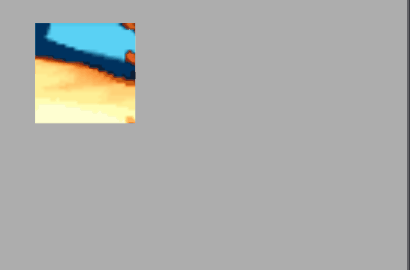
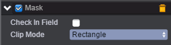
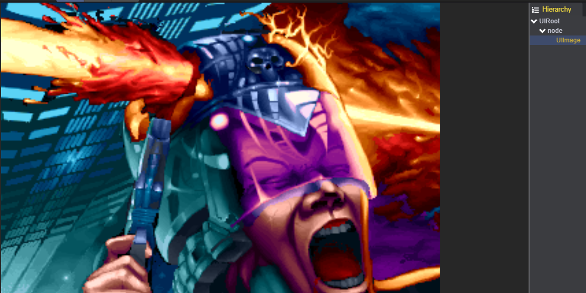
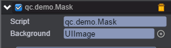

# 裁切

* 本范例介绍mask的使用。效果图如下：<br>    

   

* 在新建场景中创建一个EmptyNode，在此节点上添加NodeMask组件：点击'AddComponent'->'UI'->'NodeMask'。<br>设置node节点的大小为100\*100，裁切模式为当前节点的矩形大小。如下图：<br>

* 在node的节点下创建一个Image作为背景图。如下图：<br>

* 创建脚本Mask.js，负责拖动node节点显示node范围内的内容，脚本挂在node节点上。如下图：<br>
<br>   

* 代码如下：<br>

```javascript
var Mask = qc.defineBehaviour('qc.demo.Mask', qc.Behaviour, function() {
    this.background = null;
}, {
    background: qc.Serializer.NODE
});

Mask.prototype.awake = function() {
    this.game.input.onPointerMove.add(this.onMove, this);
};

// 拖动
Mask.prototype.onMove = function(id, x, y) {
    this.gameObject.x = x - 50;
    this.gameObject.y = y - 50;
    this.background.x = -this.gameObject.x;
    this.background.y = -this.gameObject.y;
};     
```