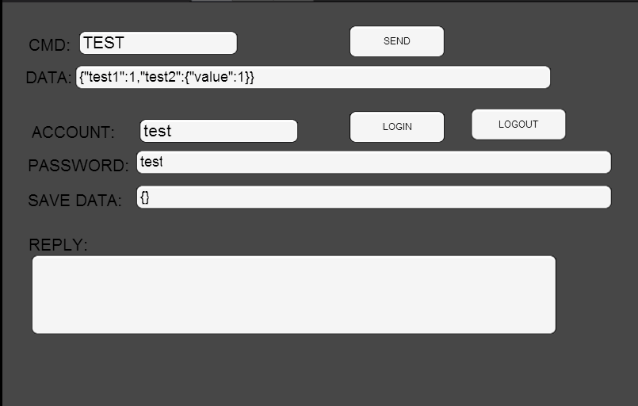
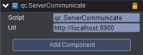
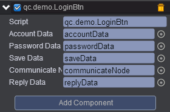
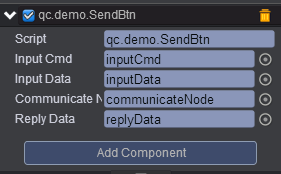

# serverCommunicate   
    
* 本范例介绍serverCommunicate插件的使用，可参考[服务器通讯](http://docs.zuoyouxi.com/manual/Plugin/ServerCommunicate.html)，运行时，可以在控制台看到输出相关信息，效果图如下：<br>      
     

## UI    
* 创建一个Empty Node节点取名communicateNode，在该节点上挂载serverCommunicate插件，可查看手册[服务器通讯](http://docs.zuoyouxi.com/manual/Plugin/ServerCommunicate.html)，效果图如下：<br>   
     

* 其它界面布局可参考[《史莱姆》](http://engine.zuoyouxi.com/demo/Layout/slime/index.html)。<br>     

* 需要说明的是要在Scripts文件夹下创建脚本LoginBtn.js，将LoginBtn.js挂载到loginBtn节点与loginoutBtn节点上，如下图：<br>   
          

* 代码如下：<br>      

```javascript     

/**
 * 登录指令
 * 传入帐号和密码，若帐号验证失败，则返回错误信息；若不存在该帐号，则新建帐号；存在该帐号，则返回用户数据
 *
 *  登出指令
 *  传入帐号和密码，若帐号验证失败，则返回错误信息；若不存在该帐号，则返回错误信息，不保存；存在该帐号，则保存用户数据
 */

var LoginBtn = qc.defineBehaviour('qc.demo.LoginBtn', qc.Behaviour, function() {
    this.accountData = null;
    this.passwordData = null;
    this.saveData = null;
    this.replyData = null;
    this.communicateNode = null;
}, {
    // 需要序列化的字段
    accountData : qc.Serializer.NODE,
    passwordData : qc.Serializer.NODE,
    saveData : qc.Serializer.NODE,
    communicateNode : qc.Serializer.NODE,
    replyData : qc.Serializer.NODE,
});

// 收到消息回复
LoginBtn.prototype.onReply = function(arg, resJson) {
    this.game.log.trace('onReply :');
    this.game.log.trace(arg);
    this.game.log.trace(resJson);

    var jsonStr = JSON.stringify(resJson);
    this.replyData.text = jsonStr;
};

// 按钮被点击的处理
LoginBtn.prototype.awake = function() {

    var self = this;
    this.addListener(this.gameObject.onClick, function(node, event){

        var account = self.accountData.text;
        var password = self.passwordData.text;
        if (node.name == 'loginBtn')
        {
            var callback = self.onReply.bind(self, {});
            qc.ServerCommunicate.login(self.communicateNode, account, password, {}, callback);
        }
        else if (node.name == 'logoutBtn')
        {
            var callback = self.onReply.bind(self, {});
            var saveData = self.saveData.text;
            qc.ServerCommunicate.logout(self.communicateNode, account, password, {}, saveData, callback);
        }

        self.replyData.text = 'waiting reply...';
    });
};           
```

* 在Scripts文件夹下再创建脚本SendBtn.js，将该脚本挂载到sendBtn节点，如下图：<br>      
          

* 代码如下：<br>       

```javascript    

/**
 * 发送指令
 */

var SendBtn = qc.defineBehaviour('qc.demo.SendBtn', qc.Behaviour, function() {
    this.inputCmd = null;
    this.inputData = null;
    this.replyData = null;
    this.communicateNode = null;
}, {
    // 需要序列化的字段
    inputCmd : qc.Serializer.NODE,
    inputData : qc.Serializer.NODE,
    communicateNode : qc.Serializer.NODE,
    replyData : qc.Serializer.NODE,
});

// 收到消息回复
SendBtn.prototype.onReply = function(arg, resJson) {
    this.game.log.trace('onReply :');
    this.game.log.trace(arg);
    this.game.log.trace(resJson);

    var jsonStr = JSON.stringify(resJson);
    this.replyData.text = jsonStr;
};

// 按钮被点击的处理
SendBtn.prototype.onClick = function() {
    var cmd = this.inputCmd.text;
    var data = this.inputData.text;
    var json = '';
    this.game.log.trace('data : {0}', data);
    try{
        json = JSON.parse(data);
    }catch(e){
        alert('data 不为 json 串')
        return;
    }
    var callback = this.onReply.bind(this, {test:11});

    // 发送消息
    qc.ServerCommunicate.sendMessage(this.communicateNode, cmd, json, callback)

    this.replyData.text = 'waiting reply...';
};        
```


