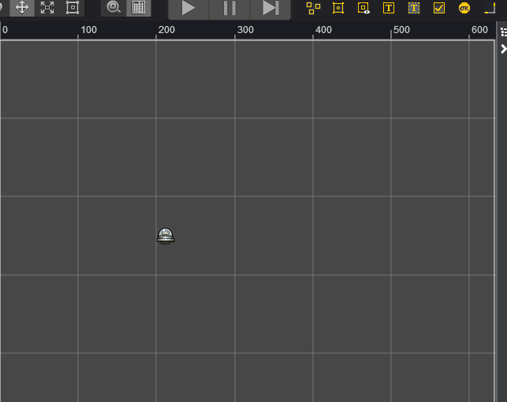
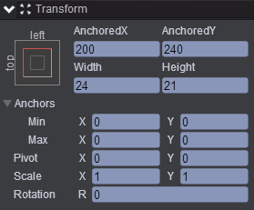
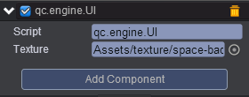

# Add A Sprite To Node(添加精灵)

* 本范例演示用代码创建精灵，运行时，自动创建多个精灵，并显示在界面上，效果图如下：<br>


## UI

* 创建一个Empty Node节点取名friendAndFoe，并在该节点下创建子节点Sprite取名ufo，ufo的属性值如下图：<br>


* 在Scripts文件夹下创建脚本，并将该脚本挂载到friendAndFoe节点上，如下图：<br>


* 脚本代码如下：<br>

```javascript

var UI = qc.defineBehaviour('qc.engine.UI', qc.Behaviour, function() {
}, {
    texture: qc.Serializer.TEXTURE
});

UI.prototype.awake = function() {

    //创建节点
    var node = this.game.add.node();
    node.name = 'enemies';
    node.parent.setChildIndex(node, 0);
    
    for (var i = 0; i < 16; i++)
    {
        
        //创建Sprite节点并显示
        var o = this.game.add.sprite(node);
        o.x = 360 + Math.random() * 200;
        o.y = 120 + Math.random() * 200;
        o.texture = this.texture;
        o.resetNativeSize();
    }
};    
```
