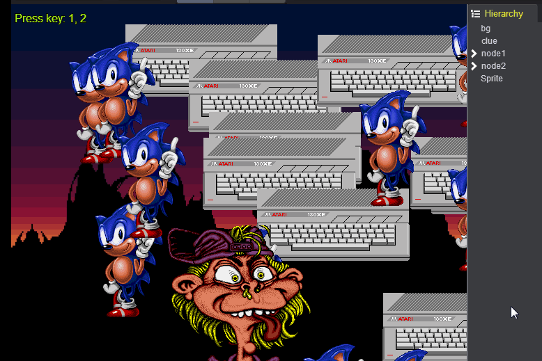
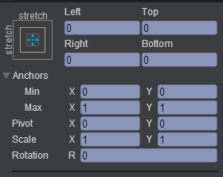
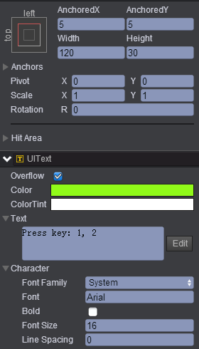
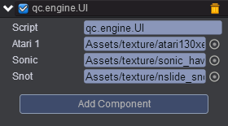

# Bring A Node To Top

* 本范例演示设置节点的位置，运行时，按数字键1或2可改变node1与node2节点的显示上下位置，效果图如下：<br>


## UI

* 创建一个Image节点取名bg，该节点属性值设置如下：<br>


* 创建一个文本节点Text取名clue，该节点属性值设置如下：<br>


* 在Scripts文件夹下创建脚本，并将该脚本挂载到bg节点上，如下图：<br>


* 脚本代码如下:<br>   

```javascript

var UI = qc.defineBehaviour('qc.engine.UI', qc.Behaviour, function() {
}, {
	//序列化
    atari1: qc.Serializer.TEXTURE,
    sonic: qc.Serializer.TEXTURE,
    snot: qc.Serializer.TEXTURE
});

//初始化
UI.prototype.awake = function() {
    // 创建节点并取名为node1
    var node1 = this.node1 = this.game.add.node();
    node1.name = 'node1';
    
    // 创建节点并取名为node2
    var node2 = this.node2 = this.game.add.node();
    node2.name = 'node2';
    
    // 创建Sprite节点
    var math = this.game.math;
    for (var i = 0; i < 10; i++) {
        var sprite = this.game.add.sprite(node1);
        sprite.name = 'atari' + i;
        sprite.x = math.random(0, this.gameObject.width);
        sprite.y = math.random(0, this.gameObject.height);
        sprite.texture = this.atari1;
        sprite.resetNativeSize();
        
        
        sprite = this.game.add.sprite(node2);
        sprite.name = 'sonic' + i;
        sprite.x = math.random(0, this.gameObject.width);
        sprite.y = math.random(0, this.gameObject.height);
        sprite.texture = this.sonic;
        sprite.resetNativeSize();
    }
    
   
    var snot = this.game.add.sprite();
    snot.pivotX = 0.5;
    snot.pivotY = 1;
    snot.x = this.gameObject.width/2;
    snot.y = this.gameObject.height;
    snot.texture = this.snot;
    snot.resetNativeSize();
};

//帧调度检测键盘按下数字1或2
UI.prototype.update = function() {
    var input = this.game.input;
    if (input.isKeyDown(qc.Keyboard.ONE)) {
        var parent = this.node1.parent;
        parent.setChildIndex(this.node1, parent.children.length - 1);
    }
    else if (input.isKeyDown(qc.Keyboard.TWO)) {
        var parent = this.node2.parent;
        parent.setChildIndex(this.node2, parent.children.length - 1);
    }
};    
```

