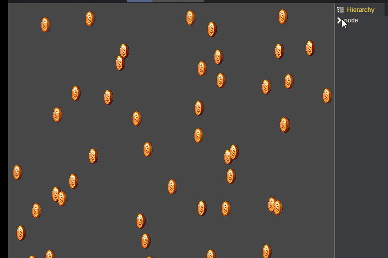
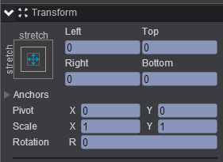
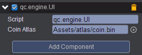

# Call ALL Animations   

* 本范例运行时，添加到node节点下的Sprite都播放帧动画，效果图如下：<br>
* 

## UI   

* 创建一个Empty Node取名为node，属性值设置如下：<br>
   

* 在Scripts文件夹下创建脚本，将该脚本挂载到node节点上，并把Assets/atlas/coin.bin拖入到Coin Atlas属性中，如下图所示：<br>
  

* 脚本代码如下：<br>

```javascript  
var UI = qc.defineBehaviour('qc.engine.UI', qc.Behaviour, function() {
}, {
    coinAtlas: qc.Serializer.TEXTURE
});

//初始化
UI.prototype.awake = function() {
    for (var i = 0; i < 50; i++) {
	
		//创建Sprite
        var sprite = this.game.add.sprite(this.gameObject);
        sprite.texture = this.coinAtlas;
        sprite.resetNativeSize();
        sprite.x = this.game.math.random(0, this.gameObject.width);
        sprite.y = this.game.math.random(0, this.gameObject.height);
    }
    
    // 播放帧动画
    this.gameObject.children.forEach(function(child) {
        child.playAnimation('rotate');
    });
};    
```
