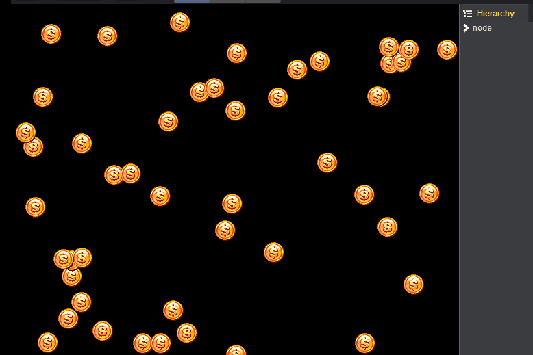
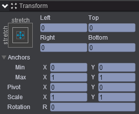
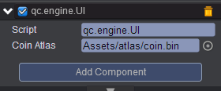

# call-all-input  

* 本范例运行时，创建多个Sprite,每个Sprite可交互，点击任何一个Sprite时，该Sprite的透明度会发生变化，效果图如下：<br>
  

* 创建一个Empty Node节点取名node，节点属性值设置如下：<br>
   

* 在Scripts文件夹下创建脚本，将脚本挂载到node节点上，并把Assets/atlas/coin.bin拖入到Coin Atlas属性中，如下图所示：<br>
   

* 脚本代码如下：<br>        

```javascript   
var UI = qc.defineBehaviour('qc.engine.UI', qc.Behaviour, function() {
}, {
    coinAtlas: qc.Serializer.TEXTURE
});

//初始化
UI.prototype.awake = function() {
    var self = this;
    
    for (var i = 0; i < 50; i++) {
	
		//创建Sprite节点
        var sprite = this.game.add.sprite(this.gameObject);
        sprite.texture = this.coinAtlas;
        sprite.resetNativeSize();
        sprite.x = this.game.math.random(0, this.gameObject.width);
        sprite.y = this.game.math.random(0, this.gameObject.height);
        sprite.interactive = true;
    }
    
	//遍历每个节点
    this.gameObject.children.forEach(function(child) {
        self.addListener(child.onClick, self.onCoinClick, self);
    });
};    

//响应点击
UI.prototype.onCoinClick = function(coin) {
    coin.alpha = 0.3;
};   
```