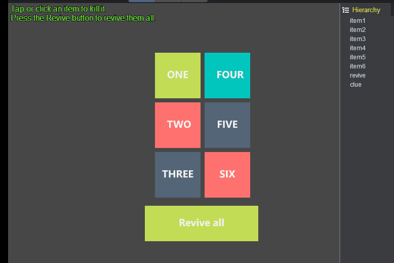
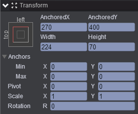
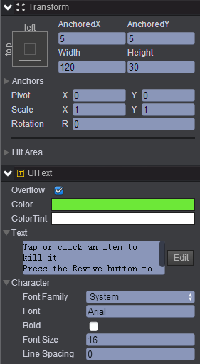
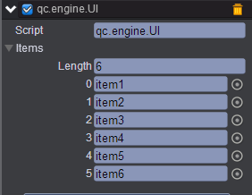

# call-all

* 本范例运行时，点击某个Sprite节点时，该节点不可见，通过点击Revive all按钮，则所有的Sprite节点可见，效果图如下：<br>


## UI

* 创建6个Sprite节点，分别取名item1~item6，创建一个图片节点Image取名revive，revive节点属性值设置如下：<br>


* 创建一个Text文本节点取名clue，clue节点属性值设置如下：<br>


* 在Scripts文件夹下创建脚本，并将该脚本挂载到revive节点上，将item1~item6节点分别拖入到对应属性，如下图所示：<br>


* 脚本代码如下：<br>
  
```javascript

var UI = qc.defineBehaviour('qc.engine.UI', qc.Behaviour, function() {
}, {
	//序列化
    items: qc.Serializer.NODES
});

//初始化
UI.prototype.awake = function() {
    var self = this;
    self.items.forEach(function(item) {
	
		//添加按钮监听
        self.addListener(item.onClick, self.onItemClick, self);
    });
};

UI.prototype.onItemClick = function(item) {
    // 隐藏item
    item.visible = false;
};

//点击事件响应
UI.prototype.onClick = function() {
    this.items.forEach(function(item) {
        item.visible = true;
    });
};     
```
