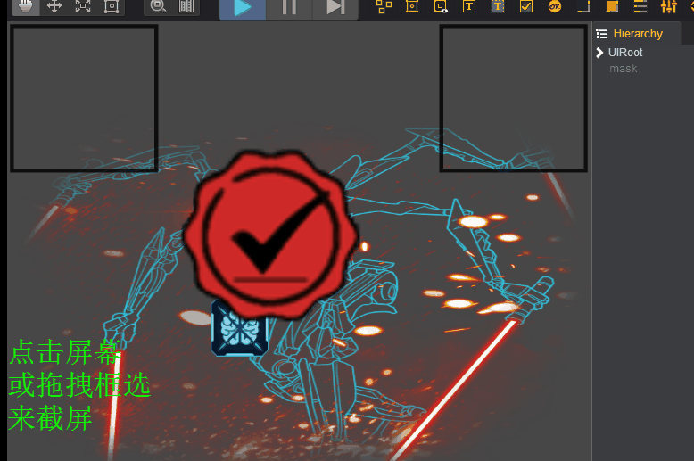
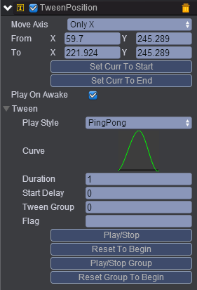
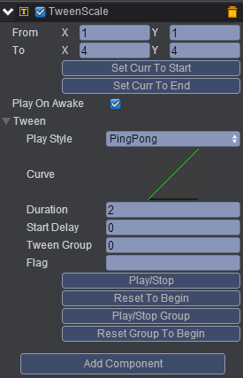
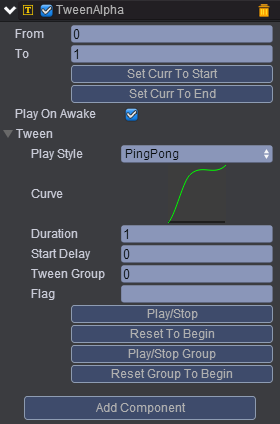
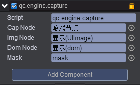
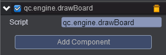

# 本范例演示截屏功能，效果图如下：<br>    
    

# UI     
 
* 界面布局可参考[slime](http://engine.zuoyouxi.com/demo/Layout/slime/index.html)。<br>     
* 布局完成后，在UIImage节点挂载TweenPosition组件，挂载Tween组件及组件具体属性信息，请参考[手册](http://docs.zuoyouxi.com/manual/Tween/index.html)，挂载完成后设置其属性值如下图在；<br>      
        

* 在Sprite节点挂载TweenScale组件，挂载完成后设置其属性值如下：<br>    
   

* 在UIText节点下挂载TweenAlpha组件，挂载完成后设置其属性值如下：<br>    
     

* 在Scripts文件夹下创建脚本capture.js，将该脚本挂载到UIRoot节点，并把对应的节点拖入到属性框，如下图：<br>   
 
    

* 代码如下：<br>     

```javascript   
var s = qc.Serializer;
var capture = qc.defineBehaviour('qc.engine.capture', qc.Behaviour, function() {

}, {
    capNode : s.NODE,
	imgNode : s.NODE,
    domNode : s.NODE,
    mask : s.NODE
});

// 节点被点击了，整个 capNode 截屏
capture.prototype.onClick = function() {
    this.capture();
};

// 拖拽开始，显示拖拽区域
capture.prototype.onDragStart = function(event) {
	this.mask.visible = true;
    this.mask.width = 0;
    this.mask.height = 0;
};

// 拖拽中，处理拖拽区域显示
capture.prototype.onDrag = function(event) {
	var source = event.source;
    var startX = source.startX;
    var startY = source.startY;
    var endX = source.x;
    var endY = source.y;
    
    this.mask.x = Math.min(startX, endX);
    this.mask.y = Math.min(startY, endY);
    this.mask.width = Math.abs(startX - endX);
    this.mask.height = Math.abs(startY - endY);
};

// 拖拽结束尝试截屏指定区域
capture.prototype.onDragEnd = function(event) {

    // 隐藏 mask 区域
    this.mask.visible = false;
    
    var source = event.source;
    var startX = source.startX;
    var startY = source.startY;
    var endX = source.x;
    var endY = source.y;
    
    // 根据世界矩阵，计算相对 capNode 的逻辑坐标
    var p1 = new qc.Point(Math.min(startX, endX), Math.min(startY, endY));
    var p2 = new qc.Point(Math.max(startX, endX), Math.max(startY, endY));
    var wt = this.capNode.worldTransform;
    p1 = wt.applyInverse(p1);
    p2 = wt.applyInverse(p2);
    
    var rectLeft = Math.max(p1.x, 0);
    var rectRight = Math.min(p2.x, this.capNode.width);
    var rectUp = Math.max(p1.y, 0);
    var rectDown = Math.min(p2.y, this.capNode.height);
    
    var p0 = wt.apply(new qc.Point(0, 0));
    p1 = wt.apply(new qc.Point(rectLeft, rectUp));
    p2 = wt.apply(new qc.Point(rectRight, rectDown));
    
    if (p2.x > p1.x && p2.y > p1.y)
        // 有效的区域
		this.capture(new qc.Rectangle(p1.x - p0.x, p1.y - p0.y, p2.x - p1.x, p2.y - p1.y));
};

// 截屏的逻辑
capture.prototype.capture = function(bounds) {
    // 1. 截屏到 Image 对象，删除 dom 上旧的 img，将当前图片加入进去
    var div = this.domNode.div;
    while (div.children.length) div.removeChild(div.children[0]);
    var img = this.capNode.snapshotAsImage(bounds, 150, 150);
    div.appendChild(img);
    img.style.width = '100%';
    img.style.height = '100%';
    
    // 现在已知 ios 的 safari 需要强制更改 div 属性，否则不会显示
    // desktop、安卓或者 Ios 的其他浏览器无这个问题。
    // 强制设置让其显示
    div.style.opacity = '0.999999';
    
    // 2. 截屏到 atlas 对象上
	this.capNode.snapshotAsAtlas('capture', bounds, 150, 150);
	this.imgNode.texture = null;
	this.imgNode.texture = this.game.assets.find('capture');
};       
```     

* 在Scripts文件夹下创建脚本drawBoard.js，把该脚本挂载到"Image挂载节点”与"dom挂载节点”上，如下图：<br>    
     

* 代码如下：<br>      

```javascript   

var drawBoard = qc.defineBehaviour('qc.engine.drawBoard', qc.Behaviour, function() {

}, {
    // fields need to serialize
});

//初始化
drawBoard.prototype.awake = function() {
	var ctx = this.gameObject;

	//画线
    ctx.moveTo(5, 5);
    ctx.lineStyle(4, 0x000000, 0.8);
    ctx.lineTo(155, 5);
    ctx.lineTo(155, 155);
    ctx.lineTo(5, 155);
    ctx.lineTo(5, 5);
};        
```

     
