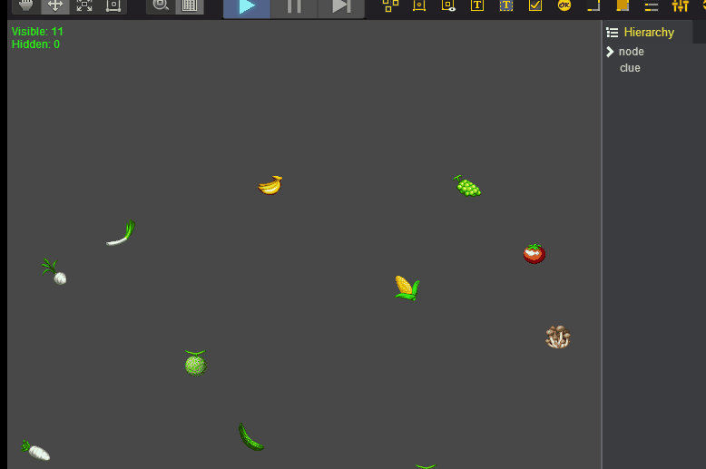
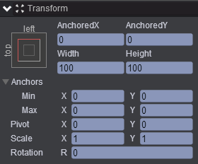
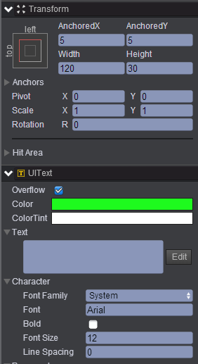
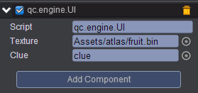

# create-if-null   
* 本范例演示定时创建图片，如果图片池中没有可用图片，则创建新的图片，效果图如下：<br>   
    

# UI   

* 创建一个Empty Node节点，取名为node，该节点属性值设置如下：<br>
    

* 创建一个Text节点，取名为clue，该节点属性值设置如下：<br>   
    

* 在Scripts文件夹下创建脚本 UI.js ，将该脚本挂载到node节点，并将Assets/atlas/fruit.bin与clue节点分别拖入到Texture与Clue属性中，如下图：<br>   
   

* 代码如下：<br>      

```javascript     

var UI = qc.defineBehaviour('qc.engine.UI', qc.Behaviour, function() {
    this.visibleCount = 0;
    this.hiddenCount = 5;
}, {
    texture: qc.Serializer.TEXTURE,
    clue: qc.Serializer.NODE
});

//初始化
UI.prototype.awake = function() {

    //  添加image节点
    for (var i = 0; i < this.hiddenCount; i++)
    {
        var image = this.game.add.image(this.gameObject);
        image.texture = this.texture;
        image.frame = 0;
        image.resetNativeSize();
        image.x = this.game.math.random(0, this.game.world.width);
        image.y = this.game.math.random(0, this.game.world.height);
        
        // 设置为不可见
        image.visible = false;
    }
    
    // 建立定时器
    this.timer = this.game.timer.loop(1000, this.resurrect, this);
};

UI.prototype.resurrect = function() {
    var children = this.gameObject.children;
    for (var i = 0; i < children.length; i++) {
        if (children[i].visible) continue;
        
        children[i].visible = true;
        children[i].frame = this.game.math.random(0, 36);
        this.visibleCount++;
        this.hiddenCount--;
        return;
    }
    
    // 创建新的image节点
    var image = this.game.add.image(this.gameObject);
    image.texture = this.texture;
    image.frame = this.game.math.random(0, 36);
    image.resetNativeSize();
    image.x = this.game.math.random(0, this.game.world.width);
    image.y = this.game.math.random(0, this.game.world.height);
    this.visibleCount++;
    
    if (this.visibleCount >= 20) {
        this.game.timer.remove(this.timer);
    }
};

//帧调度
UI.prototype.update = function() {
    this.clue.text = 'Visible: ' + this.visibleCount + 
        '\nHidden: ' + this.hiddenCount;
};     
```


