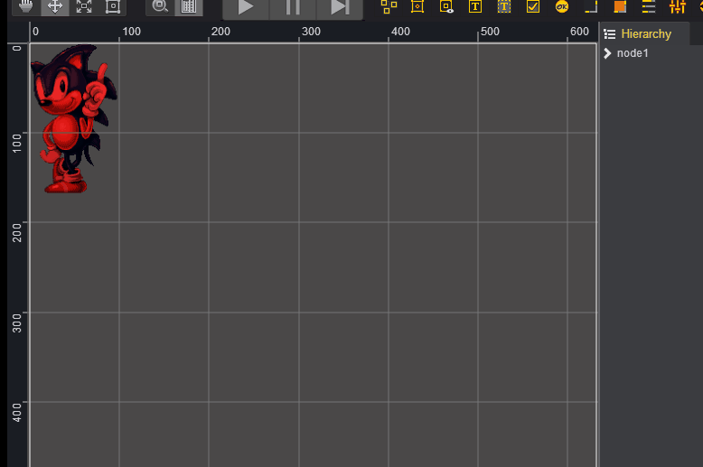
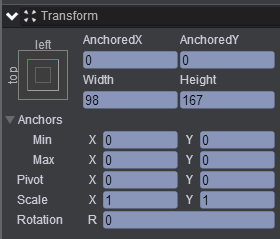
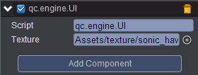

# create-node   

* 本范例演示创建图片挂载到指定节点下，效果图如下：<br>   
   

## UI    

* 创建一个Empty Node 节点取名为node1，并在该节点下创建Image节点取名image，image节点属性值设置如下：<br>     
   

* 在Scripts文件夹下创建脚本 UI.js，把该脚本挂载到node节点，并将Assets/texture/sonic_havok_sanity.bin拖入到Texture属性，如下图：<br>    
*    

* 代码如下：<br>   

```javascript     
var UI = qc.defineBehaviour('qc.engine.UI', qc.Behaviour, function() {
}, {
    texture: qc.Serializer.TEXTURE
});

//初始化
UI.prototype.awake = function() {
    //创建node节点
    var node = this.game.add.node();

    //在node节点下创建image节点
    for (var i = 0; i < 10; i++)
    {
        var image = this.game.add.image(node);
        image.texture = this.texture;
        image.resetNativeSize();
        image.x = this.game.math.random(0, this.game.world.width);
        image.y = this.game.math.random(0, this.game.world.height);
    }

};   
```
