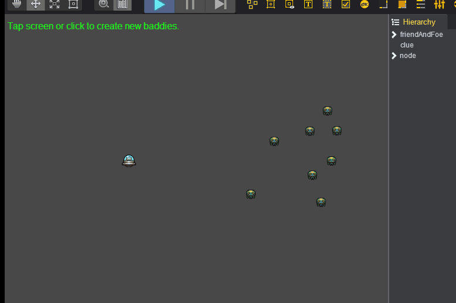
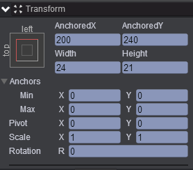
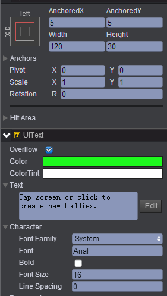
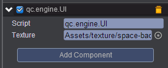

# createImageInNode  

* 本范例运行时，每点击一下屏幕产生一个Image节点，效果图如下：<br>
    

* 创建一个Empty Node节点取名friendAndFoe，在该节点下创建Image子节点，取名为ufo，ufo节点的属性值设置如下：<br>      
      

* 创建一个Text节点取名clue，该节点的属性值设置如下：<br>     
     

* 在Scripts文件夹下创建脚本 UI.js，将该脚本挂载到friendAndFoe节点，并将Assets/texture/space-baddie.bin拖入到Texture属性，如下图：<br>     
   

* 代码如下：<br>   

```javascript    
var UI = qc.defineBehaviour('qc.engine.UI', qc.Behaviour, function() {
}, {
    texture: qc.Serializer.TEXTURE
});

UI.prototype.awake = function() {
    this.addListener(this.game.input.onPointerUp, this.createBaddie, this);
    
    // 创建node节点
    this.enemies = this.game.add.node();
    
    // 创建Image节点
    for (var i = 0; i < 8; i++) this.createBaddie();
};

UI.prototype.createBaddie = function() {
    var self = this,
        math = self.game.math;
    var buddie = self.game.add.image(this.enemies);
    buddie.texture = this.texture;
    buddie.resetNativeSize();
    buddie.x = 360 + Math.random() * 200;
    buddie.y = 120 + Math.random() * 200;
};    
```

