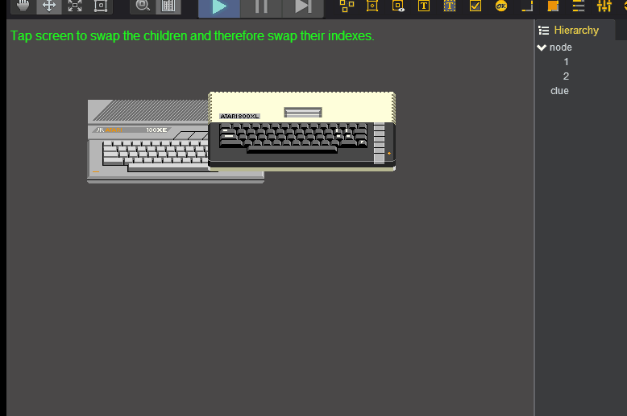
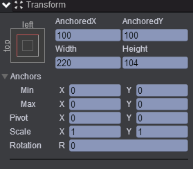
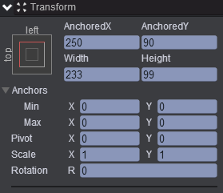
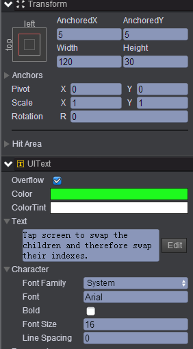
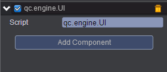

# swapChildrenInNode    

* 本范例介绍swapChildren的使用，运行时，会交换node节点的两个孩子的位置，效果图如下所示：<br>    
   

## UI    

* 创建一个Empty Node节点取名node，在node节点下创建两个Image节点，分别取名为1、2，节点1、2的属性值设置如下图所示：<br>     
* 节点1属性值如下；<br>   
  
     

* 节点2属性值如下：<br>     

     

* 创建一个Text节点取名为clue，该节点的属性值设置如下：<br>          
      

* 在Scripts文件夹下创建脚本 UI.js，把该脚本挂载到node节点，如下图：<br>      
    

* 代码如下：<br>   

```javascript    

var UI = qc.defineBehaviour('qc.engine.UI', qc.Behaviour, function() {
}, {
});

UI.prototype.awake = function() {
    this.addListener(this.game.input.onPointerUp, this.swap, this);
};

//交换两个孩子
UI.prototype.swap = function() {
    var child1 = this.gameObject.find('1'),
        child2 = this.gameObject.find('2');
	this.gameObject.swapChildren(child1, child2);
};    
```
