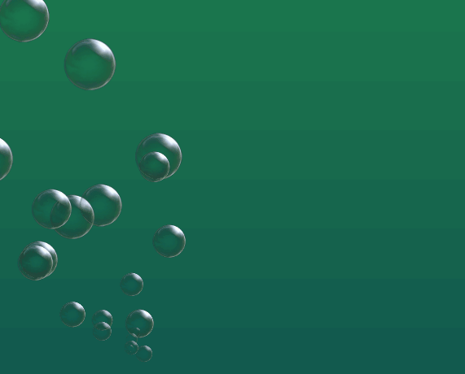
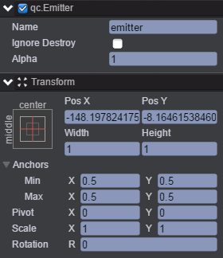
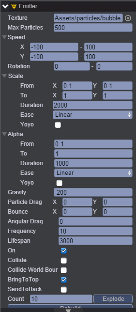
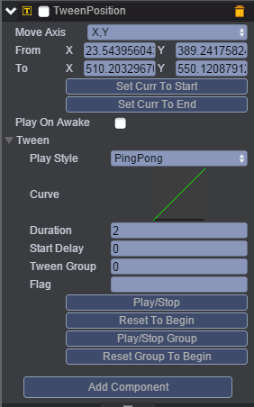

# AutoScale
本范例演示气泡Emitter（粒子发射器）的Scale(比例)，运行时，气泡从我们指定地方以一定时间产生，气泡逐渐变大至我们设置的Scale，效果图如下所示：    

  

## UI
* 创建一个Image节点并命名为background，该节点用于放置背景图。     

* 创建一个Emitter节点并取名emitter，emitter节点信息设置如下。    

* 在Inspector面板设置emitter节点的Emitter属性，如下图： 

* 属性的具体信息请查阅文档，[手册](http://docs.zuoyouxi.com/api/gameobject/CEmitter.html)。 
* 在emitter节点下挂载TweenPosition动画组件，挂载组件可以参考Tween动画下的Tween演示，挂载组件完后如下图： 

上述参数表示：气泡粒子从From移动到To，Curve为动画曲线，具体设置可参考[<<编辑动画曲线>>](http://docs.zuoyouxi.com/manual/Tween/index.html)