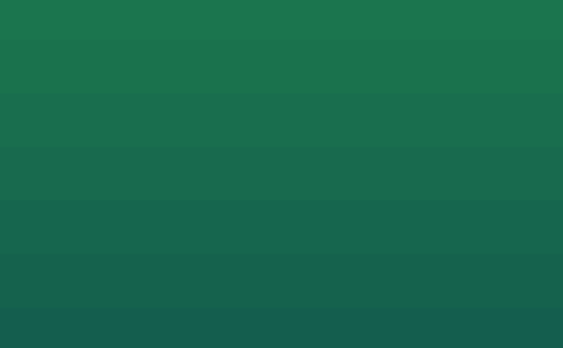
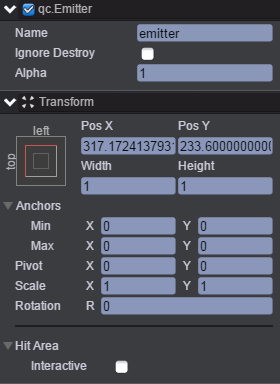
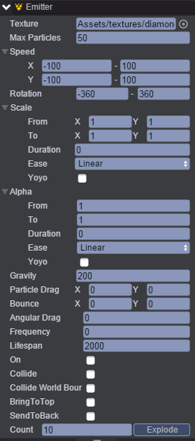
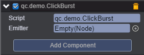

# ClickBurst
本范例演示点击屏幕产生粒子爆炸效果，运行时，点击屏幕，此时将会产生粒子爆炸的效果，效果图如下：<br>


# UI
* 创建一个Image节点并命名UIImage，该节点用于放置背景图片。<br>
* 创建一个Emitter节点并取名emitter，该节点用于产生粒子，emitter节点信息设置如下：<br>   

*    

* 在Inspector面板设置emitter节点的Emitter属性，如下图：<br>



* 属性的具体信息可参考API文档[《Emitter》](http://docs.zuoyouxi.com/api/gameobject/CEmitter.html)。<br>
* 在Scripts文件夹下创建脚本ClickBurst.js，保存并重新刷新界面，将脚本挂载到UIImage节点下，步骤是点击Inspector面板中的Add Component，此时出现如下界面：<br>

   

* 将emitter节点拖入到Emitter方框选项中，如下图：<br>

   

* 脚本ClickBurst.js负责捕捉鼠标点击的位置及响应事件，具体见代码注释，代码如下：<br>


```javascript

/**
 * 点击爆炸的粒子效果
 */
var ClickBurst = qc.defineBehaviour('qc.demo.ClickBurst', qc.Behaviour, function() {
    this.emitter = null;
}, {
    // 需要序列化的字段
    emitter: qc.Serializer.NODE
});

// 初始化处理
ClickBurst.prototype.onClick = function(e) {
    var self = this;
    if (!self.emitter) return;

    self.emitter.x = e.source.x;
    self.emitter.y = e.source.y;
    self.emitter.explode(self.emitter.lifespan, 10);
};    
```