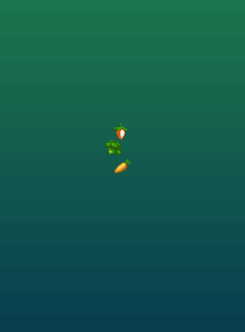
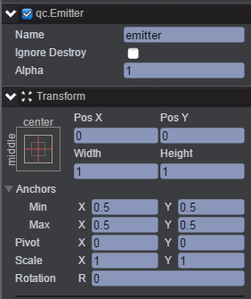
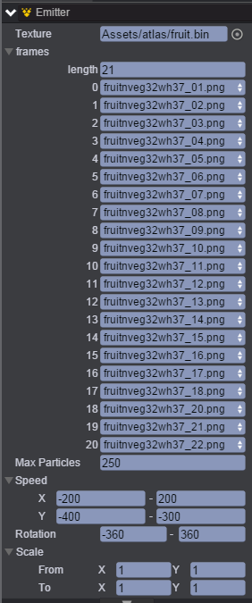
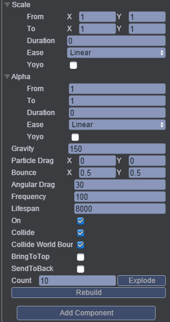

# Collison
本范例演示粒子系统中粒子碰撞检测，运行时，粒子与粒子碰撞时或者粒子与世界边界碰撞时都会产生反弹效果，效果图如下： 

# UI
* 创建Image节点并取名background，该节点用于放置背景图片。 
* 创建Emitter节点并命名emitter，该节点用于产生粒子，节点信息设置如下图： 

   

* 通过Inspector面板设置emitter节点的Emitter属性，如下图所示： 

* 上面参数表示：Length为21表示图片（粒子）的个数，即为粒子的种类，把图片资源依次放入0-20选项方框中，运行时，表示从第一个粒子一直产生到第二十一个粒子。最大粒子数量为250个。 

* 属性的具体信息可参考API文档[《Emitter》](http://docs.zuoyouxi.com/api/gameobject/CEmitter.html)。