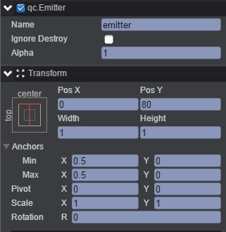
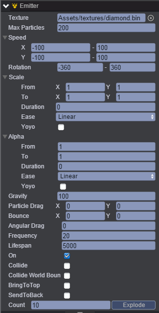

# DiamondBurst
本范例演示粒子系统中粒子爆炸效果，运行时，通过我们指定的位置模拟成粒子爆炸的效果，效果图如下： 

## UI
* 创建Image节点并命名background，该节点用于放置背景图片。 
* 创建Emitter节点并取名emitter，节点信息设置如下图： 

   

* 通过Inspector面板设置emitter节点的Emitter属性，如下图： 

* 属性的具体信息请参考API文档[《Emitter》](http://docs.zuoyouxi.com/api/gameobject/CEmitter.html)。