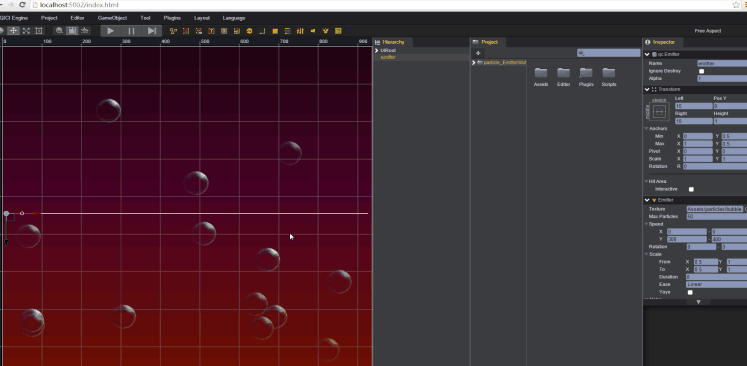
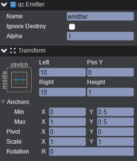
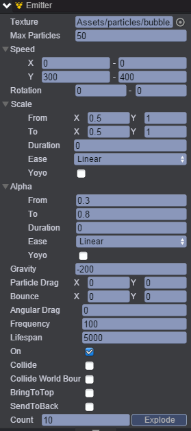
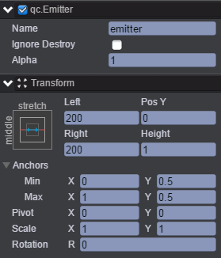

# EmitterWidth
本范例演示通过修改粒子的位置信息从而控制粒子的发射区域范围，效果图如下： 

## UI
* 创建一个Image节点并取名background，该节点用于放置背景图片。 
* 创建一个Emitter节点并命名emitter，该节点的信息设置如下图： 

  

* 通过Inspector面板修改emitter节点的Emitter属性，如下图所示： 

* 属性具体的信息可查看API文档[《Emitter》](http://docs.zuoyouxi.com/api/gameobject/CEmitter.html)。

* 由emitter节点的位置信息可以看出，粒子的发射区域是距离左右边界10，将距离修改则可以改变粒子的发射区域范围，如下图： 

