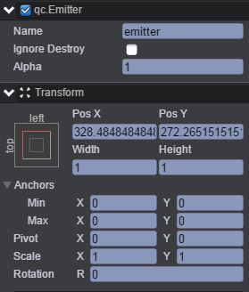
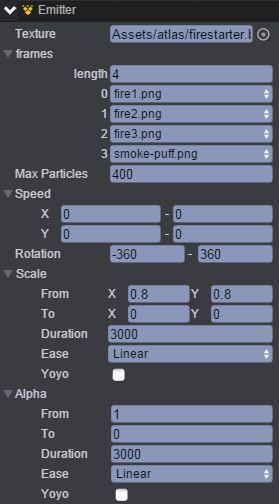
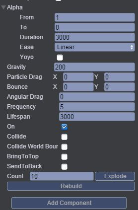
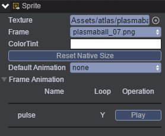
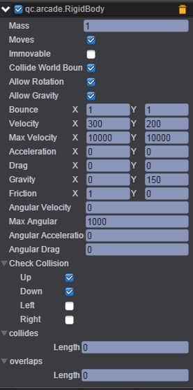
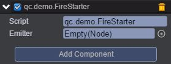
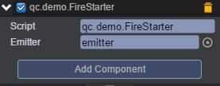

# FireStarter
本范例演示粒子跟随精灵移动，运行时，粒子跟随精灵一起运动，碰到世界边界将产生反弹的效果，效果图如下：<br>


## UI
* 创建一个Image节点并取名background，该节点用于放置背景图片。<br>
* 创建一个Emitter节点并命名emitter,该节点用于产生粒子，节点信息设置如下图：<br>


* 通过Inspector面板设置emitter节点的Emitter属性，如下图所示：<br>





* 属性的具体信息请查阅文档，[手册](http://docs.zuoyouxi.com/api/gameobject/CEmitter.html)，Texture选项方框中放置的是粒子图片资源，在length属性栏输入4，并把4张图片资源依次拖入0-3中。<br>
* 创建一个Sprite节点并取名ball，该节点用于添加帧动画，帧动画编辑请查看[《帧动画编辑》](http://docs.zuoyouxi.com/manual/FrameAnimation/index.html)，通过Inspector面板添加ball节点Sprite属性的帧动画，添加完帧动画后如下图：<br>


* 在ball节点下挂载插件，具体步骤是：首先点击菜单栏上“Plugins\PluginManager”，此时Inspector面板出现如下界面：<br>


* 把Arcade Physics勾选上，然后点击 Add Component，再选择Plugins\Arcade\RigidBody即添加插件完成，设置其属性值如下图所示：<br>



* 具体的属性信息，请查阅文档：[手册](http://docs.zuoyouxi.com/manual/Plugin/Arcade.html)。<br>
* 在Scripts文件夹下创建脚本FireStarter.js，并将该脚本挂载到ball节点下，如下图：


* 将emitter节点拖入到Emitter选项方框中，如下图：<br>



* 代码如下：<br>

```javascript
var FireStarter = qc.defineBehaviour('qc.demo.FireStarter', qc.Behaviour, function() {
    this.emitter = null;
}, {
    // 需要序列化的字段
    emitter: qc.Serializer.NODE
});

// 初始化处理
FireStarter.prototype.awake = function() {
    // 记录粒子发射器与精灵的相对位置
    var self = this;
    self._offset = new qc.Point(self.gameObject.x - self.emitter.x, self.gameObject.y - self.emitter.y);
};

// 帧调度
FireStarter.prototype.update = function() {
    var self = this;

    // 计算粒子的运动速度
    var rigid = self.getScript('qc.arcade.RigidBody');
    var px = rigid.velocity.x;
    var py = rigid.velocity.y;
    px *= -1;
    py *= -1;
    self.emitter.minParticleSpeed.set(px, py);
    self.emitter.maxParticleSpeed.set(px, py);

    // 保持相对位置不变
    self.emitter.x = self.gameObject.x - self._offset.x;
    self.emitter.y = self.gameObject.y - self._offset.y;
};    
```
