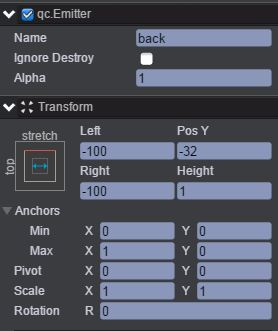
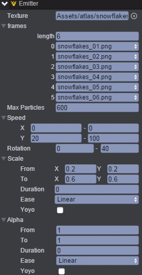
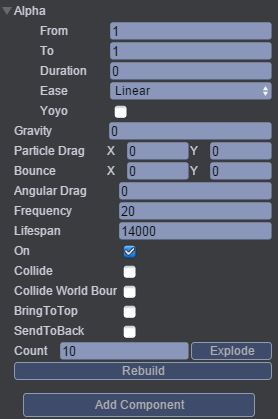
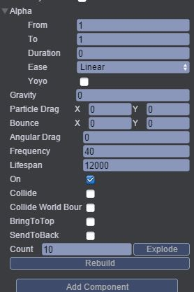
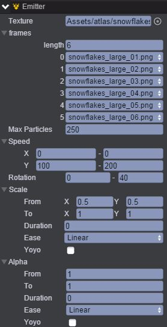
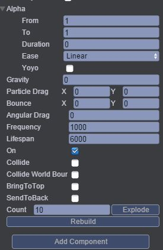

# Snow
本范例演示在一个场景中雪花飘落，运行时，有三个粒子发射器，分别是back、mid及front，表示back节点产生的粒子在最下层，mid节点在中层，front在最上面层，效果图如下： 

## UI
* 创建一个Image节点并取名为background，该节点用于放置背景图片。 
* 创建三个Emitter节点分别命名back、mid、front，这三个节点用于产生粒子，三个节点的位置信息都设置为如下图所示： 

* 通过Inspector面板设置back节点的Emitter属性，如下图所示： 

* 属性的具体信息可参考API文档[《Emitter》](http://docs.zuoyouxi.com/api/gameobject/CEmitter.html)，需要说明的是要把图片资源依次拖入0-5选项框中，表示back节点粒子产生时依次从粒子图片1到粒子图片6。 
* 同样通过Inspector面板设置mid节点及front节点的Emitter属性，如下图： 

* mid节点： 

* front节点： 

