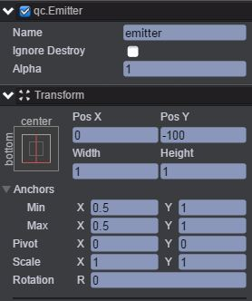
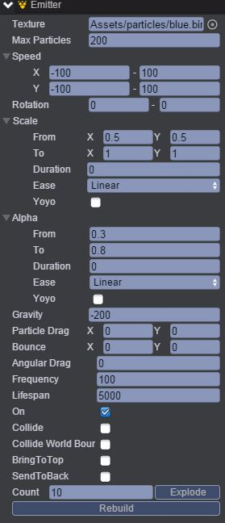

# Alpha
* 本范例演示粒子系统中的粒子透明度，运行时，粒子的透明度在设置的时间内会发生变化，效果图如下：    

## UI
* 创建一个Emitter节点并命名emitter，该节点信息设置如下图所示：   

* 通过Inspector面板设置emitter的Emitter属性，如下图：    

上面的各个属性名的作用可以参看API文档[《Emitter》](http://docs.zuoyouxi.com/api/gameobject/CEmitter.html)，这里只介绍Alpha（透明度），Alpha表示从0.3到0.8（透明度为1表示不透明）。