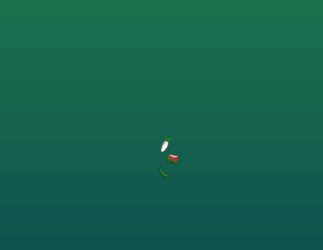
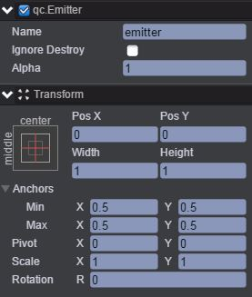
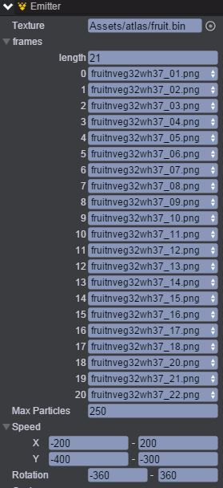
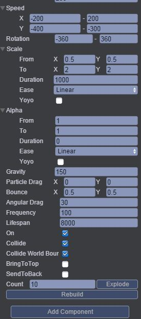

# Scale
本范例演示粒子系统中的粒子缩放比例，运行时，通过设置粒子缩放比可放大或者缩小粒子，效果图如下： 

## UI
* 创建一个Image节点并取名background，该节点用于放置背景图片。 
* 创建Emitter节点并命名emitter，该节点信息设置如下图所示： 

* 通过Inspector面板设置emitter节点的Emitter属性，如下图所示： 

Texture表示粒子使用的图片集，设置length为21表示21种不同种类的图片粒子，运行时，并依次产生。 

* 属性的具体信息可参看API文档[《Emitter》](http://docs.zuoyouxi.com/api/gameobject/CEmitter.html)。