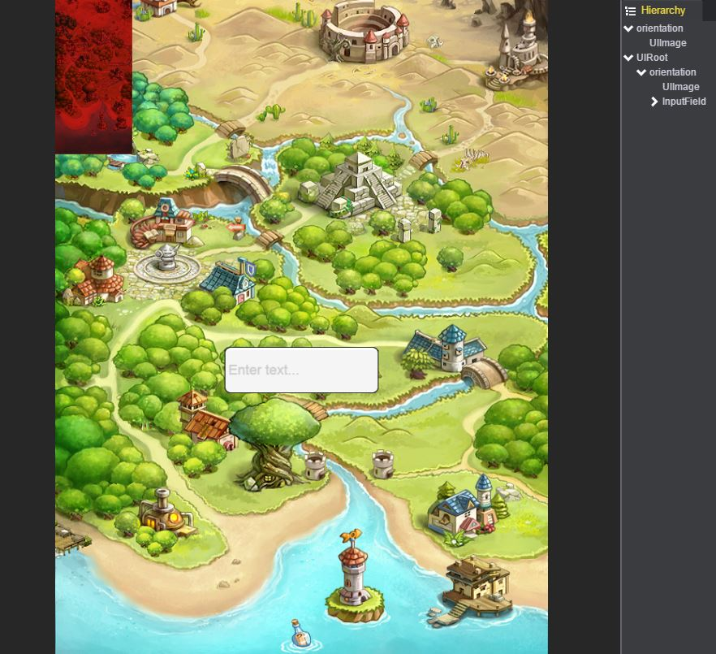
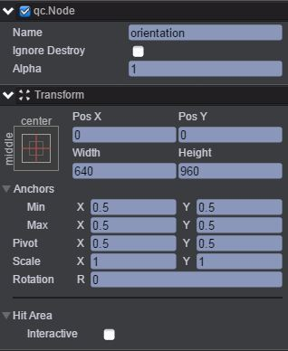
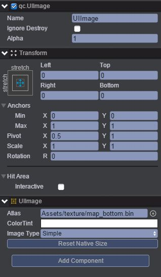
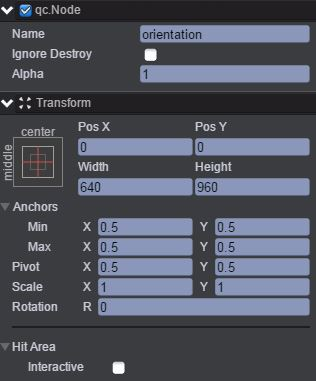
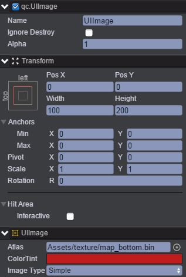
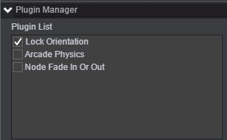
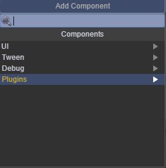
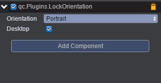

# 锁屏

本范例介绍锁屏插件，效果图如下： 

# UI
## orientation节点
* 创建一个Empty Node节点并命名orientation。节点信息设置如下： 

* 在orientation节点下创建Image节点并命名UIImage,该节点用于放置背景图，节点信息设置如下： 

## UIRoot节点
* 在UIRoot节点下创建一个Empty Node节点并命名orientation，节点信息设置如下： 

* 在orientation节点下创建一个Image节点并取名UIImage，节点信息设置如下： 

* 在orientation节点下创建一个InputField节点，该节点用于输入文本。 
## 挂载锁屏插件
* 在orientaton节点下挂载锁屏插件，步骤是：点击菜单栏上Plugins\Plugin Manager，此时出现如下界面： 

* 把Locker orientation勾选上。 
* 通过Inspector面板挂载orientation节点的锁屏插件，步骤是：点击Add Component，出现如下界面： 

* 选择Plugins\LockOrientation即完成添加锁屏插件，如下图： 

上图中Orientation有Landscape（横向）与Portrait（竖向）可选，本范例选择竖向。 