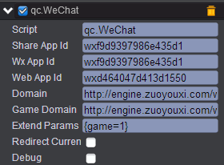
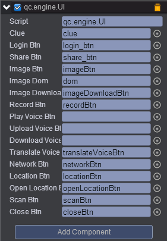
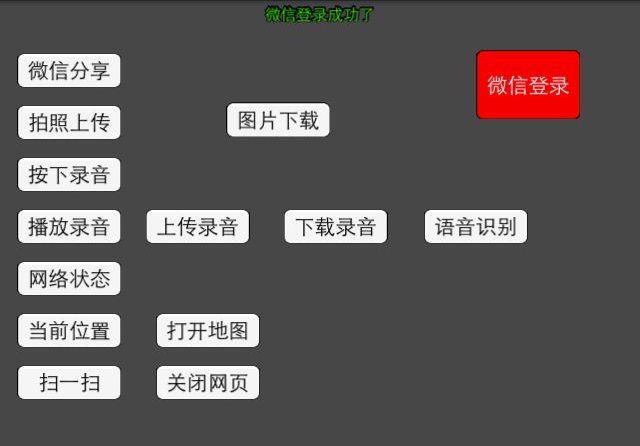
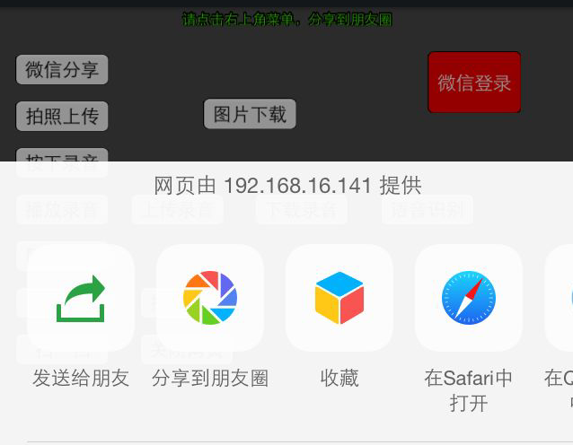
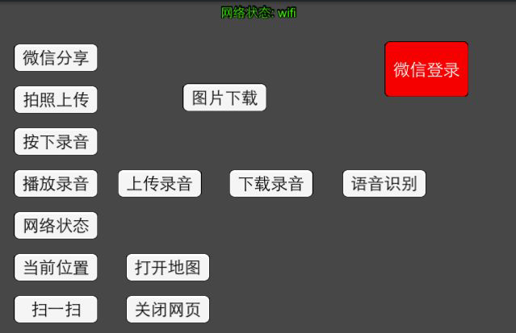

# wechat      
* 本范例介绍微信插件的使用，该插件对微信JS-SDK进行了进一步的封装，并提供了服务器后台部分的支持，借助本插件，开发者可以方便的实现微信登录、微信分享、扫一扫等功能，如需实现各项功能效果，请在手机微信里运行该demo。<br>    
    

##  UI        

* 界面布局可参考[《史莱姆》](http://engine.zuoyouxi.com/demo/Layout/slime/index.html)。<br>           
     
* 界面布局完成后，需要将weChat插件挂载到UIRoot节点，挂载weChat插件及插件属性可以查看[weChat插件](http://docs.zuoyouxi.com/manual/Plugin/Wechat.html)，挂载完成后的效果图如下：<br>          
     

* 在Scripts文件夹下创建脚本 UI.js，把该脚本挂载到UIRoot节点上，并把相应的节点拖入到对应的属性框，如下图：<br>          
       

* 在手机上运行时，下图只列出部分按钮的结果，想看所有按钮结果，请在微信上运行，效果图如下：<br>     

* 点击微信登录按钮，将登录微信。如下图：<br>    
            

* 点击微信分享按钮，出现如下图：<br>   
   
          


*  点击网络状态按钮时，由于测试时手机使用的是wifi，故显示的网络状态也是wifi，如下图：<br>       
          

* 代码如下；<br>        

```javascript             

var UI = qc.defineBehaviour('qc.engine.UI', qc.Behaviour, function() {
}, {
    clue: qc.Serializer.NODE,
    loginBtn: qc.Serializer.NODE,
    shareBtn: qc.Serializer.NODE,
    imageBtn: qc.Serializer.NODE,
    imageDom: qc.Serializer.NODE,
    imageDownloadBtn: qc.Serializer.NODE,
    recordBtn: qc.Serializer.NODE,
    playVoiceBtn: qc.Serializer.NODE,
    uploadVoiceBtn: qc.Serializer.NODE,
    downloadVoiceBtn: qc.Serializer.NODE,
    translateVoiceBtn: qc.Serializer.NODE,
    networkBtn: qc.Serializer.NODE,
    locationBtn: qc.Serializer.NODE,
    openLocationBtn: qc.Serializer.NODE,
    scanBtn: qc.Serializer.NODE,
    closeBtn: qc.Serializer.NODE
});

//初始化
UI.prototype.awake = function() {
    var self = this;
    var wx = this.getScript('qc.WeChat').wx;
    
    self.addListener(self.shareBtn.onClick, self.onShare, self);
    self.addListener(self.imageBtn.onClick, self.onImage, self);    
    self.addListener(self.imageDownloadBtn.onClick, self.onDownloadImage, self);  
    self.addListener(self.recordBtn.onDown, function() {
        // 按钮按下，开始录音
        self.recording = true;
        self.clue.text = '开始录音，松开按钮结束录音';
        wx.startRecord();
    });  
    self.addListener(self.recordBtn.onUp, function() {
        // 按钮松开，结束录音
        if (!self.recording) return;
        self.recording = false;
        wx.stopRecord(function(localId) {
            self.voiceLocalId = localId;
            self.onEndRecord();
        });
    });
    
    self.addListener(self.playVoiceBtn.onClick, function() {
        // 播放语音
        if (!self.voiceLocalId) {
            self.clue.text = '请先录音';
            return;
        }
        self.clue.text = '播放录音，localId=' + self.voiceLocalId;
        wx.playVoice();
    });
    
    self.addListener(self.uploadVoiceBtn.onClick, function() {
        // 上传语音
        if (!self.voiceLocalId) {
            self.clue.text = '请先录音';
            return;
        }
        self.clue.text = '开始上传录音，localId=' + self.voiceLocalId;
        wx.uploadVoice(self.voiceLocalId, 1, function(serverId) {
            self.clue.text = '录音上传完成，serverId=' + serverId;
            self.voiceServerId = serverId;
        });
    });
    
    self.addListener(self.downloadVoiceBtn.onClick, function() {
        // 下载语音
        if (!self.voiceServerId) {
            self.clue.text = '请先上传录音';
            return;
        }
        self.clue.text = '开始下载录音，serverId=' + self.voiceServerId;
        wx.downloadVoice(self.voiceServerId, 1, function(localId) {
            self.clue.text = '录音下载完成，localId=' + localId;
            self.voiceLocalId = localId;
        });
    });
    
    self.addListener(self.translateVoiceBtn.onClick, function() {
        // 语音识别
        if (!self.voiceLocalId) {
            self.clue.text = '请先录音';
            return;
        }
        self.clue.text = '开始语音识别，localId=' + self.voiceLocalId;
        wx.translateVoice(self.voiceLocalId, 1, function(text) {
            self.clue.text = '语音识别结果: ' + text;
        });
    });
    
    self.addListener(self.networkBtn.onClick, function() {
        // 获取网络状态
        wx.getNetworkType(function(type) {
            self.clue.text = '网络状态: ' + type;
        });
    });
    
    self.addListener(self.locationBtn.onClick, function() {
        // 获取当前位置
        wx.getLocation('wgs84', function(pos) {
            self.clue.text = '当前位置：lat=' + pos.latitude + ', lng=' + pos.longitude;
            self.pos = pos; 
        });
    });
    
    self.addListener(self.openLocationBtn.onClick, function() {
        // 打开当前位置地图
        if (!self.pos) {
            self.clue.text = '请先获取当前位置信息';
            return;
        }
        wx.openLocation(self.pos.latitude, self.pos.longitude);
    });
    
    self.addListener(self.scanBtn.onClick, function() {
        // 扫一扫
        self.clue.text = '开始扫码';
        wx.scanQRCode(function(r) {
            self.clue.text = '扫码结果:' + r;
        });
    });
    
    self.addListener(self.closeBtn.onClick, function() {
        // 关闭网页
        wx.closeWindow();
    });
    
    // 微信登录
    self.addListener(self.loginBtn.onClick, self.login, self);
    
    // 录音自动停止的处理
    self.doRecordEnd();
    
    // 监听微信登录的事件
    var wechat = this.getScript('qc.WeChat');
    self.addListener(wechat.onStartLogin, function() {
        self.clue.text = '微信登录中';
    });
    self.addListener(wechat.onLogin, function() {
        self.clue.text = '微信登录成功了';
    });
    self.addListener(wechat.sessionExpired, function() {
        self.clue.text = '会话过期了，access_token失效';
    });
};

// 分享的逻辑
UI.prototype.onShare = function() {
    var self = this;
    var wx = this.getScript('qc.WeChat').wx;
    wx.share('青瓷引擎', 'http://www.qiciengine.com/Public/Front/images/logo.png',
            'HTML5专业游戏引擎', 'http://www.qiciengine.com', function() {
        self.clue.text = '分享成功';
    });
    
    self.clue.text = '请点击右上角菜单，分享到朋友圈';
};

// 拍照并上传的逻辑
UI.prototype.onImage = function() {
    var self = this;
    var wx = this.getScript('qc.WeChat').wx;
    
    // 上传照片的逻辑
    var upload = function(localId) {
        self.clue.text = '开始上传照片';
        wx.uploadImage(localId, 1, function(serverId) {
            self.clue.text = '照片上传完毕，serverId=' + serverId;
            self.imageServerId = serverId;
        });
    };
    
    self.clue.text = '先从相机拍照或从相册中选择1张图片';
    wx.chooseImage(1, undefined, undefined, function(localIds) {
        self.clue.text = '图片选择完毕，localId=' + localIds[0];
        
        // 显示到dom中
        self.imageDom.innerHTML = "";
        
        // 延迟开始上传
        self.game.timer.add(2000, function() { upload(localIds[0]); });
    });
};

// 下载图片
UI.prototype.onDownloadImage = function() {
    var self = this;
    if (!self.imageServerId) {
        self.clue.text = '请先上传一张图片';
        return;
    }
    
    self.clue.text = '开始下载图片，serverId=' + self.imageServerId;
    var wx = this.getScript('qc.WeChat').wx;
    wx.downloadImage(self.imageServerId, 1, function(localId) {
        self.clue.text = '下载完成，localId=' + localId;
        
        // 显示到dom中
        self.imageDom.innerHTML = "";
    });
};

// 微信登录
UI.prototype.login = function() {
    var self = this,
        wechat = self.getScript('qc.WeChat');
	wechat.login();
};

// 注册录音停止的处理
UI.prototype.doRecordEnd = function() {
    var self = this,
        wx = this.getScript('qc.WeChat').wx;
    if (!wx.ready) {
        // 延迟继续检测
        self.game.timer.add(1000, self.doRecordEnd, self);
        return;
    }
    
    wx.onVoiceRecordEnd(function(localId) {
        self.recording = false;
        self.voiceLocalId = localId;
        self.onEndRecord();
    });
};          
``` 
