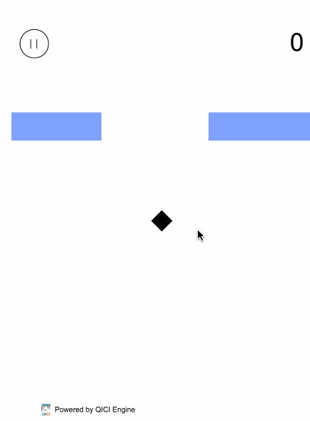

# 游戏名：[《跳跃的方块》](http://engine.zuoyouxi.com/game/JumpingBrick/)
  

# 教程内容
本文档完整介绍《跳跃的方块》的开发流程，重点演示如何使用青瓷引擎快速构建。  
文档中不对具体的业务逻辑、算法和数据结构进行详细解释，请读者自行参考源码和注释进行理解。  

请首先阅读：  
* [Hello World](http://docs.zuoyouxi.com/HelloWorld)
* [游戏制作与启动](http://docs.zuoyouxi.com/StartUp)
