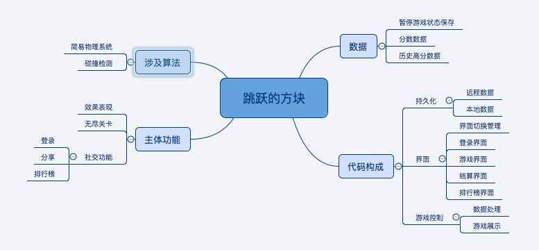

# 功能分析
根据游戏设定，解析出游戏的主体功能，需要使用的算法，需要持久化的数据，然后制订代码结构。如图所示：  
 

## 主要功能点
 1. 社交功能，比如：微信登录与分享，排行榜。
 2. 无尽关卡模式。
 3. 效果表现，比如死亡时屏幕震动等。

## 代码构成
将代码分为三大类：数据处理，界面控制，游戏控制。  
* __[创建工程和场景](Startup.md)__
* __[游戏世界](game/README.md)__
* __[数据处理](data/README.md)__
* __[界面控制](ui/README.md)__
