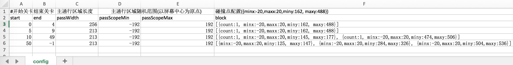

# 游戏配置
## 设置可调整参数
这个游戏中，一些参数会严重影响用户体验，需要进行不停的尝试，以找到最合适的设置。所以，这里将这些参数提取出来，群策群力，快速迭代出最终版本。  
分析游戏内容后，将游戏数据分为两类：

1. __关卡数据__ 如何生成关卡、如何生成阻挡。把这些数据配置到一个Excel文件JumpingBrick.xls中,并拷贝到Assets/excel目录下。内容如下：
 

2. __物理信息__ 游戏使用的物理碰撞比较简单，而且移动的方块自身有旋转45度，不太适合直接使用引擎的物理插件。故而这里直接设置方块上升的速度，下落的加速度等物理信息，由游戏脚本自己处理。

新建一个脚本GameConfig.js，内容如下：
````javascript
/*
 *  游戏配置
 */
var GameConfig = qc.defineBehaviour('qc.JumpingBrick.GameConfig', qc.Behaviour, function() {
    var self = this;

    // 设置到全局中
    JumpingBrick.gameConfig = self;
    
    // 等级配置
    self.levelConfigFile = null;
    
    // 游戏使用的重力
    self.gravity = -1600;
    
    // 点击后左右移动的速度
    self.horVelocity = 100;
    
    // 点击后上升的速度
    self.verVelocity = 750;

    // 点击后上升速度的持续时间
    self.verVelocityKeepTime = 0.001;

    // 锁定状态下竖直速度
    self.verLockVelocity = -200;

    // 块位置超过屏幕多少后，屏幕上升
    self.raiseLimit = 0.5;

    // 层阻挡高度
    self.levelHeight = 67;

    // 层间距
    self.levelInterval = 640;

    // 普通阻挡的边长
    self.blockSide = 45;

    // 方块的边长
    self.brickSide = 36;

    // 计算碰撞的最大时间间隔
    self.preCalcDelta = 0.1;

    // 关卡颜色变化步进
    self.levelColorStride = 5;

    // 关卡颜色的循环数组
    self.levelColor = [0x81a3fc, 0xeb7b49, 0xea3430, 0xf5b316, 0x8b5636, 0x985eb5];

    // 保存配置的等级信息
    self._levelConfig = null;

    self.runInEditor = true;
}, {
    levelConfigFile: qc.Serializer.EXCELASSET,
    gravity : qc.Serializer.NUMBER,
    horVelocity : qc.Serializer.NUMBER,
    verVelocity : qc.Serializer.NUMBER,
    verVelocityKeepTime : qc.Serializer.NUMBER,
    raiseLimit : qc.Serializer.NUMBER,
    levelHeight : qc.Serializer.NUMBER,
    levelInterval : qc.Serializer.NUMBER,
    blockSide : qc.Serializer.NUMBER,
    preCalcDelta : qc.Serializer.NUMBER,
    levelColorStride : qc.Serializer.NUMBER,
    levelColor : qc.Serializer.NUMBERS
});

GameConfig.prototype.getGameWidth = function() {
    return this.gameObject.width;
};

GameConfig.prototype.awake = function() {
    var self = this;
    
	// 将配置表转化下，读取出等级配置
    var rows = self.levelConfigFile.sheets.config.rows;
    var config = [];
    var idx = -1, len = rows.length;
    while (++idx < len) {
        var row = rows[idx];
        // 为了方便配置，block部分使用的是javascript的数据定义语法
        // 通过eval转化为javascript数据结构
        row.block = eval(row.block);
        config.push(row);
    }

    self._levelConfig = config;

    // 计算出方块旋转后中心到顶点的距离
    self.brickRadius = self.brickSide * Math.sin(Math.PI / 4);
};

/*
 *  获取关卡配置
 */
GameConfig.prototype.getLevelConfig = function(level) {
    var self = this;
    var len = self._levelConfig.length;
    while (len--) {
        var row = self._levelConfig[len];
        if (row.start > level || (row.end > 0 && row.end < level)) {
            continue;
        }
        return row;
    }
    return null;
};
````

