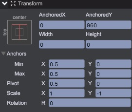
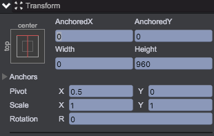
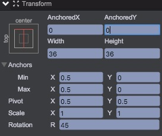
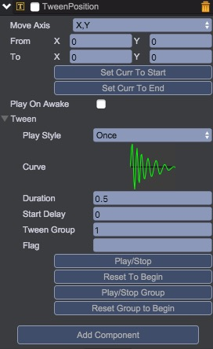
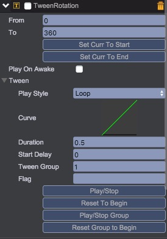
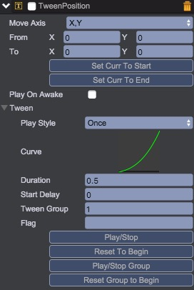

# 控制展示游戏世界
经过前面的准备，虚拟游戏世界已经构建完成，开始着手将虚拟世界呈现出来。

## 添加图形资源
导入所有的图形资源到Assets/atlas/main@atlas下，并重新打包图集。  
 <video controls="controls" src="../../video/import_atlas.mp4"></video>

## 创建功能按钮和界面
在game下添加引导界面、暂停按钮(UIImage)、分数显示(UIText)、暂停界面(Node)、暂停界面下的恢复按钮(UIImage)和一个半透明层(UIImage)
* __暂停按钮__  
暂停按钮的范围为相对于父节点左上角(20, 20, 70, 70)，并且需要能接受事件。  
 <video controls="controls" src="../../video/create_pause.mp4"></video>

* __分数显示__  
分数显示区域为相对于父节点右上角(width - 90, 20, width - 110, 70)的范围，并设置文本向右对齐。  
 <video controls="controls" src="../../video/create_score.mp4"></video>

* __暂停界面__  
暂停界面有一个屏蔽操作用的半透明遮罩和一个恢复按钮组成。遮罩需要铺满全屏，恢复按钮以父节点的中心为锚点，向下偏移40。
遮罩和恢复按钮都需要接受事件。  
 <video controls="controls" src="../../video/create_pausePanel.mp4"></video>

* __引导界面__
引导界面提示玩家应该如何操作，以屏幕中心为描点，进行布局。
 <video controls="controls" src="../../video/create_manual.mp4"></video>


*一点关于布局的理解*
> 显示的内容可以看做一个矩形区域，Pivot控制节点原点在矩形区域中的位置，Anchors和偏移值(left,right,top, bottom, anchoredX, anchoredY, width, height)则控制矩形四个顶点的位置。  
> 所以设置时，先确定希望节点原点的位置，设置好Pivot后，根据希望的矩形设置四个顶点的位置。  
> 假设：父节点的高度、宽度分别为h、w。那么当四个边可以根据公式表达分别为:  
> * x1 = a1 * w + b1
> * x2 = a2 * w + b2
> * y1 = c1 * h + d1
> * y2 = c2 * h + d2  

> __就可以通过如下设置达到希望的效果：__  

> * anchor中 minX = a1, maxX = a2。当a1 === a2时，设置width = -b2 - b1；否则设置left = b1，right = -b2。
> * anchor中 minY = c1, maxY = c2。当c1 === c2时，设置height = -d2 - d1; 否者设置top = d1，right = -d2。

## 创建游戏世界的基础坐标系
在[前面章节](README.md)中创建的game节点，是一个铺满屏幕的节点，可以理解为对应屏幕，且Pivot为(0,0)，那么坐标系为从左上到右下的一个坐标系，这个坐标系和虚拟世界的不同，需要转换下。
在game节点下创建一个节点origin，把origin作为显示虚拟世界的原点。
1. 先调整x轴的坐标系。
    调整origin的width为0，MinAnchors中的minX,maxX调整为0.5。这样origin就位于父节点的水平中心上。
2. 在调整y轴方向。
    原来的y轴正方向为从上至下，而虚拟世界的却是从下至上，所以对节点进行垂直翻转(scaleY = -1)来达到预期效果。
3. 调整y轴原点位置。
    垂直翻转后，原点位置位于屏幕上边缘，通过设置AnchoredY=960将节点移动到屏幕下边缘。
最终该节点的布局参数如下：  


## 映射规则
* 原点所在的y轴即为游戏的deadLine。
* 方块在屏幕中的位置为：y - deadLine。
* 关卡在屏幕中的位置为：-deadLine。

## 创建关卡父节点
在虚拟世界的创建过程中，分析了关卡的特性，在显示时只需要显示屏幕中的关卡，甚至连创建也不需要，并且关卡是一个连着一个，有点类似于单列表格的形式。于是这里选择使用官方插件中的[TableView][TableView]来实现关卡效果。
使用[TableView][TableView]时，需要为所有的关卡创建一个父节点，和创建方块类似，我们创建一个levels的Node节点，作为所有关卡的父节点。
布局参数如下：  


## 创建方块
在origin节点下创建一个UIImage节点:brick。设置它相对于父节点的上边缘水平中心为锚点，以自己的中心为中心，旋转45度。
最终布局参数如下：  


创建坐标系、关卡父节点、方块的具体操作如下：  
 <video controls="controls" src="../../video/create_brick_levels.mp4"></video>

## 创建关卡数据适配器
使用[TableView][TableView]时，还需要一个数据适配器([TableViewAdapter][TableViewAdapter])来提供关卡数据。
先引入插件ExtraUI([com.qici.extraUI][ExtraUI])，建立一个脚本LevelAdapter。内容如下:  
````javascript
var LevelAdapter = qc.defineBehaviour('qc.engine.LevelAdapter', com.qici.extraUI.TableViewAdapter, function() {
	var self = this;
	
	// 载入配置和游戏世界
    self.config = JumpingBrick.gameConfig;
    self.world = JumpingBrick.gameWorld;
}, {
});

LevelAdapter.prototype.awake = function() {
};

/**
 * 获取表格大小，x、y同时只能有一个为Infinity
 * @return {{x: number|Infinity, y: number| Infinity}}
 */
LevelAdapter.prototype.getTableSize = function() {
    // 关卡为无限的
	return { x: 1, y: Infinity};
};

/**
 * 根据在Table中的点返回对应的单元格
 * @param  {number} x - x轴坐标
 * @param  {number} y - y轴坐标
 * @return {{x: number, y: number}}} 返回点所在的单元格信息
 */
LevelAdapter.prototype.findCellWithPos = function(x, y) {
    // 第一个格子为第一屏960的高度，第二个格子为第一关
	return { 
		x: 0,
		y: y < 960 ? 0 : (1 + Math.floor((y - 960) / this.config.levelInterval))
	};
};

/**
 * 获取节点的显示位置
 */
LevelAdapter.prototype.getCellRect = function(col, row) {
    if (row === 0) 
        return new qc.Rectangle(0, 0, 100, 960);
    else
        return new qc.Rectangle(0, 960 + (row - 1) * this.config.levelInterval, 100, this.config.levelInterval);
};

/**
 * 节点处于不可见时，回收节点，
 * @param  {qc.Node} cell - 节点
 * @param  {number} col - 所在列
 * @param  {number} row - 所在行
 */
LevelAdapter.prototype.revokeCell = function(cell, col, row) {
    // 关卡不可见时，删除已经生成的关卡数据
	this.world.deleteLevelInfo(row - 1);
};

/**
 * 节点处于可见时，创建节点，
 * @param  {qc.Node} cell - 节点
 * @param  {number} col - 所在列
 * @param  {number} row - 所在行
 */
LevelAdapter.prototype.createCell = function(cell, col, row) {
    // 创建关卡时，设置关卡信息
	var self = this,
		levelInfo = self.world.getLevelInfo(row - 1);
	cell.levelShow.setLevelInfo(levelInfo);
};
````

## 创建关卡的单元格处理脚本
创建脚本LevelShow，用来控制关卡预制的显示方式。
内容如下：  
````javascript
var LevelShow = qc.defineBehaviour('qc.engine.LevelShow', qc.Behaviour, function() {
    // 将脚本对象关联到节点上
	this.gameObject.levelShow = this;
}, {
	leftLevel : qc.Serializer.NODE,   // 关卡左边阻挡
	rightLevel : qc.Serializer.NODE,  // 关卡右边阻挡
	block : qc.Serializer.NODE        // 阻挡块的父节点
});

LevelShow.prototype.onDestory = function() {
    // 释放关联
	this.gameObject.levelShow = null;
};

LevelShow.prototype.update = function() {
	var self = this,
		width = JumpingBrick.gameConfig.getGameWidth();
    // 如果是电脑浏览器打开，游戏显示的宽度可能会变化，所以需要根据屏幕宽度的变化，动态调整关卡阻挡的范围。
    // 防止左右两边出现空白区域
	if (width !== self.recordWidth) {
		var diff = (width - self.recordWidth) / 2;
		self.recordWidth = width;

		if (diff + self.leftLevel.width > 0) {
			self.leftLevel.x -= diff;
			self.leftLevel.width += diff;	
		}
		
		if (diff + self.rightLevel.width > 0) {
			self.rightLevel.width += diff;	
		}
	}
};

LevelShow.prototype.setLevelInfo = function(levelInfo) {
	var self = this,
		width = JumpingBrick.gameConfig.getGameWidth();
	var blockChildren = self.block.children;
	var blockLen = blockChildren.length;

	self.recordWidth = width;
	if (!levelInfo) {
		self.leftLevel.visible = self.rightLevel.visible = false;
		while (blockLen--) {
			blockChildren[blockLen].visible = false;
		}
		return;
	}
	var passArea = levelInfo.passArea,
		color = new qc.Color(levelInfo.color);

	self.leftLevel.visible = self.rightLevel.visible = true;
	// 设置左边阻挡
	self.leftLevel.x = -0.5 * width;
	self.leftLevel.y = passArea.y;
	self.leftLevel.width = passArea.x - self.leftLevel.x;
	self.leftLevel.height = passArea.height;
	self.leftLevel.colorTint = color;

	// 设置右边阻挡
	self.rightLevel.x = passArea.x + passArea.width;
	self.rightLevel.y = passArea.y;
	self.rightLevel.width = 0.5 * width - self.rightLevel.x;
	self.rightLevel.height = passArea.height;
	self.rightLevel.colorTint = color;

	// 确保块够用
	while (blockLen < levelInfo.block.length) {
		blockLen++;
		self.game.add.clone(self.leftLevel, self.block);
	}

	blockChildren = self.block.children;
	blockLen = blockChildren.length;
	var idx = -1;
	while (++idx < blockLen) {
		var blockInfo = levelInfo.block[idx];
		if (!blockInfo) {
			blockChildren[idx].visible = false;
		}
		else {
			blockChildren[idx].colorTint = color;
			blockChildren[idx].visible = true;
			blockChildren[idx].x = blockInfo.x;
			blockChildren[idx].y = blockInfo.y;
			blockChildren[idx].width = blockInfo.width;
			blockChildren[idx].height = blockInfo.height;
		}
	}
};

````

## 创建关卡预制
创建一个预制level，level下有三个节点：leftLevel(UIImage)，rightLevel(UIImage)，block(Node)。
并为其添加上一步创建的脚本LevelShow。
<video controls="controls" src="../../video/create_level_show.mp4"></video>

## 构建控制脚本
### 创建脚本GameControl
创建脚本，并预设功能相关的节点，监听相关事件。具体实现如下：
````javascript
/**
 * 游戏控制，将虚拟世界投影到游戏世界，并管理暂停等处理
 */
var GameControl = qc.defineBehaviour('qc.JumpingBrick.GameControl', qc.Behaviour, function() {
	var self = this;

    // 设置到全局中
    JumpingBrick.gameControl = self;

    // 方块
    self.brick = null;

    // 关卡的父节点，用于动态挂载关卡节点
    self.levelParent = null;

    // 开始指引界面
    self.startManual = null;

    // 暂停界面
    self.pausePanel = null;

    // 暂停按钮
    self.pauseButton = null;

    // 回到游戏按钮
    self.resumeButton = null;

    // 当前的状态
    self._state = 0;
}, {
    brick: qc.Serializer.NODE,
    tableViewNode : qc.Serializer.NODE,
    scoreText: qc.Serializer.NODE,
    levelParent: qc.Serializer.NODE,
    startManual: qc.Serializer.NODE,
    pausePanel: qc.Serializer.NODE,
    pauseButton: qc.Serializer.NODE,
    resumeButton: qc.Serializer.NODE
});

/**
 * 初始化
 */
GameControl.prototype.awake = function() {
	var self = this,
		config = JumpingBrick.gameConfig;

    // 监听节点的鼠标或者触摸按下事件
    self.addListener(self.gameObject.onDown, self.doPointDown, self);
    // 监听键盘事件
    self.addListener(self.game.input.onKeyDown, self.doKeyDown, self);
    // 监听暂停按钮
    self.pauseButton && self.addListener(self.pauseButton.onClick, self.doPause, self);
    // 监听恢复按钮
    self.resumeButton && self.addListener(self.resumeButton.onClick, self.doResume, self);
    // 监听游戏结束
    self.addListener(JumpingBrick.gameWorld.onGameOver, self.doGameOver, self);

  	// 监听分数变化
  	self.addListener(JumpingBrick.gameWorld.onScoreChanged, self.doScoreChanged, self);

    // 获取Brick上的结束时播放的TweenPosition
    self._brickTweenPosition = self.brick.getScript('qc.TweenPosition');
    if (self._brickTweenPosition)
    self.addListener(self._brickTweenPosition.onFinished, self.doGameFinished, self);

    // 获取levelParent上的结束时播放的TweenPosition
    self._levelTweenPosition = self.levelParent.getScript('qc.TweenPosition');

    // 根据配置初始化方块信息
    if (self.brick) {
    	self.brick.width = self.brick.height = config.brickSide;
    	self.brick.rotation = Math.PI / 4;
    }

    // 初始化
    self.switchState(GameControl.STATE_MANUEL);
};

/**
 * 销毁时
 */
GameControl.prototype.onDestroy = function() {
   // 预生成的关卡节点清理
    this._blockPool = [];

    // 使用中的关卡节点清理
    this._showLevel = [];
};
````
### 运行时状态管理
游戏运行时，分为开始引导、游戏运行、游戏暂停、游戏结束4个状态，对这四个状态进行统一管理。代码如下：  
````javascript
/**
 * 游戏开始时，指引界面状态
 */
GameControl.STATE_MANUEL 	= 0;
/**
 * 游戏运行状态
 */
GameControl.STATE_RUN 		= 1;
/**
 * 游戏暂停状态
 */
GameControl.STATE_PAUSE 	= 2;

/**
 * 游戏结束处理
 */
GameControl.STATE_GAMEOVER 	= 3;

/**
 * 切换状态
 */
GameControl.prototype.switchState = function(state) {
	var self = this;
	self.state = state;
	self.startManual.visible = self.state === GameControl.STATE_MANUEL;
	if (self.startManual.visible) {
		// 进入开始引导时，必须重置游戏世界
		JumpingBrick.gameWorld.resetWorld();
		self.tableViewNode.getScript('com.qici.extraUI.TableView').revokeAllCell();
	}

 	self.pausePanel.visible = self.state === GameControl.STATE_PAUSE;
    // 同步虚拟世界和显示
 	self.syncWorld();
};
````

### 处理暂停和恢复时的数据保存及恢复
````javascript

/**
 * 保存游戏
 */
GameControl.prototype.saveGameState = function() {
	var self = this,
		gameWorld = JumpingBrick.gameWorld,
		data = JumpingBrick.data;
    if (!data)
        return;
    var saveData = gameWorld.saveGameState();
    data.saveGameState(saveData);
};

/**
 * 恢复游戏
 */
GameControl.prototype.restoreGameState = function() {
	var self = this,
		gameWorld = JumpingBrick.gameWorld,
		data = JumpingBrick.data;
    if (!data)
        return;
	var saveData = data.restoreGameState();
	if (saveData) {
		gameWorld.restoreGameState(saveData);
		self.switchState(GameControl.STATE_PAUSE);	
	}
};

/**
 * 清理游戏
 */
GameControl.prototype.clearGameState = function() {
	var self = this,
		data = JumpingBrick.data;
    if (!data)
        return;
	data.clearGameState();
};

````

### 处理功能效果
对暂停、恢复进行处理。  
````javascript
/**
 * 处理暂停
 */
GameControl.prototype.doPause = function() {
	var self = this;
	self.saveGameState();
	self.switchState(GameControl.STATE_PAUSE);
};

/**
 * 处理恢复
 */
GameControl.prototype.doResume = function() {
	var self = this;
	self.clearGameState();
	self.switchState(GameControl.STATE_RUN);
};
````

### 处理输入事件处理
让游戏支持输入。  
````javascript
/**
 * 处理方块跳跃
 */
GameControl.prototype.doBrickJump = function(direction) {
	var self = this,
		world = JumpingBrick.gameWorld;

	if (self.state === GameControl.STATE_MANUEL) {
		// 引导状态跳跃直接切换到运行状态
		self.switchState(GameControl.STATE_RUN);
	}

	world.brickJump(direction);
};

/**
 * 处理点击
 */
GameGControl.prototype.doPointDown = function(node, event) {
	var self = this;
	if (self.state !== GameControl.STATE_MANUEL &&
		self.state !== GameControl.STATE_RUN) {
		return;
	}
	var localPoint = self.gameObject.toLocal({x: event.source.x, y: event.source.y});
	var halfWidth = self.gameObject.width * 0.5;
	self.doBrickJump(localPoint.x - halfWidth);
};

/**
 * 处理键盘
 */
GameControl.prototype.doKeyDown = function(keycode) {
	var self = this;
	if (keycode === qc.Keyboard.LEFT || keycode === qc.Keyboard.RIGHT) {
        if (self.state !== GameControl.STATE_MANUEL &&
			self.state !== GameControl.STATE_RUN) {
			return;
		}
        self.doBrickJump(keycode === qc.Keyboard.LEFT ? -1 : 1);
    }
    else if (keycode === qc.Keyboard.ENTER || keycode === qc.Keyboard.SPACEBAR) {
    	if (self.state === GameControl.STATE_RUN) {
    		self.doPause();
    	}
    	else if (self.state === GameControl.STATE_PAUSE) {
    		self.doResume();
    	}
    }
};
````

### 处理游戏世界的事件
需要处理游戏世界反馈回来的分数变更和游戏结束事件。  
````javascript
/**
 * 分数变更
 */
GameControl.prototype.doScoreChanged = function(score) {
	var self = this;
	if (self.scoreText) {
		self.scoreText.text = '' + score;
	}
	JumpingBrick.data.buildShareContent(score);
};

/**
 * 处理游戏结束
 */
GameControl.prototype.doGameOver = function(type) {
	var self = this;
	// 切换状态
	self.switchState(GameControl.STATE_GAMEOVER);
	// 播放结束动画
	if (type !== qc.JumpingBrick.GameWorld.GAMEOVER_DEADLINE && self._brickTweenPosition) {
		if (self._levelTweenPosition) {
			self._levelTweenPosition.setCurrToStartValue();
		    self._levelTweenPosition.setCurrToEndValue();
		    self._levelTweenPosition.to.x += 6;
		    self._levelTweenPosition.to.y += 6;
		    self._levelTweenPosition.resetToBeginning();
		    qc.Tween.playGroup(self.levelParent, 1);
		}
		self._brickTweenPosition.setCurrToStartValue();
		self._brickTweenPosition.setCurrToEndValue();
		self._brickTweenPosition.to.y = -2 * JumpingBrick.gameConfig.brickRadius;
		self._brickTweenPosition.duration = Math.max(0.01, Math.sqrt(Math.abs(2 * (self._brickTweenPosition.to.y - self._brickTweenPosition.from.y) / JumpingBrick.gameConfig.gravity)));	
		self._brickTweenPosition.resetToBeginning();
		qc.Tween.playGroup(self.brick, 1);
	}
	else {
		self.doGameFinished();
	}
	
};

/**
 * 处理游戏完结
 */
GameControl.prototype.doGameFinished = function() {
	var self = this;
	// 更新数据
    if (JumpingBrick.data)
		JumpingBrick.data.saveScore(JumpingBrick.gameWorld.score);

	// 切换到结算界面
	qc.Tween.stopGroup(self.brick, 1);
	qc.Tween.stopGroup(self.levelParent, 1);
	self.brick.rotation = Math.PI / 4;
    // 当不存在界面管理时，直接重新开始游戏
    if (JumpingBrick.uiManager)
		JumpingBrick.uiManager.switchStateTo(qc.JumpingBrick.UIManager.GameOver);
    else
        self.switchState(GameControl.STATE_MANUEL);
};

````

### 调度游戏并同步世界显示
````javascript

GameControl.prototype.resetFPS = function() {
	var self = this;
	self.game.debug.total = 0;
	self._fpsCount = 1;
};

/**
 * 每帧更新
 */
GameControl.prototype.update = function() {
	var self = this;

	if (self.state === GameControl.STATE_RUN) {
		// 只有运行状态才处理虚拟世界更新
		var delta = self.game.time.deltaTime * 0.001;
		JumpingBrick.gameWorld.updateLogic(delta);
		self.syncWorld();
	}

	// 帧率分析，如果当前能支持60帧则60帧调度
	if (self._fpsCount > 50) {
		var cost = self.game.debug.total / self._fpsCount;
		self._fpsCount = 1;
		self.game.debug.total = 0;
		if (cost < 10) {
			self.game.time.frameRate = 60;
		}
		else {
			self.game.time.frameRate = 30;
		}
	}
	else {
		self._fpsCount++;
	}
};


/**
 * 同步世界数据
 */
GameControl.prototype.syncWorld = function() {
	var self = this,
		world = JumpingBrick.gameWorld;

	// 同步方块
	self.brick.x = world.x;
	self.brick.y = world.y - world.deadline;

	self.levelParent.y = -world.deadline;
};
````

## 组合脚本
* 保存场景，刷新编辑页面，让编辑器能载入设置的插件。
* 将GameConfig, GameWorld, GameControl, LevelAdapter都挂载到game节点上。并设置game节点可接受输入事件。
* 将TableView挂载到origin上
* 为brick，levels添加游戏结束的表现效果。添加TweenPosition和TweenRotation组件。  
levels添加TweenPosition后,设置如图：  
  
brick添加TweenRotaion后，设置如图:  
  
brick添加TweenPosition后，设置如图:  
  
* 设置关联。

添加脚本并设置关联的操作如下(未包含Tween添加和设置)：
 <video controls="controls" src="../../video/add_game_script.mp4"></video>

## 测试调整
至此，游戏部分就已经基本完成了。因为代码处理中兼容了其他模块不存在的情况，所以现在已经可以提供给其他人进行测试、反馈，然后进行优化调整了。


[ExtraUI]: http://docs.zuoyouxi.com/manual/Plugin/ExtraUI/Index.html
[TableView]: http://docs.zuoyouxi.com/manual/Plugin/ExtraUI/TableView.html
[TableViewAdapter]: http://docs.zuoyouxi.com/manual/Plugin/ExtraUI/TableViewAdapter.html

