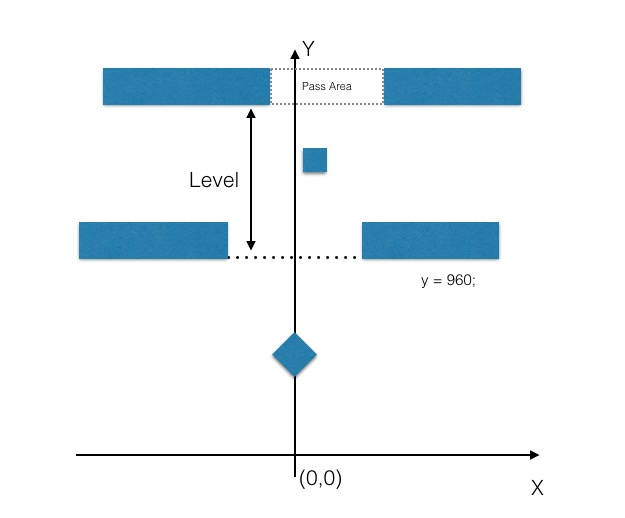
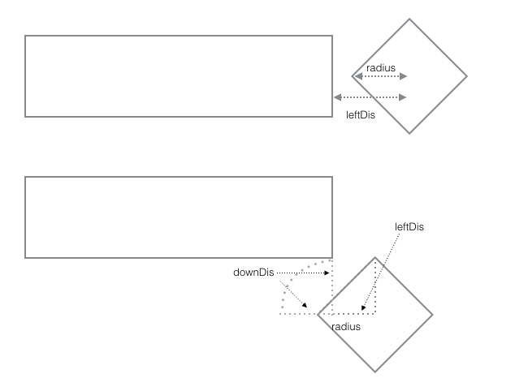

# 构建世界逻辑
《跳跃的方块》是一个无尽的虚拟世界，世界的高度不限，宽度根据显示的宽度也不尽相同。为了方便处理显示，我们设定一个x轴从左至右，y轴从下至上的坐标系，x轴原点位于屏幕中间。如下图所示：
 

## 基础设定
1. 方块的坐标为方块中心点的坐标。
2. 方块的初始位置为(0, 480)。
3. 关卡的下边界的y轴坐标值为960。保证第一个屏幕内，看不到关卡；而当方块跳动后，关卡出现。
4. 关卡只需要生成可通行范围的矩形区域，阻挡区域根据屏幕宽度和可通行区域计算得到。
5. 阻挡块需要生成实际占据的矩形区域。

## 创建虚拟世界
创建虚拟世界的管理脚本：GameWorld.js。代码内容如下：
````javascript
var GameWorld = qc.defineBehaviour('qc.JumpingBrick.GameWorld', qc.Behaviour, function() {
	var self = this;

	// 设置到全局中
    JumpingBrick.gameWorld = self;

	// 创建结束监听
	self.onGameOver = new qc.Signal();

	// 分数更新的事件
	self.onScoreChanged = new qc.Signal();

	self.levelInfo = [];

	self.runInEditor = true;
}, {

});

GameWorld.prototype.awake = function() {
	var self = this;
	// 初始化状态
	this.resetWorld();
};
````
## 游戏涉及到的数据
在虚拟世界中，方块有自己的位置、水平和竖直方向上的速度、受到的重力加速度、点击后上升速度保持的时间等信息。每次游戏开始时，需要重置这些数据。
现在大家玩游戏的时间很零碎，很难一直关注在游戏上，所以当游戏暂停时，我们需要保存当前的游戏数据。这样，玩家可以再找合适的时间来继续游戏。  
先将重置、保存数据、恢复数据实现如下：
````javascript
/**
 * 设置分数
 */
GameWorld.prototype.setScore = function(score, force) {
	if (force || score > this.score) {
		this.score = score;
		this.onScoreChanged.dispatch(score);	
	}
};

/**
 * 重置世界
 */
GameWorld.prototype.resetWorld = function() {
	var self = this;

	// 方块在虚拟世界坐标的位置
	self.x = 0;
	self.y = 480;

	// 方块在虚拟世界的速度值
	self.horV = 0;
	self.verV = 0;

	// 当前受到的重力
	self.gravity = JumpingBrick.gameConfig.gravity;

	// 维持上升速度的剩余时间
	self.verKeepTime = 0;

	// 死亡线的y轴坐标值
	self.deadline = 0;

	// 已经生成的关卡
	self.levelInfo = [];

	// 是否游戏结束
	self.gameOver = false;

	// 当前的分数
	self.setScore(0, true);
};

/**
 * 获取要保存的游戏数据
 */
GameWorld.prototype.saveGameState = function() {
	var self = this;
    var saveData = {
        deadline : self.deadline,
        x : self.x,
        y : self.y,
        horV : self.horV,
        verV : self.verV,
        gravity : self.gravity,
        verKeepTime : self.verKeepTime,
        levelInfo : self.levelInfo,
        gameOver : self.gameOver,
        score : self.score
    };
    return saveData;
};

/**
 * 恢复游戏
 */
GameWorld.prototype.restoreGameState = function(data) {
    if (!data) {
        return false;
    }
    var self = this;
	self.deadline = data.deadline;
	self.x = data.x;
	self.y = data.y;
	self.horV = data.horV;
	self.verV = data.verV;
	self.gravity = data.gravity;
	self.verKeepTime = data.verKeepTime;
	self.levelInfo = data.levelInfo;
	self.gameOver = data.gameOver;
	self.setScore(data.score, true);
    return true;
};

````

## 动态创建关卡数据
世界坐标已经确定，现在开始着手创建关卡信息。
因为游戏限制了每屏能显示的关卡数，方块只会和本关和下关的阻挡间产生碰撞，所以游戏中不用在一开始就创建很多的关卡。而且游戏中方块不能下落出屏幕，已经通过的，并且不在屏幕的内的关卡，也可以删除，不予保留。  
所以，我们根据需求创建关卡信息，创建完成后保存起来，保证一局游戏中，关卡信息是固定的。
代码如下：
````javascript
/**
 * 获取指定y轴值对应的关卡
 */
GameWorld.prototype.transToLevel = function(y) {
	// 关卡从0开始，-1表示第一屏的960区域
	return y < 960 ? -1 : Math.floor((y - 960) / JumpingBrick.gameConfig.levelInterval);
};

/**
 * 获取指定关卡开始的y轴坐标
 */
GameWorld.prototype.getLevelStart = function(level) {
	return level < 0 ? 0 : (960 + level * JumpingBrick.gameConfig.levelInterval);
};

/**
 * 删除关卡数据
 */
GameWorld.prototype.deleteLevelInfo = function(level) {
	var self = this;

	delete self.levelInfo[level];
};


/**
 * 获取关卡信息
 */
GameWorld.prototype.getLevelInfo = function(level) {
	if (level < 0) 
		return null;

	var self = this;
	var levelInfo = self.levelInfo[level];

	if (!levelInfo) {
		// 不存在则生成
		levelInfo = self.levelInfo[level] = self.buildLevelInfo(level);
	}
	return levelInfo;
};

/**
 * 生成关卡
 */
GameWorld.prototype.buildLevelInfo = function(level) {
	var self = this,
		gameConfig = JumpingBrick.gameConfig,
		blockSide = gameConfig.blockSide,
		levelHeight = gameConfig.levelHeight;

	var levelInfo = {
		color: gameConfig.levelColor[Math.floor(level / gameConfig.levelColorStride) % gameConfig.levelColor.length],
		startY: self.getLevelStart(level),
		passArea: null,
		block: []
	};

	// 获取关卡的配置
	var cfg = JumpingBrick.gameConfig.getLevelConfig(level);

	// 根据配置的通行区域生成关卡的通行区域
	var startX = self.game.math.random(cfg.passScopeMin, cfg.passScopeMax - cfg.passWidth);
	levelInfo.passArea = new qc.Rectangle(
		startX, 
		0, 
		cfg.passWidth,
		levelHeight);

	// 生成阻挡块
	var idx = -1, len = cfg.block.length;
	while (++idx < len) {
		var blockCfg = cfg.block[idx];
		// 阻挡块x坐标的生成范围是可通行区域的左侧x + minX 到 右侧x + maxX
		var blockX = startX + 
			self.game.math.random(blockCfg.minx, cfg.passWidth + blockCfg.maxx - blockSide);
		// 阻挡块y坐标的生成范围是关卡上边界y + minY 到上边界y + maxY
		var blockY = JumpingBrick.gameConfig.levelHeight + 
			self.game.math.random(blockCfg.miny, blockCfg.maxy - blockSide);

		levelInfo.block.push(new qc.Rectangle(
			blockX,
			blockY,
			blockSide,
			blockSide));
	}
	return levelInfo;
};
````

## 分数计算
根据设定，当方块完全通过关卡的通行区域后，就加上一分，没有其他的加分途径，于是，可以将分数计算简化为计算当前完全通过的最高关卡。代码如下：
````javascript
/**
 * 更新分数
 */
GameWorld.prototype.calcScore = function() {
	var self = this;

	// 当前方块所在关卡
	var currLevel = self.transToLevel(self.y);
	// 当前关卡的起点
	var levelStart = self.getLevelStart(currLevel);

	// 当方块完全脱离关卡通行区域后计分
	var overLevel = self.y - levelStart - JumpingBrick.gameConfig.levelHeight - JumpingBrick.gameConfig.brickRadius;
	var currScore = overLevel >= 0 ? currLevel + 1  : 0;
	self.setScore(currScore);
};
````

## 物理表现
方块在移动过程中，会被给予向左或者向右跳的指令。下达指令后，方块被赋予一个向上的速度，和一个水平方向的速度，向上的速度会保持一段时间后才受重力影响。
理清这些效果后，可以用下面这段代码来处理：
````javascript
/**
 * 控制方块跳跃
 * @param {number} direction - 跳跃的方向 < 0 时向左跳，否则向右跳
 */
GameWorld.prototype.brickJump = function(direction) {
	var self = this;
	// 如果重力加速度为0，表示方块正在靠边滑动，只响应往另一边跳跃的操作
	if (self.gravity === 0 && direction * self.x >= 0) {
		return;
	}
	// 恢复重力影响
	self.gravity = JumpingBrick.gameConfig.gravity;
	self.verV = JumpingBrick.gameConfig.verVelocity;
	self.horV = (direction < 0 ? -1 : 1) * JumpingBrick.gameConfig.horVelocity;
	self.verKeepTime = JumpingBrick.gameConfig.verVelocityKeepTime;
};

/**
 * 移动方块
 * @param {number} delta - 经过的时间
 */
GameWorld.prototype.moveBrick = function(delta) {
	var self = this;

	// 首先处理水平方向上的移动
    self.x += self.horV * delta;

    // 再处理垂直方向上得移动
    if (self.verKeepTime > delta) {
		// 速度保持时间大于经历的时间
        self.y += self.verV * delta;
        self.verKeepTime -= delta;
    }
    else if (self.verKeepTime > 0) {
		// 有一段时间在做匀速运动，一段时间受重力加速度影响
        self.y += self.verV * delta + 0.5 * self.gravity * Math.pow(delta - self.verKeepTime, 2);
        self.verV += self.gravity * (delta - self.verKeepTime);
        self.verKeepTime = 0;
    }
    else {
		// 完全受重力加速度影响
        self.y += self.verV * delta + 0.5 * self.gravity * Math.pow(delta, 2);
        self.verV += self.gravity * delta;
    }
};
````

## 碰撞检测
这样方块就开始运动了，需要让它和屏幕边缘、关卡通道、阻挡碰撞，产生不同的效果。
1. 当方块与关卡阻挡碰撞后，结束游戏。
2. 当方块与屏幕下边缘碰撞后，结束游戏。
3. 当方块与屏幕左右边缘碰撞后，将不受重力加速度影响，沿屏幕边缘做向下的匀速运动，直到游戏结束，或者接收到一个向另一边边缘跳跃的指令后恢复正常。

旋转45°后的方块与矩形的碰撞：
1. 当方块的包围矩形和矩形不相交时，不碰撞。
2. 当方块的包围矩形和矩形相交时。如下图分为两种情况处理。
 

代码实现如下：
````javascript
/**
 * 掉出屏幕外结束
 */
GameWorld.GAMEOVER_DEADLINE = 1;
/**
 * 碰撞结束
 */
GameWorld.GAMEOVER_BLOCK = 2;

/**
 * 块与一个矩形阻挡的碰撞检测
 */
GameWorld.prototype.checkRectCollide = function(x, y, width, height) {
    var self = this,
		brickRadius = JumpingBrick.gameConfig.brickRadius;

	var	upDis = self.y - y - height; // 距离上边距离
	if (upDis >= brickRadius) 
		return false;

    var downDis = y- self.y; // 距离下边距离
    if (downDis >= brickRadius)
		return false;

    var leftDis = x - self.x; // 距离左边距离
    if (leftDis >= brickRadius)
		return false;

    var rightDis = self.x - x - width; // 记录右边距离
    if (rightDis >= brickRadius)
		return false;

    // 当块中点的y轴值，在阻挡的范围内时，中点距离左右边的边距小于brickRadius时相交
    if (downDis < 0 && upDis < 0) {
        return leftDis < brickRadius && rightDis < brickRadius;
    }

    // 当块的中点在阻挡范围上时
    if (upDis > 0) {
        return leftDis < brickRadius - upDis && rightDis < brickRadius - upDis;
    }
    // 当块的中点在阻挡范围下时
    if (downDis > 0) {
        return leftDis < brickRadius - downDis && rightDis < brickRadius - downDis;
    }
    return false;
};

/**
 * 碰撞检测
 */
GameWorld.prototype.checkCollide = function() {
    var self = this;

    // game节点铺满了屏幕，那么节点的宽即为屏幕的宽
    var width = this.gameObject.width;
    var brickRadius = JumpingBrick.gameConfig.brickRadius;
    var leftEdge = -0.5 * width;
    var rightEdge = 0.5 * width;

    // 下边缘碰撞判定，方块中心的位置距离下边缘的距离小于方块的中心到顶点的距离
    if (this.deadline - self.y > brickRadius) {
        return GameWorld.GAMEOVER_DEADLINE;
    }

    // 左边缘判定，方块中心的位置距离左边缘的距离小于方块的中心到顶点的距离
    if (self.x - leftEdge < brickRadius) {
        self.x = leftEdge + brickRadius;
        self.horV = 0;
        self.verV = JumpingBrick.gameConfig.verLockVelocity;
        self.gravity = 0;
    }
    // 右边缘判定，方块中心的位置距离右边缘的距离小于方块的中心到顶点的距离
    if (rightEdge - self.x < brickRadius) {
        self.x = rightEdge - brickRadius;
        self.horV = 0;
        self.verV = JumpingBrick.gameConfig.verLockVelocity;
        self.gravity = 0;
    }

    // 方块在世界中，只会与当前关卡的阻挡和下一关的阻挡进行碰撞
    var currLevel = self.transToLevel(self.y);
    for (var idx = currLevel, end = currLevel + 2; idx < end; idx++) {
		var level = self.getLevelInfo(idx);
		if (!level) 
			continue;

		var passArea = level.passArea;
        // 检测通道左侧和右侧阻挡
        if (self.checkRectCollide(
				leftEdge, 
				passArea.y + level.startY, 
				passArea.x - leftEdge, 
				passArea.height) ||
			self.checkRectCollide(
				passArea.x + passArea.width, 
				passArea.y + level.startY, 
				rightEdge - passArea.x - passArea.width,
				passArea.height)) {
			return GameWorld.GAMEOVER_BLOCK;
		}

		// 检测本关的阻挡块
		var block = level.block;
		var len = block.length;
		while (len--) {
			var rect = block[len];
			if (self.checkRectCollide(rect.x, rect.y + level.startY, rect.width, rect.height)) {
				return GameWorld.GAMEOVER_BLOCK;
			}
		}
    }
    
    return 0;
};

````

# 添加时间处理
到此，游戏世界的基本逻辑差不多快完成了。现在加入时间控制。
````javascript

/**
 * 游戏结束的处理
 */
GameWorld.prototype.doGameOver = function(type) {
	var self = this;
	self.gameOver = true;
	self.onGameOver.dispatch(type);
};

/**
 * 更新逻辑处理
 * @param {number} delta - 上一次计算到现在经历的时间，单位：秒
 */
GameWorld.prototype.updateLogic = function(delta) {
	var self = this,
		screenHeight = self.gameObject.height;
	if (self.gameOver) {
		return;
	}
	// 将经历的时间分隔为一小段一小段进行处理，防止穿越
	var calcDetla = 0;
	while (delta > 0) {
		calcDetla = Math.min(delta, JumpingBrick.gameConfig.preCalcDelta);
		delta -= calcDetla;
		// 更新方块位置
		self.moveBrick(calcDetla);
		// 检测碰撞
		var ret = self.checkCollide();
		if (ret !== 0) {
			// 如果碰撞关卡阻挡或者碰撞死亡线则判定死亡
			self.doGameOver(ret);
			return;
		}
	}

	// 更新DeadLine
	self.deadline = Math.max(self.y - screenHeight * JumpingBrick.gameConfig.raiseLimit, self.deadline);

	// 结算分数
	self.calcScore();
};
````
