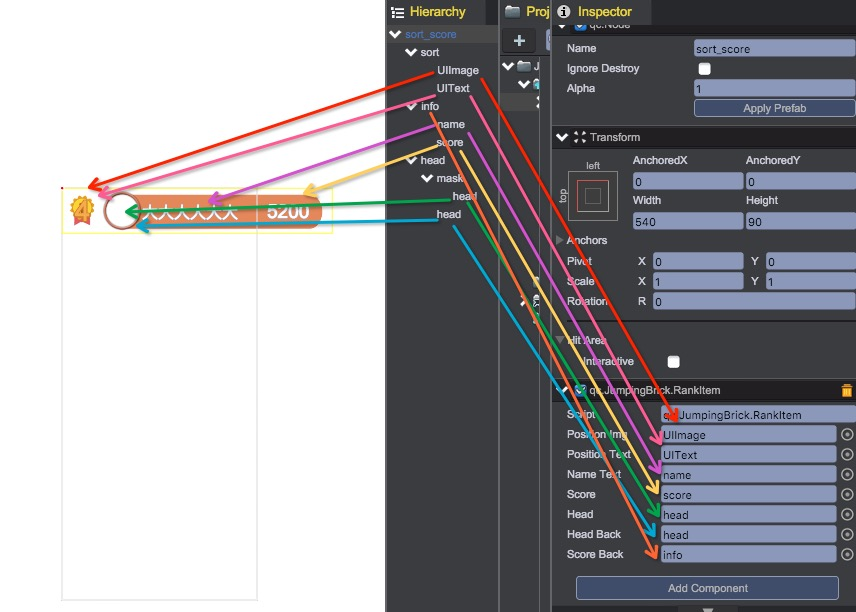
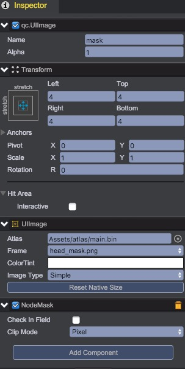
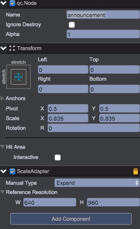
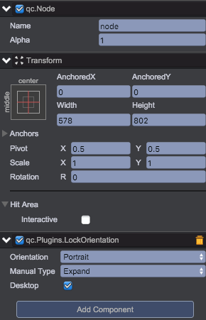
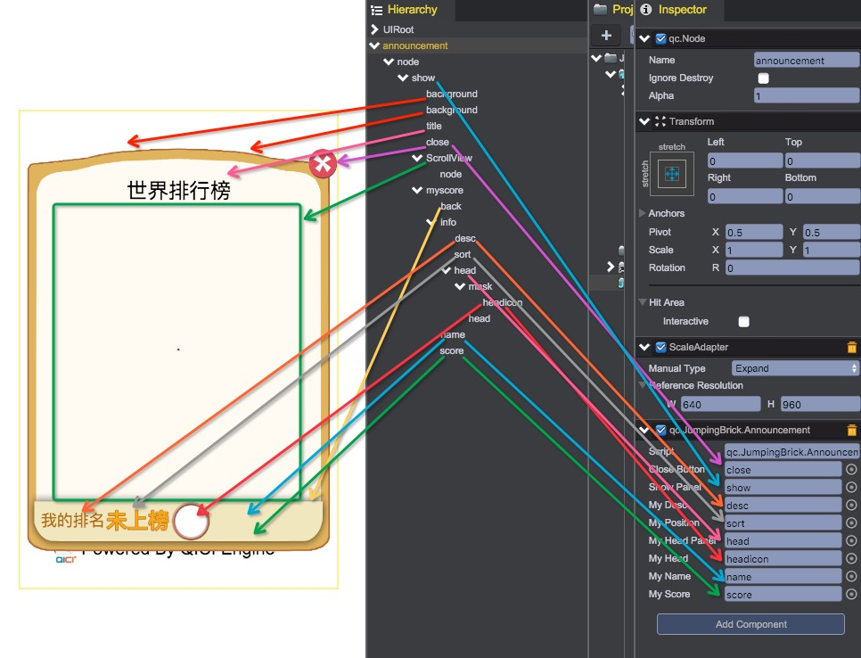
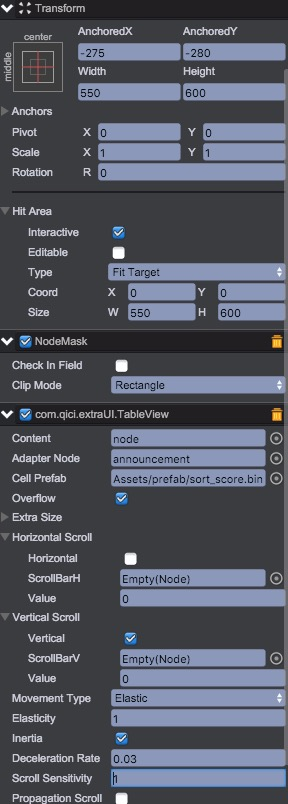

# 排行榜界面
## 排行榜榜单元素
排行榜的榜单也是一个TableView，所以我们先建立一个榜单元素的控制脚本：RankItem.js。
````javascript
// define a user behaviour
var RankItem = qc.defineBehaviour('qc.JumpingBrick.RankItem', qc.Behaviour, function() {
    // need this behaviour schedule in editor
    //this.runInEditor = true;
}, {
	positionImg : qc.Serializer.NODE,
    positionText : qc.Serializer.NODE,
    nameText : qc.Serializer.NODE,
    score : qc.Serializer.NODE,
    head : qc.Serializer.NODE,
    headBack : qc.Serializer.NODE,
    scoreBack : qc.Serializer.NODE
});

RankItem._position = [
	'first.png',
	'second.png',
	'third.png'
];

RankItem._textTint = [
	0xffb16742,
    0xff2899a7,
    0xffa5b471,
	0xff876712
];

RankItem._headBack = [
	'list_head_org.png',
    'list_head_blu.png',
	'list_head_green.png',
	'list_head_yel.png'
];

RankItem._infoBack = [
	'list_bak_org.png',
    'list_bak_blu.png',
	'list_bak_green.png',
	'list_bak_yel.png'
];

// Awake is called when the script instance is being loaded.
RankItem.prototype.awake = function() {

};

RankItem.prototype.revoke = function() {
	var self = this;
	if (self.headKey) {
		// 清理资源
		self.game.assets.unload(self.headKey);
		self.headKey = null;
	}
};

// Update is called every frame, if the behaviour is enabled.
RankItem.prototype.refreshData = function(index, data, cache) {
	// 更新信息
	var self = this;
	self.headBack.frame = RankItem._headBack[index < 4 ? (index - 1) : 3];
	self.scoreBack.frame = RankItem._infoBack[index < 4 ? (index - 1) : 3];
	if (index < 4) {
		self.positionImg.visible = true;
		self.positionImg.frame = RankItem._position[index - 1];
		self.positionText.visible = false;
		self.nameText.stroke = new qc.Color(RankItem._textTint[index - 1]);
		self.score.stroke = new qc.Color(RankItem._textTint[index - 1]);
	}
	else {
		self.positionImg.visible = false;
		self.positionText.visible = true;
		self.positionText.text = index.toString();
		self.nameText.stroke = new qc.Color(RankItem._textTint[3]);
		self.score.stroke = new qc.Color(RankItem._textTint[3]);
	}

	// 载入头像
	// 获取64 * 64的头像尺寸
	if (data.headurl) {
		if (self.headKey) {
			// 清理资源
			self.game.assets.unload(self.headKey);
		}
		self.headKey = data.headurl;
		self.game.assets.loadTexture(self.headKey, data.headurl + '64', function(assets) {
			self.head.texture = assets;
			if (cache) {
				cache.dirty = true;
			}
		});		
	}
	self.nameText.text = data.name;
	self.score.text = data.score.toString();
};

````
创建榜单预制：sort_score.bin。并和脚本进行关联：  


其中mask使用Pixel模式，使用自己的本身图片的透明通道作为子节点的透明通道，设置如下：  


## 排行榜界面
* __管理脚本__
使用ViewTable来管理榜单节点，需要提供TableViewAdapter来提供数据。创建一个Announcement.js，用来提供数据并管理界面。内容如下：  

````javascript  
/**
 * 排行榜界面
 */
var Announcement = qc.defineBehaviour('qc.JumpingBrick.Announcement', com.qici.extraUI.TableViewAdapter, function() {
    
}, {
    closeButton: qc.Serializer.NODE,
    showPanel : qc.Serializer.NODE,
    myDesc : qc.Serializer.NODE,
    myPosition : qc.Serializer.NODE,
    myHeadPanel : qc.Serializer.NODE,
    myHead : qc.Serializer.NODE,
    myName : qc.Serializer.NODE,
    myScore : qc.Serializer.NODE
});

Announcement.prototype.awake = function() {
    var self = this,
    	data = JumpingBrick.data;
    self.addListener(self.closeButton.onClick, self.returnToGameOver, self);
    self.addListener(self.gameObject.onClick, self.returnToGameOver, self);
    self.addListener(self.showPanel.onClick, function() {}, self);
    self.addListener(data.onRankUpdate, self.receiveRankData, self);
};

/**
 * 返回游戏结算界面
 */
Announcement.prototype.returnToGameOver = function() {
	var self = this;
	if (self.headKey) {
		self.game.assets.unload(self.headKey);
	}
	JumpingBrick.uiManager.switchStateTo(qc.JumpingBrick.UIManager.GameOver);
};

// 请求排行榜数据
Announcement.prototype.updateRank = function() {
	var data = JumpingBrick.data;
	data.queryRank();
};

/**
 * 收到排行榜数据
 */
Announcement.prototype.receiveRankData = function(data) {
	var self = this;
	// 更新自己的信息
	var selfData = data.selfRank;
	if (!selfData) {
		self.myPosition.text = '请登录游戏后查看';
		self.myHeadPanel.visible = false;
		self.myName.visible = false;
		self.myScore.visible = false;
		self.myDesc.visible = false;
	}
	else {
		self.myPosition.text = selfData.ranking ? selfData.ranking.toString() : '未上榜';
		self.myHeadPanel.visible = true;
		self.myDesc.visible = true;
		
		// 获取64 * 64的头像尺寸
		if (selfData.headurl) {
			if (self.headKey) {
				self.game.assets.unload(self.headKey);
			}
			self.headKey = selfData.headurl;
			self.game.assets.loadTexture(self.headKey, selfData.headurl + '64', function(assets) {
				self.myHead.texture = assets;
			});		
		}
		self.myName.text = selfData.name;
		self.myScore.text = selfData.scorers.toString();
	}

	var rankTop = data.rankTop;
	self.rankTop = rankTop;

	self.dispatchDataChange();
};


/**
 * 获取表格大小，x、y同时只能有一个为Infinity
 */
Announcement.prototype.getTableSize = function() {
	return { x: 1, y: this.rankTop ? this.rankTop.length : 0 };
};

/**
 * 根据在Table中的点返回对应的单元格
 * @param  {number} x - x轴坐标
 * @param  {number} y - y轴坐标
 */
Announcement.prototype.findCellWithPos = function(x, y) {
	return {
		x: Math.floor(x / 540),
		y: Math.floor(y / 90)
	};
};

/**
 * 获取节点的显示位置
 */
Announcement.prototype.getCellRect = function(col, row) {
	return new qc.Rectangle(col * 540, row * 90, 540, 90);
};

/**
 * 节点处于不可见时，回收节点，
 * @param  {qc.Node} cell - 节点
 * @param  {number} col - 所在列
 * @param  {number} row - 所在行
 */
Announcement.prototype.revokeCell = function(cell, col, row) {
	cell.getScript('qc.JumpingBrick.RankItem').revoke();
};

/**
 * 节点处于可见时，创建节点，
 * @param  {qc.Node} cell - 节点
 * @param  {number} col - 所在列
 * @param  {number} row - 所在行
 */
Announcement.prototype.createCell = function(cell, col, row) {
	if (this.rankTop) {
		cell.getScript('qc.JumpingBrick.RankItem').refreshData(row + 1, this.rankTop[row]);
	}
};
````

* __排行榜根节点__
排行榜界面是一个固定大小的窗口，如果还是按游戏的方式以高度为准，可能在有些设备上就会超出屏幕区域。
所以，为了排行榜，需要再建立一个UIRoot，命名为announcement，Manual Type类型为Expand，建议的宽高还是设计使用的(640, 960)。 
如图所示：  
  
为了适应屏幕旋转，还是需要为announcement节点添加一个锁屏的组件。如图所示：  
  

* __界面展示及脚本关联__
在锁屏组件下开始拼界面，并将Announcement.js加到announcement节点上。如图所示：  

其中tableView的脚本挂载scrollView节点上，配置如下：  


