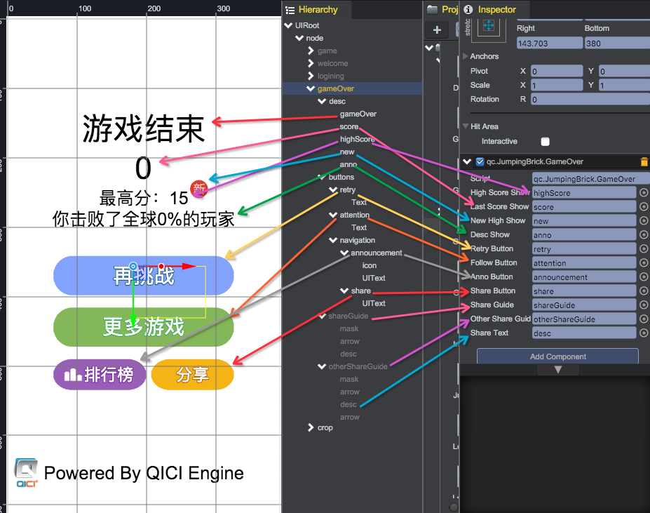
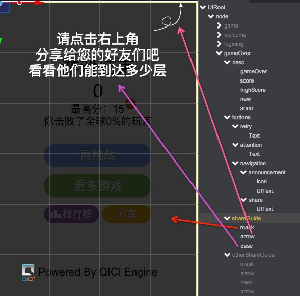
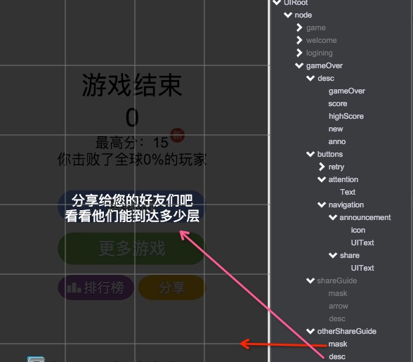

# 结算界面
## 创建管理脚本
创建脚本：GameOver.js。用于更新界面数据，和管理按钮功能。
内容如下：  
````javascript
/**
 * 游戏结束结算界面
 */
var GameOver = qc.defineBehaviour('qc.JumpingBrick.GameOver', qc.Behaviour, function() {
	var self = this;
	JumpingBrick.gameOver = self;
}, {
	highScoreShow : qc.Serializer.NODE,
    lastScoreShow : qc.Serializer.NODE,
    newHighShow : qc.Serializer.NODE,
    descShow : qc.Serializer.NODE,
    retryButton : qc.Serializer.NODE,
    followButton : qc.Serializer.NODE,
    annoButton : qc.Serializer.NODE,
    shareButton : qc.Serializer.NODE,
    shareGuide : qc.Serializer.NODE,
    otherShareGuide : qc.Serializer.NODE,
    shareText : qc.Serializer.NODE
});


// Awake is called when the script instance is being loaded.
GameOver.prototype.awake = function() {
    var self = this;
    self.retryButton.onClick.add(function() {
        JumpingBrick.uiManager.switchStateTo(qc.JumpingBrick.UIManager.Game);
    }, self);
    self.followButton.onClick.add(function() {
    document.location.href =
                    'http://mp.weixin.qq.com/s?__biz=MzI5MTA3Nzc4Mw==&mid=400360588&idx=1&sn=090f19666259b1ab5d0a5c5d870de8ad&scene=0#rd';
    }, self);
    self.annoButton.onClick.add(function() {
        JumpingBrick.uiManager.switchStateTo(qc.JumpingBrick.UIManager.Announcement);
    }, self);
    self.shareButton.onClick.add(function() {
        if (JumpingBrick.data.isWeChat()) {
            self.shareGuide.visible = true;    
        }
        else {
            self.otherShareGuide.visible = true;
        }
    }, self);
    self.shareGuide.onClick.add(function() {
        self.shareGuide.visible = false;
    });
    self.otherShareGuide.onClick.add(function() {
        self.otherShareGuide.visible = false;
    });

    self.game.input.onKeyDown.add(function(keyCode) {
        if (!self.gameObject.worldVisible) return;
        if (keyCode === qc.Keyboard.ENTER || keyCode === qc.Keyboard.SPACEBAR) {
            JumpingBrick.uiManager.switchStateTo(qc.JumpingBrick.UIManager.Game);
        }
    }, self);
};


GameOver.prototype.refresh = function() {
	var self = this,
		data = JumpingBrick.data;
    self.shareGuide.visible = false;
    self.annoButton.visible = data.loginType === qc.JumpingBrick.DataManager.WECHATLOGIN;
    if (self.annoButton.visible) {
        self.shareButton.setStretch(190, 0, 0, 16);
        self.shareText.fontSize = 32;
    }
    else {
        self.shareButton.setStretch(0, 0, 0, 0);
        self.shareText.fontSize = 40;
    }
    self.highScoreShow.text = '最高分：' + data.highScore;
    self.lastScoreShow.text = data.lastScore.toString();
    self.newHighShow.visible = !!data.lastScore && data.newHigh;
    self.descShow.text = self._makeDesc(data.lastScore);
};

GameOver.prototype._makeDesc = function(score) {
    var percent = Math.min(30, score) * 2;
    if (score > 30) {
        percent += Math.min(20, score - 30);
    }
    if (score > 50) {
        percent += Math.floor((score - 50) / 2);
    }
    percent = Math.min(99, percent);
    return '你击败了全球' + parseInt(percent) + '%的玩家';
};
````

## 处理界面
和登录界面类似，都是以屏幕中心为锚点，进行布局。然后和脚本关联上。如下图所示：  


游戏中，对于在微信中分享和在其他浏览器分享，期望有两套分享指引，如图所示:  

|微信浏览器|非微信浏览器|
|:-------:|:---------:|
|||