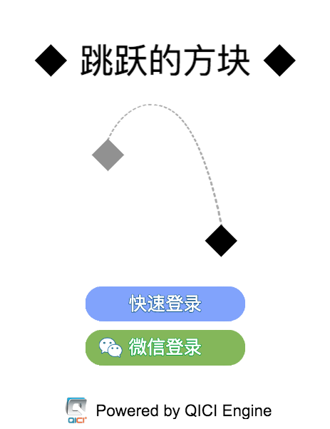

# 登陆界面
登陆界面的设计如下图：  
  
为了保证实现效果，有几点需要注意：
1. 所有的显示内容，应该是基于水平中线布局。
2. 因为要求在微信中打开游戏时，隐藏快速登录的按钮，所以将两个按钮置于一个TableLayout中，让其自适应布局来调整位置。

## 控制脚本
创建登陆界面的控制脚本：Welcome.js。内容如下：
````javascript

var Welcome = qc.defineBehaviour('qc.JumpingBrick.Welcome', qc.Behaviour, function() {

}, {
	quickLogin: qc.Serializer.NODE,
	wechatLogin: qc.Serializer.NODE
});

Welcome.prototype.awake = function() {
	var self = this;

	self.quickLogin && self.addListener(self.quickLogin.onClick, self.doQuickLogin, self);
	self.wechatLogin && self.addListener(self.wechatLogin.onClick, self.doWechatLogin, self);
};

Welcome.prototype.update = function() {
    var self = this;
	if (self.quickLogin.visible && JumpingBrick.data.isWeChat()) {
		self.quickLogin.visible = false;
		self.quickLogin.parent.getScript('qc.TableLayout').relayout();
	}
};

// 快速登陆
Welcome.prototype.doQuickLogin = function() {
	JumpingBrick.data.quickLogin();
};

// 微信登陆
Welcome.prototype.doWechatLogin = function() {
	JumpingBrick.data.wechatLogin();
};
````

## 构建登录界面
创建登录界面的根节点welcome，便于对界面进行整体控制。并将Welcome脚本加载到welcome节点上，关联快速登陆和微信登陆按钮。
 <video controls="controls" src="../../video/create_welcome_show.mp4"></video>
