# 刀塔传奇

* 国民级动作卡牌手游《刀塔传奇》融入轻操作立体化战斗，玩家可把握大招释放顺序，巧妙搭配实现打断、秒杀等战斗技巧。
* 本范例主要演示刀塔传奇战斗时的情景。效果图如下：<br>
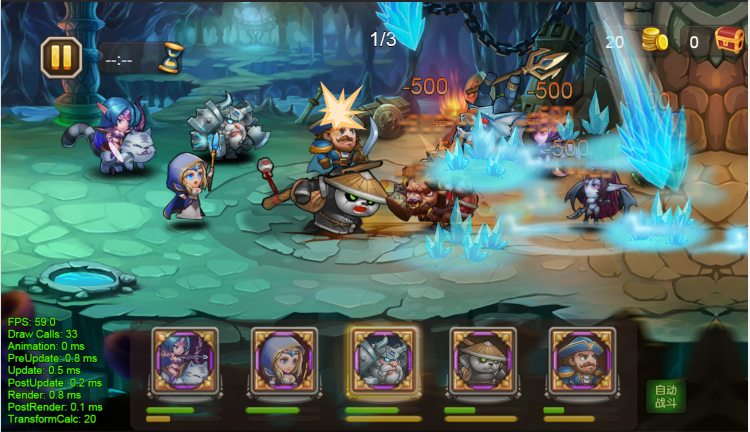<br>


## Loading

* loading是播放等待动画，在切换场景或者加载场景经常用到。效果图如下：<br>
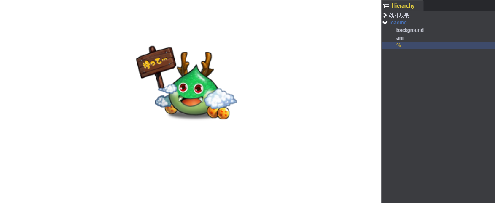
* 创建一个EmptyNode组件loading，设置其节点及其孩子在切换场景时不会被析构，即在IgnoreDestroy属性打钩。如下图：<br>
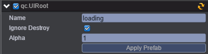
* 在loading节点上添加一个NodeFadeInOut插件，用来控制loading淡入淡出设置。<br>将loading设置为淡出类型，如下图：<br>
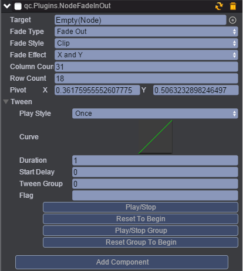<br>
* 参数说明：<br>
target - 需要淡入淡出的节点，不设置默认为自身节点<br>
fadeType - 淡入淡出类型，本示例是选择FadeOut淡出类型<br>
Fade style - clip裁剪<br>
effect - 生效的效果 xy轴同时使用clip效果<br>
columnCount - 变化的列数为31<br>
rowCount - 变化的行数18<br>
pivotX - 变化时的原点 x 坐标<br>
pivotY - 变化时的原点 y 坐标<br>
* 创建一个Image组件background，作为loading的背景图。
* 创建一个Sprite组件ani,用于播放动画。
* 创建一个Text组件%，用于显示加载资源的进度。
* 创建脚本LoadingUI.js，挂载在loading节点，负责loading的淡入淡出的逻辑。<br>
* 创建loading预制，使loading可以动态生成。<br>  

* LoadingUI.js代码如下：<br>

```javascript
/**
 * 场景加载的进度提示界面
 */
var LoadingUI = qc.defineBehaviour('qc.demo.LoadingUI', qc.Behaviour,
    function() {
        this.clue = null;
    },
    {
        // 需要序列化的字段
        clue: qc.Serializer.NODE
    }
);

// 初始化处理
LoadingUI.prototype.awake = function() {
    // 关注场景开始切换和切换结束的事件
    var self = this;
    self.game.state.onStartLoad.add(function() {
        // 场景加载开始，显示本界面
        self.show();
    });
    self.game.state.onEndLoad.add(function() {
        // 场景加载完毕，隐藏本界面
        if (self.gameObject.visible) {
            if (self.duringTween)
                self.nextChange = 1;
            else
                self.hide();
        }
    });
}

// 帧调度，保证本界面永远在其他界面之上
LoadingUI.prototype.update = function() {
    var self = this,
        loaded = self.game.assets.loaded,
        total = self.game.assets.total;
    if (total) {
        self.clue.text = '拼命加载中：' + loaded + '/' + total;
    }
    else {
        self.clue.text = '';
    }
    // 扔到最后面去
    self.gameObject.parent.setChildIndex(this.gameObject, self.gameObject.parent.children.length - 1);
}

// 开始显示本界面
LoadingUI.prototype.show = function() {
    var self = this,
        fadeInOut = self.gameObject.getScript('qc.Plugins.NodeFadeInOut');

    self.gameObject.visible = true;
    self.gameObject.alpha = 0;
    fadeInOut.stop();
    fadeInOut.enable = false;
    fadeInOut.target = self.gameObject.game.world;
    fadeInOut.fadeType = NodeFadeInOut.FADE_OUT;
    fadeInOut.fadeStyle = this.getRandomInt(0, 2);
    fadeInOut.fadeEffect = this.getRandomInt(0, 3);
    fadeInOut.pivotX = Math.random(0, 1);
    fadeInOut.pivotY = Math.random(0, 1);
    fadeInOut.columnCount = this.getRandomInt(1, 32);
    fadeInOut.rowCount = this.getRandomInt(1, 32);
    fadeInOut.resetToBeginning();
    fadeInOut.playForward();
    self.gameObject.alpha = 1;
    self.duringTween = true;
    fadeInOut.onFinished.addOnce(function() {
        self.duringTween = false;
        if (self.nextChange) {
            self.hide();
            self.nextChange = 0;
        }
    });
}

// 结束显示本页面，加载完毕了
LoadingUI.prototype.hide = function() {
    var self = this,
        fadeInOut = self.gameObject.getScript('qc.Plugins.NodeFadeInOut');

    self.gameObject.alpha = 1;
    fadeInOut.enable = false;
    fadeInOut.target = null;
    fadeInOut.fadeType = NodeFadeInOut.FADE_OUT;
    fadeInOut.fadeStyle = this.getRandomInt(0, 2);
    fadeInOut.fadeEffect = this.getRandomInt(0, 3);
    fadeInOut.pivotX = Math.random(0, 1);
    fadeInOut.pivotY = Math.random(0, 1);
    fadeInOut.columnCount = this.getRandomInt(1, 32);
    fadeInOut.rowCount = this.getRandomInt(1, 32);
    fadeInOut.resetToBeginning();
    fadeInOut.playForward();
    self.duringTween = true;
    fadeInOut.onFinished.addOnce(function() {
        self.gameObject.visible = false;
        self.duringTween = false;
        self.nextChange = 0;
    });
}

LoadingUI.prototype.getRandomInt = function(min, max) {
    return Math.floor(Math.random() * (max - min)) + min;
}

```
* 最后通过面板中Project->Setting，将Loading Prefab的值设置为：Assets/prefabs/loading.bin。如下图：<br>
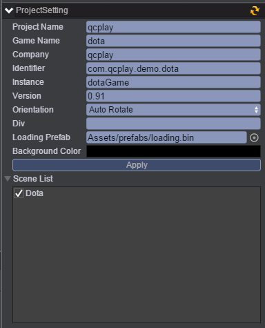<br><br>

## UI布局

* UI布局由背景和战场两部分组成。如下图：<br>
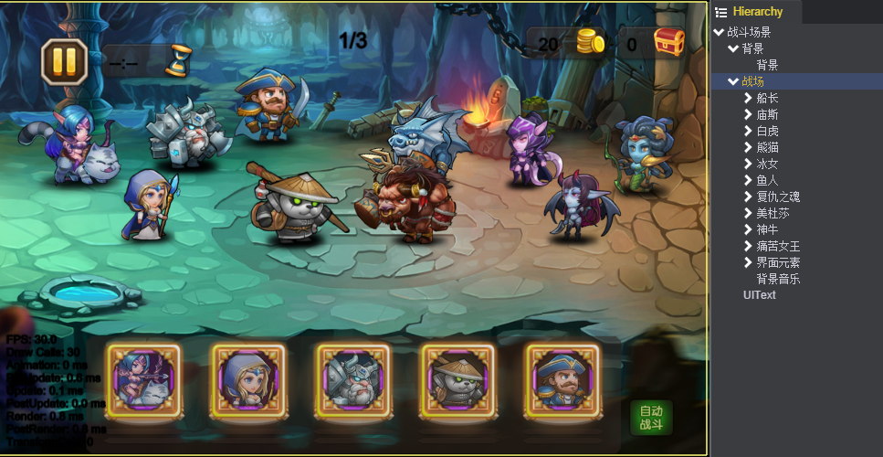<br><br>

### 背景

* 背景是由两张图组合而成。目的是为了在根据不同的分辨率显示背景图。如下图：<br>
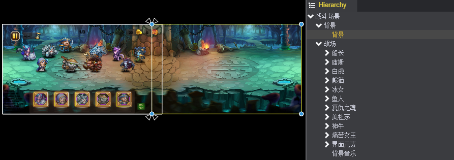<br><br>
* 首先创建第一张背景图,即左侧背景图，在战斗场景节点下，创建一个Image命名为背景，设置以左侧对齐，上下拉伸。如下图：<br>
<br><br>
* 在背景节点添加一个Aspect Ratio Fitter组件，模式Mode为Height Controls Width，Ratio为1.665。目的是为了根据窗口的高按照1.665比例控制背景图宽的显示尺寸。如下图：<br>
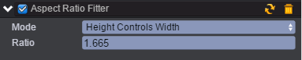<br><br>
* 复制第一张背景作为第二张背景，挂在第一张背景的节点下。设置以右侧对齐，上下拉伸；以Y轴为中心，x轴旋转180°，即Scale(-1,1)。如下图：<br>
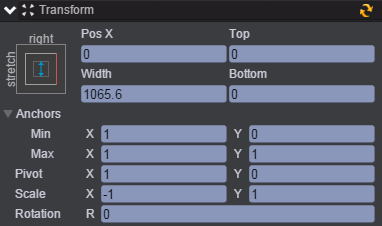<br><br>


### 战场

* 在场景中总共有10个怪物，其中我方5个和敌方5个怪物对战的情景。在此我们就不一一介绍每个怪物的战斗情况，就拿船长这个角色来举例说明。如下图：<br>
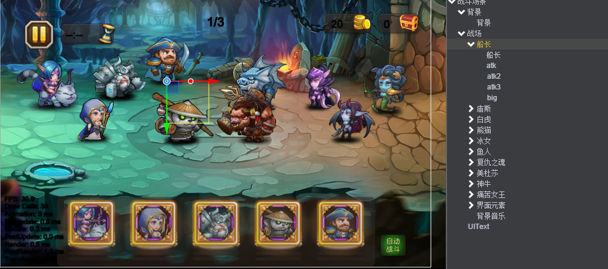<br><br>

#### 1、创建角色

* 创建一个Empty Node组件命名为船长，作为父亲节点。在此节点上添加一个TweenPosition组件，用来播放船长出场移动到场景中间的动画。再添加载一个TweenAlpha组件，用来播放船长死亡后，淡出场景动画。如下图：<br>
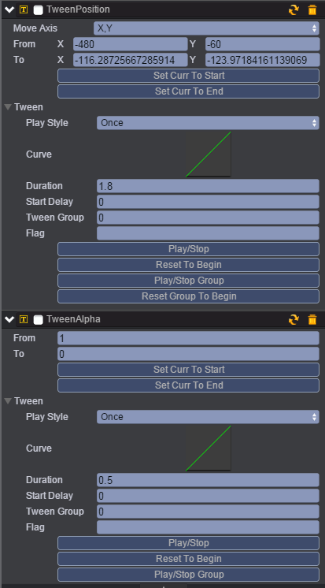<br><br>
* 在父亲节点下创建一个Sprite组件命名为船长，用来显示船长角色模型和播放攻击动作。如下图：<br>
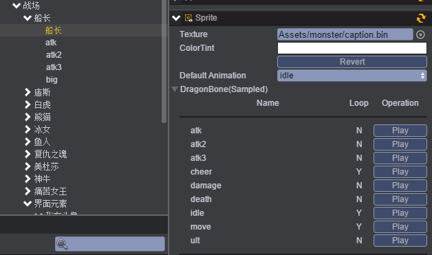<br><br>
在此节点上挂载脚本Fighter.js，负责控制角色属性信息，战斗对象，攻击技能和移动目标位置。具体逻辑请根据示例代码注释进行理解。如下图：<br>
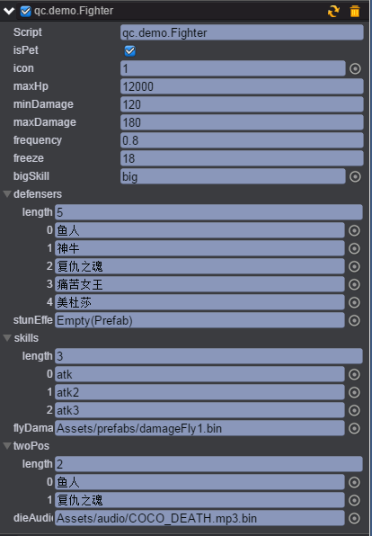<br>
说明：<br>
isPet：是否为我方宠物<br>
icon：关联的头像节点<br>
maxHp：最大血量<br>
minDamage：最小伤害<br>
maxDamage：最大伤害<br>
frequency：攻击频率<br>
freeze：大招冷却时间<br>
bigSkill：大招技能关联的节点<br>
defensers：战斗对象<br>
skills：普通攻击技能<br>
flyDamage：伤害显示<br>
twoPos：移动目标位置<br>
dieAudio：死亡时声音<br>

* 在父亲节点下创建一个Empty Node命名为atk，用来设置角色的普通攻击技能。在此节点上挂载CommonAttack.js脚本，负责普通攻击的逻辑。设置角色攻击动画为atk，精灵对象为船长，攻击开始到命中的时间0.2秒，攻击命中特效hit.bin，特效飞行时间1秒。如下图：<br>
<br><br>
* 创建角色的攻击技能atk2，设置与atk类似。攻击动画设置为atk2攻击开始到命中的时间0.8秒，如下图：<br>
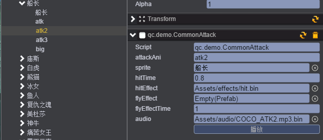<br><br>
* 创建角色的攻击技能atk3，由于此技能带有击飞效果，需要添加脚本CaptainAttack3.js控制技能atk3释放和目标对象击飞的逻辑。设置角色攻击动画为atk3，精灵对象为船长，攻击开始到命中的时间0.8秒，攻击命中特效captainAtk3.bin,击飞距离flyDistance为120，击飞时长0.6秒，落下时长0.4秒。如下图：<br>
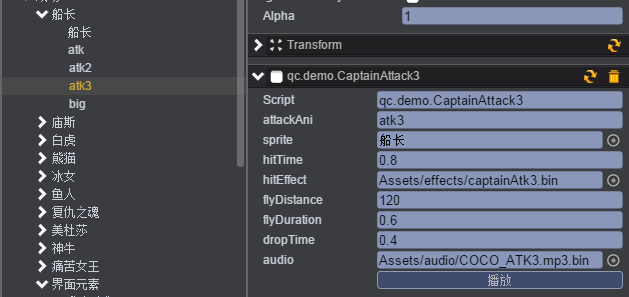<br><br>
* 创建角色的大招big，将CaptainBig.js脚本挂载在big上，负责控制船长大招的逻辑。设置大招攻击动作ult，精灵对象为船长，大招特效CaptainBig.bin，大招凸显时间0.8秒，攻击开始到命中的时间1.8秒，攻击命中特效captainHit.bin。如下图：<br>
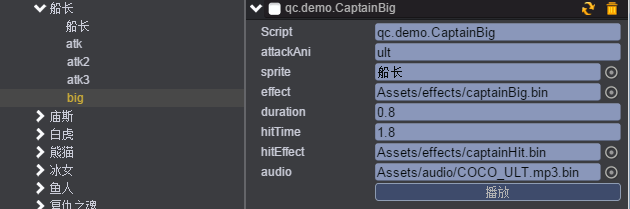<br><br>
具体代码参考示例代码。

#### 2、出场

* 当点击开始按钮时，所有怪物都被创建出来，从出生点向场中间集结。
* 创建脚本CombatUI.js，挂载在战场的节点上，负责开始战斗和创建我方宠物和敌方怪物。如下图：<br>
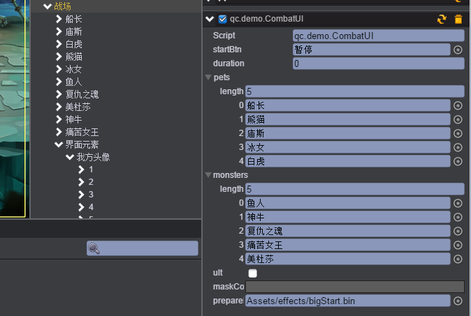<br><br>
* 创建脚本FighterAppear.js，挂载在怪物的子节点怪物名字的节点上，负责播放怪物移动动画的逻辑。设置移动的动作名称move，船长与战场中间的距离20。如下图：<br>
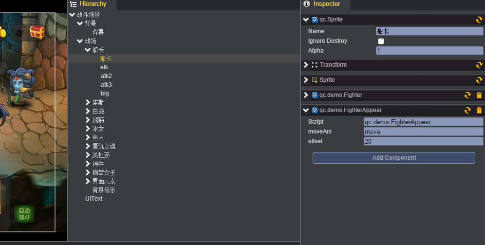<br>
* 代码如下：<br>

```javascript
var s = qc.Serializer;

/**
 * 战斗者出现的动画表现
 */
var FighterAppear = qc.defineBehaviour('qc.demo.FighterAppear', qc.Behaviour, function() {
    var self = this;

    // 走动的动作名称
    self.moveAni = 'move';

    // 偏移量，需要加上屏幕的宽度
    self.offset = 20;

    // 在编辑器模式下需要运行
    self.runInEditor = true;
}, {
    // 需要序列化的字段
    moveAni: s.STRING,
    offset: s.NUMBER
});

// 播放动作
FighterAppear.prototype.play = function() {
    var self = this, o = self.gameObject;
    var fighter = o.getScript('qc.demo.Fighter');
    o.parent.visible = true;
    o.alpha = 1;

    var tp = o.parent.getScript('qc.TweenPosition');
    tp.to.x = o.parent.x;
    tp.to.y = o.parent.y;
    tp.from.y = tp.to.y;
    if (fighter.isPet)
        tp.from.x = tp.to.x - self.game.world.width / 2 - self.offset;
    else
        tp.from.x = tp.to.x + self.game.world.width / 2 + self.offset;
    tp.resetToBeginning();
    tp.playForward();
    o.playAnimation(self.moveAni, 1, true);
    tp.onFinished.addOnce(function() {
        // 动作播放完毕，播放idle动作
        fighter.resumeIdle();

        // 可以出招了
        fighter.nextRound = 0;
        fighter.bigTime = fighter.freeze * 1000;
    });
}
```

#### 3、头像信息

* 头像信息是负责显示怪物当前hp、mp以及大招激活时的特效。如下图：<br>
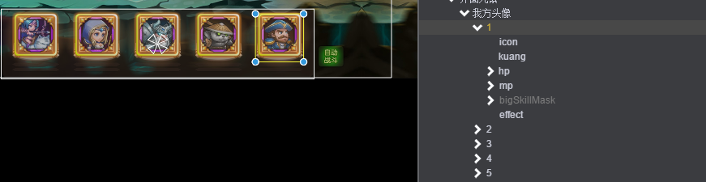<br>
* 其中hp条和mp条是由ProgressBar组件构成。通过控制ProgressBar中Value的属性值来实现hp和mp的变化，Value的值范围是0~1。如下图：<br>
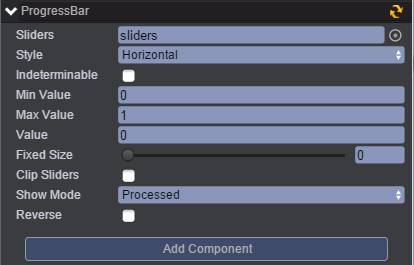<br>
* 当mp条满时，角色的大招就会被激活。创建脚本IconInfo.js，负责控制怪物的hp和mp的进度条变化，以及大招激活时的特效处理逻辑。如下图：<br>
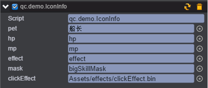<br>

#### 4、飘血

* 创建预制预制damageFly1.bin，负责显示怪物在战斗受到伤害时，在头顶显示伤害数字。
* 创建一个Text组件命名为damageFly1，用来显示伤害数字。
* 在damageFly1节点上添加一个TweenPosition组件，负责伤害数字往上飘。如下图：<br>
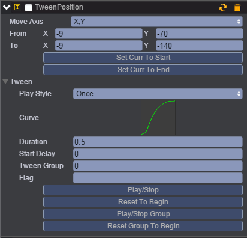<br><br>
* 在damageFly1节点上添加一个TweenAlpha组件，负责伤害数字飘到顶点后消失。如下图：<br>
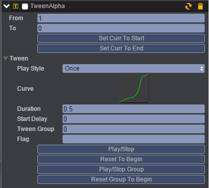<br><br>
* 在damageFly1节点上添加一个TweenScale组件，负责伤害数字逐渐放大的效果。如下图：<br>
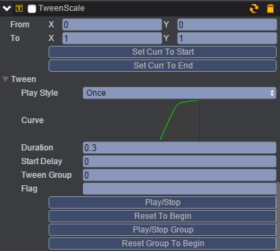<br><br>
* 创建脚本DamageFly.js，挂载在damageFly1节点上，负责控制飘血的动画表现逻辑。<br>代码如下：<br>

```javascript
var s = qc.Serializer;

/**
 * 飘血的动画表现
 */
var DamageFly = qc.defineBehaviour('qc.demo.DamageFly', qc.Behaviour, function() {
    var self = this;

    // 在编辑器模式下需要运行
    self.runInEditor = true;
}, {
    // 需要序列化的字段
});

// 创建出来就开始播放动作
DamageFly.prototype.play = function(damage) {
    var self = this, o = self.gameObject;
    o.text = '-' + damage;

    // 设定初生点位置
    var tp = o.getScript('qc.TweenPosition');
    tp.from.x = o.x + self.game.math.random(-30, 30);
    tp.from.y = o.y - self.game.math.random(-10, 10);
    tp.to.x = tp.from.x;
    tp.to.y = tp.from.y - 80;
    o.x = tp.from.x;
    o.y = tp.from.y;

    // 放大
    var ts = o.getScript('qc.TweenScale'),
        ta = o.getScript('qc.TweenAlpha');

    // 往上移动并淡出
    ts.onFinished.addOnce(function() {
        tp.resetToBeginning();
        tp.playForward();

        ta.from = 1;
        ta.to = 0;
        ta.onFinished.addOnce(function() {
            o.destroy();
        });
        ta.resetToBeginning();
        ta.playForward();
    });
    ts.resetToBeginning();
    ts.playForward();
}
```

#### 5、技能特效

* 由于技能特效有多个，在这里就用船长的大招技能特效来说明。
* 首先创建一个Sprite组件命名为captainBig，设置大招的动画；如下图：<br>
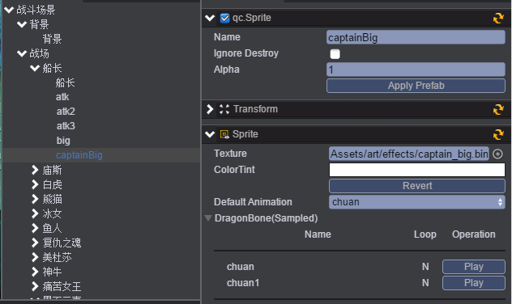<br><br>
说明：<br>
大招的动画都是导入的DragonBone骨骼动画，如下图：<br>
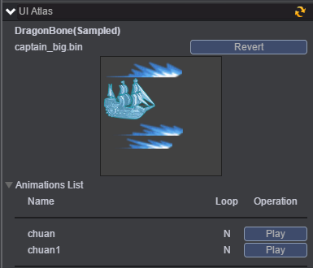<br><br>
* 在captainBig节点上添加一个TweenPosition组件，设置动画移动。如下图：<br>
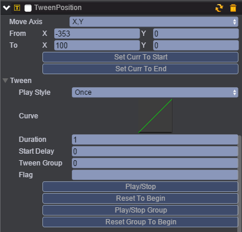<br><br>
* 创建脚本EffectAni.js，挂载在captainBig节点上，负责特效的动作逻辑。type为从屏幕外移动进来到目标点moveFromOut，移动到目标点(100,0)如下图：<br>
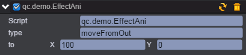<br><br>
代码如下：<br>

```javascript
var s = qc.Serializer;

/**
 * 特效的动作
 */
var EffectAni = qc.defineBehaviour('qc.demo.EffectAni', qc.Behaviour, function() {
    var self = this;

    // 动作类型
    // moveFromOut - 从屏幕外移动进来到目标点
    self.type = 'moveFromOut';

    // 目标点
    self.to = new qc.Point(0, 0);

    self.runInEditor = true;
}, {
    // 需要序列化的字段
    type: s.STRING,
    to: s.POINT
});

// 启动处理
EffectAni.prototype.awake = function() {
    var self = this, o = self.gameObject;
    switch (self.type) {
    case 'moveFromOut':
        var tp = o.getScript('qc.TweenPosition');
        tp.to = self.to;
        tp.from.x = tp.to.x - self.game.world.width / 2;
        tp.from.y = self.to.y;
        tp.resetToBeginning();
        tp.playForward();
        break;
    }
}
```
