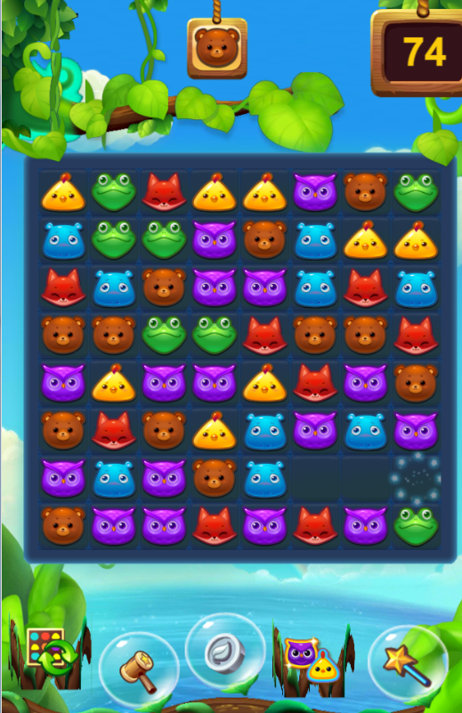
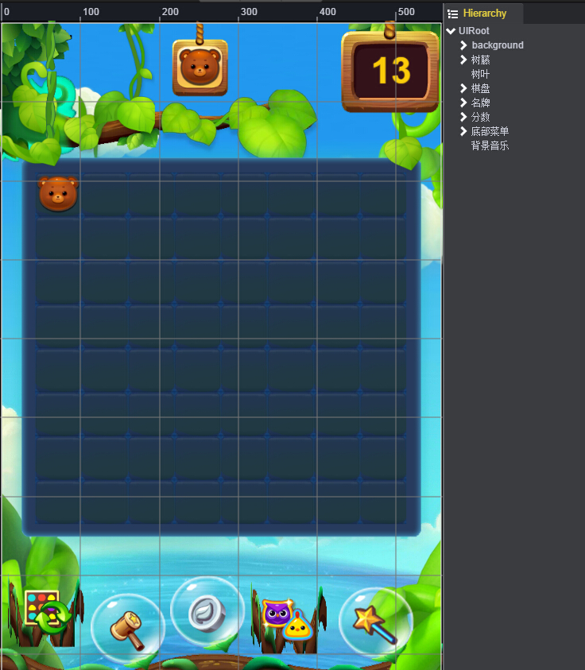
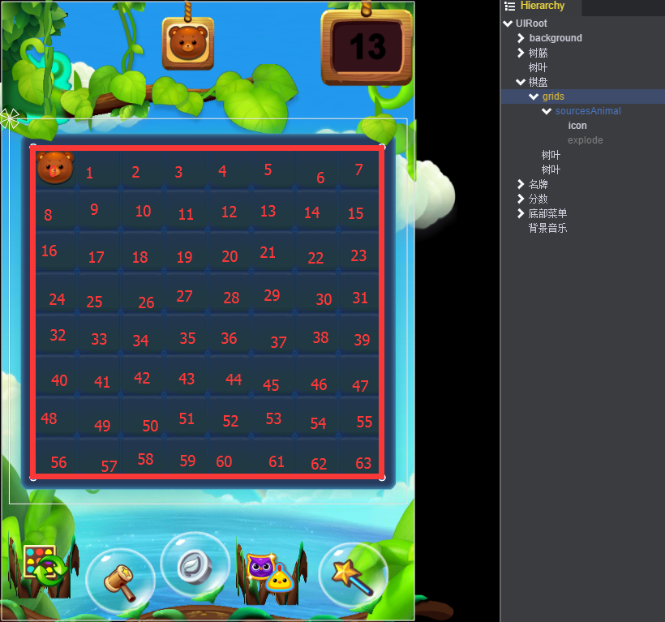
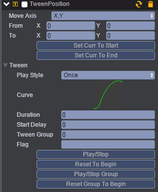
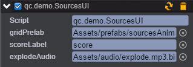

# 消消乐游戏

* 消消乐这款游戏在8\*8格子的游戏池中进行。每个格子中有一个方块。选中一个方块拖动到相邻的方块的位置，它们的位置会互换，互换后如果横排或竖排有3个以上相同的方块，则可以消去该方块，并得分。效果图如下：<br>


## 1、创建场景

* 创建场景Sources.bin。<br>

## 2、绘制UI

* UI布局参考[《史莱姆》](http://engine.zuoyouxi.com/demo/Layout/slime/index.html)。 效果图如下：<br>


## 3、棋盘设置

* 棋盘是8\*8的大小，从左往右排序，如下图：<br>


## 4、方块预置

* 因为在8*8的棋盘中，每个格子的方块结构都是一样，所以需要创建一个通用的结构，避免重复的创建相同的内容结构。
* 在grids节点下创建一个Empty Node节点，命名为sourcesAminal。<br>
设置大小为76\*72，以左上角定位。<br>
添加一个TweenPosition组件，用来显示两个方对换位置的动画。详见[Tween](http://docs.zuoyouxi.com/manual/Tween/index.html)。设置如下图：<br>
<br>
* 在sourcesAminal的节点下创建一个Image和Sprite，分别命名为icon和explode。icon用来显示方块的图案，explode用来显示方块被消除时的动画。<br>
* 创建一个脚本Animal.js，挂载在sourcesAnimal节点。用来控制方块图案类型的显示和消除方块时动画的播放,以及消除方块后掉落处理。<br>
* 掉落起始坐标form：<br>
x = ((fromIndex+64)%8)\*76，此处+64是为了保证方块的索引为正数<br>
y = (fromIndex/8)\*72<br>
* 掉落终点坐标to：<br>
x = (toIndex%8)\*76，<br>
y = (toIndex/8)\*72<br>
* 代码如下：<br>

```javascript
/**
 * 动物信息
 */
var Animal = qc.defineBehaviour('qc.demo.Animal', qc.Behaviour, function() {
    var self = this;

    self.type = 0;
    self.index = 0;

    self.explode = null;
}, {
    // 需要序列化的字段
    icon: qc.Serializer.NODE,
    explode: qc.Serializer.NODE
});

// 设置动物的数据
Animal.prototype.setData = function(data) {
    var self = this;
    self.icon.frame = data.icon;
    self.type = data.type;
    self.index = data.index;
    self.name = '' + self.index;
};

/**
 * 播放消失爆炸的效果
 * @param cb
 */
Animal.prototype.disappear = function(cb) {
    var self = this;
    self.icon.visible = false;

    // 播放爆炸特效
    self.explode.visible = true;
    self.explode.onFinished.addOnce(function() {
        self.explode.visible = false;
        cb();
    });
    self.explode.playAnimation('explode');
};

/**
 * 从fromIndex往下掉落
 * @param icon
 * @param fromIndex
 */
Animal.prototype.drop = function(type, icon, fromIndex, cb) {
    var self = this;
    self.icon.frame = icon;
    self.type = type;
    self.icon.visible = true;
    var c = self.getScript('qc.TweenPosition');
    c.from = new qc.Point(((fromIndex + 64) % 8) * 76,
        self.game.math.floorTo(fromIndex / 8) * 72);
    c.to = new qc.Point(((self.index) % 8) * 76,
        self.game.math.floorTo(self.index / 8) * 72);
    c.duration = (c.to.y - c.from.y) / 72 * 0.13;
    c.resetToBeginning();
    c.onFinished.addOnce(function() {
        cb();
    });
    c.playForward();
}
```
* 将sourcesAnimal节点拖拽到Assets/prefabs/目录，生成sourcesAnimal.bin，预制就创建成功。

## 4、添加游戏逻辑

* 创建脚本SourcesUI.js，挂载在grids节点，负责整个游戏的逻辑。如下图：<br>
<br>
大部分为逻辑相关，请按照示例代码注释理解。
* 创建脚本SourcesUtil.js，查找所有可以被消灭的方块。<br>
主要逻辑：<br>
1、遍历每个方块，记录每个方块横向方向，相邻方块的图标类型与其相同的个数；<br>
2、遍历每个方块，记录每个方块纵向方向，相邻方块的图标类型与其相同的个数；<br>
3、用广度优先算法，记录符合消灭的条件的方块，添加到list中。<br>
代码如下：<br>

```javascript
/**
 * 查找所有可以被消灭的格子
 * @param sourceTable
 * @param w
 * @param h
 * @param limit
 * @returns {Array}
 */
SourcesUtil.findResult = function(sourceTable, w, h, limit) {
    var list;
    var table = [];
    var i, j, k;
    var head, tail;
    var count, lastType, type;
    var slot;
    var xi, xj, yi, yj, yslot;
    var output = [], singleOutput;
    w = w || 8;
    h = h || 8;
    limit = limit || 3;

    var hash = function(i, j) { return i * w + j; }

    for (i = 0; i < h; i++) {
        table.push([]);
        for (j = 0; j < w; j++) {
            table[i].push({
                type: sourceTable[hash(i, j)]
            });
        }
    }

    // 横向统计
    for (i = 0; i < h; i++) {
        lastType = -1;
        for (j = 0; j <= w; j++) {
            slot = table[i][j] || {};
            type = slot.type;
            if (type !== lastType) {
                // 向前找所有跟我一样的 slot，记录横向数量
                for (k = j - 1; k >= 0; k--) {
                    if (table[i][k].type === lastType)
                        table[i][k].hc = count;
                    else
                        break;
                }
                count = 1;
                lastType = type;
            }
            else count++;
        }
    }

    // 纵向统计
    for (j = 0; j < w; j++) {
        lastType = -1;
        for (i = 0; i <= h; i++) {
            slot = (i == h ? {} : table[i][j]);
            type = slot.type;
            if (type !== lastType) {
                // 向上找所有跟我一样的 slot，记录纵向数量
                for (k = i - 1; k >= 0; k--) {
                    if (table[k][j].type === lastType)
                        table[k][j].vc = count;
                    else
                        break;
                }
                count = 1;
                lastType = type;
            }
            else count++;
        }
    }

    // 来一次广度优先吧
    for (i = 0; i < h; i++) {
        for (j = 0; j < w; j++) {
            // seek for next blank slot
            slot = table[i][j];
            if (slot.hc < limit && slot.vc < limit) continue;
            if (slot.visited) continue;

            // new begin slot
            list = [];
            singleOutput = [hash(i, j)];

            list.push([i, j]);
            slot.visited = true;
            head = 0;
            tail = 1;
            type = slot.type;

            while (head < tail) {
                xi = list[head][0];
                xj = list[head][1];
                head++;

                // 四方查找
                [
                    [-1, 0],  // 上
                    [1, 0],  // 下
                    [0, -1],  // 左
                    [0, 1]  // 右
                ].forEach(function(direction) {
                        yi = xi + direction[0];
                        yj = xj + direction[1];

                        if (!table[yi]) return;
                        if (!(yslot = table[yi][yj])) return;

                        if (yslot.visited ||
                            yslot.type !== type ||
                            (yslot.hc < limit && yslot.vc < limit))
                            return;

                        list.push([yi, yj]);
                        tail++;
                        yslot.visited = true;

                        singleOutput.push(hash(yi, yj));
                    });
            }

            output.push(singleOutput);
        }
    }

    return output;
}
```
