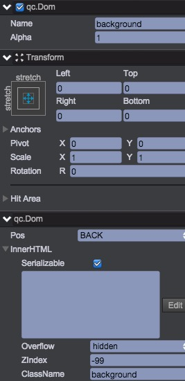

# 设置背景色
创建DOM节点：background，属性设置如下：   
  

* 大小为铺满整个整个屏幕
* Pos为背景，设置zIndex为-99
* className设置为background

打开css/style.css，添加background样式表
````
.background { background-color:#1F1E1E; }
````

保存后查看效果，背景色是不是变了？