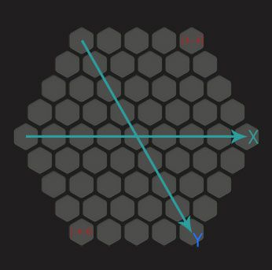

# 棋盘设计与实现
棋盘为一边长为5的正六变形，为了方便计算，我们如下设定棋盘的坐标系（下文称为：格子逻辑坐标）：  
  
原点在六边形中心点，半径为4。

1. 修改Tetris.js文件，增加棋盘的配置信息：
````javascript
	window.Tetris = qc.Tetris = {
	    // 棋盘的大小（半径）
	    SIZE: 4,
	    
	    // 棋盘中，每个格子的宽度和高度
	    BLOCK_W: 61,
	    BLOCK_H: 67,
	    
	    // 所有的操作指令集合
	    operation: {}
	};
````
棋盘格子的大小 = 格子图片的大小，后续导入资源后可以看到其大小为61*67。  

2. 在Scripts/logic下创建文件Board.js，维护棋盘的数据，代码如下：
````javascript
	var Board = qc.Tetris.Board = function() {
	    var self = this,
	        size = qc.Tetris.SIZE,
	        len = qc.Tetris.BLOCK_H;
	    
	    // 构建用来转换格子坐标的矩阵
	    var m = self.m = new qc.Matrix();
	    m.a = len;
	    m.c = len / 2;
	    m.d = len * (Math.sqrt(3) / 2);
	    
	    // 初始化棋盘数据
	    self.data = {};
	    for (var i = -size; i <= size; i++) {
	        for (var j = -size; j <= size; j++) {
	            // 这些格子落在六边形外，忽略掉
	            if (i * j > 0 && Math.abs(i + j) > size) continue;
	            if (i * j < 0 && (Math.abs(i) > size || Math.abs(j) > size)) continue;

	            // 计算格子的坐标和对应屏幕上的偏移
	            var pos = Tetris.makePos(i, j);
	            var pt = self.toWorld(new qc.Point(i, j));
	            self.data[pos] = {
	                value: 0,
	                x: pt.x,
	                y: pt.y
	            };
	        }
	    }
	};
	Board.prototype = {};
	Board.prototype.constructor = Board;

	Object.defineProperties(Board.prototype, {
	    /**
	     * @property {boolean} die - 当前是否已经死亡了
	     * @readonly
	     */ 
	    die: {
	        get: function() {
	            // TODO: 等待实现
	        }
	    }
	});

	/**
	 * 清空棋盘
	 */
	Board.prototype.clear = function() {
	    for (var pos in this.data) {
	        this.data[pos].value = 0;
	    }
	};

	/**
	 * 重新开始游戏
	 */
	Board.prototype.restart = function() {
	    this.clear();
	};

	// 判定形状可以放进来不
	// pos: 目标逻辑坐标
	// list: 形状的信息
	Board.prototype.checkPutIn = function(pos, list) {
	    // TODO: 等待实现
	};

	// 把某个形状放进来
	Board.prototype.putIn = function(pos, list, value) {
	    // TODO: 等待实现
	};

	// 根据格子的逻辑坐标，算出所在的屏幕坐标
	// distance: 两个格子中心点之间的距离
	Board.prototype.toWorld = function(p, distance) {
	    if (!distance)
	        return this.m.apply(p);

	    var m = new qc.Matrix();
	    m.a = distance;
	    m.c = distance * 0.5;
	    m.d = distance * (Math.sqrt(3) * 0.5);
	    return m.apply(p);
	};

	// 根据格子的屏幕坐标，反算格子的逻辑坐标
	Board.prototype.toLocal = function(p) {
	    return this.m.applyInverse(p);
	};
````

3. 修改Tetris.js，在qc.initGame方法中，实例化本对象：
````javasript
	qc.initGame = function(game) {
	    // 将游戏实例记录下来，便于访问
	    Tetris.game = game;

	    // 帧率显示为60帧（满帧）
	    game.time.frameRate = 60;
	    
	    // 初始化分数信息
	    Tetris.score = new qc.Tetris.Score();
	    
	    // 构建棋盘对象
	    Tetris.board = new qc.Tetris.Board();
	};
````
同时，在本文件中(Tetris.js)实现两个函数：makePos和readPos：
````javascript
	// 构建坐标
	window.Tetris.makePos = function(x, y) {
	    return x + '_' + y;
	};

	// 获取坐标
	window.Tetris.readPos = function(pos) {
	    var arr = pos.split('_');
	    return new qc.Point(arr[0]*1, arr[1]*1);
	};
````

4. 运行下，控制台应该没有报错
