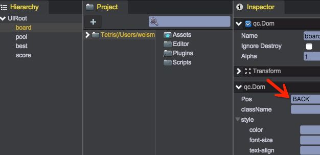

# 绘制棋盘

## DOM的层次
DOM节点可以绘制在最底层（当工程背景设置为非透明时，将不可见），也可以绘制在最上层（在所有精灵、UIImage等节点之上）。  
本棋盘放在最底层，因为棋盘上面还需要拖拽形状、显示可放入指示等。方法是：选中board节点，在Inspector中设置Pos=BACK：  
  

## 开始绘制棋盘
1. 棋盘中的每个格子都作为一个div元素，采用绝对定位。  
格子可能表现为7种图片形式（空时为灰色，其他为形状的对应颜色），这7种图片通过不同的样式类来区分。  

2. 打开Assets/css/style.css，加入如下几个样式表：  
````javascript   
	.board { width: 61px; height: 67px; position: absolute; background-repeat: no-repeat; }
	.board_gray {
		background-image: url("../raw/gray.png");
	}
	.board_blue {
		background-image: url("../raw/blue.png");
	}
	.board_cyan {
		background-image: url("../raw/cyan.png");
	}
	.board_green {
		background-image: url("../raw/green.png");
	}
	.board_lightyellow {
		background-image: url("../raw/lightyellow.png");
	}
	.board_red {
		background-image: url("../raw/red.png");
	}
	.board_yellow {
		background-image: url("../raw/yellow.png");
	}
````
这些样式表指明了棋盘格子中的图片

3. 编辑Tetris.js，加入IMAGES常量，指明在不同的格子对应的className
````javascript
	window.Tetris = qc.Tetris = {
	    // 棋盘的大小（半径）
	    SIZE: 4,
	    
	    // 棋盘中，每个格子的宽度和高度
	    BLOCK_W: 61,
	    BLOCK_H: 67,
	    
	    // 所有的格子图片
	    IMAGES: [
	        'gray',        // 0
	        'blue',        // 1
	        'cyan',        // 2
	        'green',       // 3
	        'lightyellow', // 4
	        'red',         // 5
	        'yellow'       // 6
	    ],
	    
	    // 所有的操作指令集合
	    operation: {}
	};
````

4. 在Scripts/ui下创建脚本BoardUI.js，负责棋盘的绘制逻辑：  
````javascript
	var s = qc.Serializer;

	/**
	 * 管理棋盘的数据并绘制棋盘
	 */
	var BoardUI = qc.defineBehaviour('qc.tetris.BoardUI', qc.Behaviour, function() {
	    var self = this;

	    /**
	     * 棋盘的棋子元素
	     */
	    self.pieces = {};

	    // 本脚本在编辑模式下可以运行
	    self.runInEditor = true;
	}, {
	    linePrefab: s.PREFAB
	});

	/**
	 * 初始化处理
	 */
	BoardUI.prototype.awake = function() {
	    var self = this;
	    self.reset();

	    // 立刻重绘制下
	    self.redraw();

	    // 缓存图片，防止在图片切换过程中出现卡顿
	    if (self.game.device.editor) return;
	    qc.Tetris.IMAGES.forEach(function(c) {
	        var div = document.createElement('div');
	        div.className = 'board board_' + c;
	        div.style.left = '-2000px';
	        div.style.left = '-2000px';
	        self.gameObject.div.appendChild(div);
	    });
	};

	/**
	 * 重绘棋盘
	 * @private
	 */
	BoardUI.prototype.redraw = function() {
	    var self = this;

	    // 绘制背景
	    self.drawBackground();
	};

	/**
	 * 绘制棋盘背景
	 */
	BoardUI.prototype.drawBackground = function() {
	    var self = this;

	    for (var pos in self.pieces) {
	        var div = self.pieces[pos];
	        div.className = 'board board_' + qc.Tetris.IMAGES[qc.Tetris.board.data[pos].value];
	    }
	};

	/**
	 * 初始化棋盘
	 */
	BoardUI.prototype.reset = function() {
	    var self = this, o = self.gameObject;

	    // 构建棋盘数据
	    if (o.children.length === 0) {
	        for (var pos in qc.Tetris.board.data) {
	            var info = qc.Tetris.board.data[pos];
	            var div = self.pieces[pos] = document.createElement('div');
	            div.className = 'board board_' + qc.Tetris.IMAGES[info.value];
	            div.style.left = Math.round(info.x + (o.width - qc.Tetris.BLOCK_W) / 2) + 'px';
	            div.style.top = Math.round(info.y + (o.height - qc.Tetris.BLOCK_H) / 2) + 'px';
	            o.div.appendChild(div);
	        }
	    }
	    else {
	        o.children.forEach(function(child) {
	            self.pieces[child.name] = child;
	        });
	    }
	};
````
本脚本运行在编辑模式下，这样就可以实时看到棋盘。对本脚本做一些解释：  
	* 属性pieces存放了下面所有的div元素（显示格子），key为其逻辑坐标
	* 初始化时，会将底下的所有格子创建出来，并设置上合适的位置（由于在Board.js中计算坐标时，是以棋盘中心为原点；但格子div是以棋盘的左上角为原点，因此代码中做了换算）
	* redraw方法中，以格子的值获取对应的className，对应的设置到格子div就可以了
	* 另外，初始时我们把所有格子的图片都加载进来（方法是创建个屏幕内不可见的div），这样在className切换过程中，就可以直接从本地缓存读取图片，避免加载图片影响用户体验。

5. 将此脚本挂载到__board__节点上，保存场景，就可以看到效果了  

__视频操作：__  
<video controls="controls" src="../video/create_board.mp4"></video>

