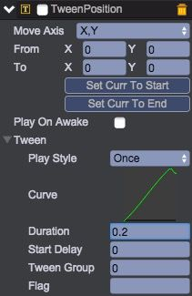

# 形状飞入动画
1. 双击Assets/prefab/Shape.bin，编辑预制

2. 选中__Shape__节点，添加TweenPosition组件，属性设置如下：  
  
动画曲线设置了个“回弹”效果，from和to的值将在代码中动态设置

3. 保存预置

4. 打开Scripts/ui/Pool.js，添加flyIn接口，处理飞入动画的播放
````javascript   
	/**
	 * 播放飞入的动画
	 */
	Pool.prototype.flyIn = function(index) {
	    var self = this, o = self.gameObject, children = o.children;
	    var offset = o.width * (0.5 - 0.165);

	    // 先确保位置都正确
	    self.resize();

	    if (index === 0) {
	        var o = children[0], c = o.getScript('qc.tetris.ShapeUI');
	        c.flyIn(offset);
	    }
	    if (index === 0 || index === 1) {
	        var o = children[1], c = o.getScript('qc.tetris.ShapeUI');
	        c.flyIn(offset);
	    }

	    var o = children[2], c = o.getScript('qc.tetris.ShapeUI');
	    c.flyIn(offset);
	};
````

5. 打开Scripts/ui/ShapeUI.js，添加flyIn接口，处理单个形状飞入动画
````javascript   
	/**
	 * 飞入动画
	 */
	ShapeUI.prototype.flyIn = function(offset) {
	    var self = this,
	        tp = self.getScript('qc.TweenPosition');

	    tp.delay = 0.5;
	    tp.to = new qc.Point(self.gameObject.x, self.gameObject.y);
	    tp.from = new qc.Point(tp.to.x + offset, tp.to.y);
	    tp.resetToBeginning();
	    tp.playForward();
	};
````