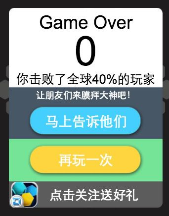
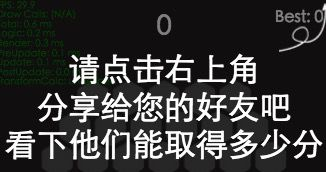
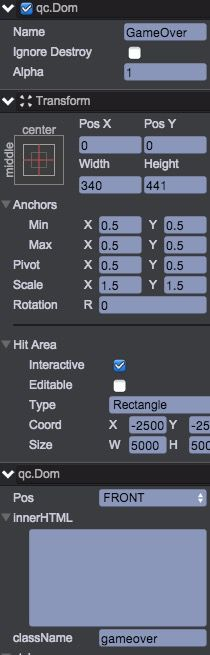
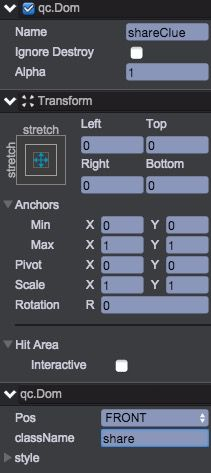
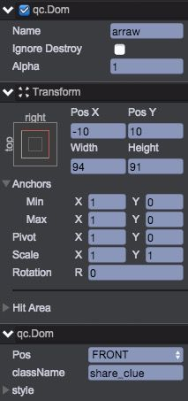
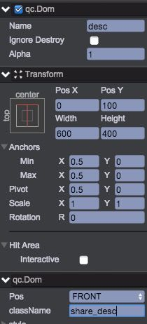
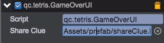

# 游戏结束界面
游戏界面包含2个页面：   
    
这两个页面使用html+css元素快速搭建（DOM节点）。步骤如下：  

1. 在UIRoot下创建Dom节点，取名GameOver  
  
	* 居中显示，大小为340\*441
	* 缩放1.5倍
	* 设置节点可以交互（碰撞范围非常大，这样底部游戏所有的元素都无法接收事件了）
	* 设置className=gameover  
2. 在Scripts/ui下新建脚本：GameOverUI.js  
````javascript
	/**
	 * 游戏结束界面
	 */
	var GameOverUI = qc.defineBehaviour('qc.tetris.GameOverUI', qc.Behaviour, function() {
	    var self = this;
	    qc.Tetris.gameOver = self;
	    self.runInEditor = true;
	}, {
	    shareClue: qc.Serializer.PREFAB
	});

	GameOverUI.prototype.awake = function() {
	    var div = this.gameObject.div;
	    var score = qc.Tetris.score.current;
	    var percent = 40;

	    this.rawHtml =
	        '<div class="gameover_title">Game Over</div>' +
	        '<div class="gameover_score">__SCORE__</div>' +
	        '<div class="gameover_pos">你击败了全球__PERCENT__%的玩家</div>' +
	        '<div class="gameover_desc">让朋友们来膜拜大神吧！</div>' +
	        '<div class="gameover_share" onclick="qc.Tetris.gameOver.share()" ontouchstart="qc.Tetris.gameOver.share()">马上告诉他们</div>' +
	        '<div class="gameover_restart" onclick="qc.Tetris.gameOver.restart()" ontouchstart="qc.Tetris.gameOver.restart()">再玩一次</div>' +
	        '<div class="gameover_act">' +
	        '    <div class="gameover_logo"></div><div class="gameover_act_desc">点击关注送好礼</div> ' +
	        '</div>' +
	        '<div class="clear"></div>';
	    this.rawHtml = this.rawHtml.replace('__SCORE__', '' + score);
	    this.rawHtml = this.rawHtml.replace('__PERCENT__', '' + percent);
	    div.innerHTML = this.rawHtml;
	};

	GameOverUI.prototype.onDestroy = function() {
	    delete qc.Tetris.gameOver;
	};

	GameOverUI.prototype.share = function() {
	    // 打开share界面
	    this.game.add.clone(this.shareClue, this.gameObject.parent);
	};

	GameOverUI.prototype.restart = function() {
	    this.gameObject.destroy();
	    qc.Tetris.operation.restart();
	};
````
本界面主要通过内置的DOM来进行处理，具体不多作解释（您需要有一定的web前端开发基础）
3. 打开Assets/css/style.css，添加如下样式表：  
````javascript   
	/* Game Over */
	.gameover {
	    text-align: center;
	    width: 100%;
	    font-family: arial, sans serif;
	    background: url("../raw/bg.png") no-repeat;
	    color: #000000;
	}
	.gameover_title {
	    font-size: 40px;
	    margin-top: 10px;
	    height: 50px;
	    text-align: center;
	}
	.gameover_score {
	    font-size: 90px;
	    margin-top: -15px;
	    height: 98px;
	    text-align: center;
	}
	.gameover_pos {
	    text-align: center; font-size: 28px;
	    height: 40px;
	}
	.gameover_desc {
	    text-align: center; color: #ffffff;
	    height: 30px; font-size: 20px; line-height: 100%;
	}
	.gameover_share {
	    background: url("../raw/btn_blue.png") center no-repeat;
	    height: 76px;
	    line-height: 76px;
	    font-size: 30px;
	    color: #ffffff;
	    text-align: center;
	}
	.gameover_restart {
	    background: url("../raw/btn_yellow.png") center no-repeat;
	    text-align: center; color: #ffffff;
	    height: 76px;
	    line-height: 76px;
	    font-size: 30px;
	    margin-top: 10px;
	}

	.gameover_logo {
	    float: left;
	    background: url("../raw/logo.png") no-repeat;
	    width: 64px;
	    height: 62px;
	    margin: 8px 0px 0px 2px;
	}
	.gameover_act_desc {
	    color: #ffffff;
	    float: right;
	    width: 250px;
	    text-align: left;
	    height: 62px;
	    line-height: 62px;
	    margin-top: 8px;
	    font-size: 28px;
	}
	.clear { clear: both; }
````
4. GameOverUI.js脚本挂载到GameOver对象，刷新查看下效果。
5. 将GameOver节点拖拽到Assets/prefab下，创建预制。然后从场景中删除。游戏结束界面就完成了。下面构建分享页面
6. 在UIRoot下新建Dom节点：shareClue，参数设置如下：  
  
大小设置为铺满整个屏幕，className=share
7. 在shareClue新建Dom节点：arraw，用来显示箭头，定位为右上角，参数设置如下：    

8. 在shareClue新建Dom节点：desc，用来显示提示语内容。参数设置如下：    

9. 在Scripts/ui新建文件ShareClue.js  
````javascript
	/**
	 * 分享提示页面
	 */
	var ShareClue = qc.defineBehaviour('qc.tetris.ShareClue', qc.Behaviour, function() {
	    var self = this;
	    self.runInEditor = true;
	}, {
	    descNode: qc.Serializer.NODE
	});

	/**
	 * 初始化
	 */
	ShareClue.prototype.awake = function() {
	    this.descNode.div.innerHTML = '请点击右上角<br/>分享给您的好友吧<br/>看下他们能取得多少分';
	};

	/**
	 * 点击时干掉本页面
	 */
	ShareClue.prototype.onClick = function() {
	    this.gameObject.destroy();
	};
````
10. 将ShareClue脚本挂载到shareClue节点上，设置Desc Node为下面的desc节点
11. 编辑Assets/css/style.css，添加样式表：  
````javascript   
	/* 分享提示 */
	.share {
	    background-color: #000000;
	    opacity:0.5;
	    filter:alpha(opacity=50);
	    text-align: center; color: #ffffff;
	}
	.share_clue {
	    background-image: url("../raw/arrows.png");
	}
	.share_desc {
	    color: #ffffff; font-size: 60px; text-align: center;
	    line-height: 70px;
	}
````
12. 保存场景并刷新之，查看效果。
13. 将shareClue拖拽到Assets/prefab，创建预置，然后从场景中删除。
14. 选中UIRoot节点，设置UIManager组件的gameOverPrefab=Assets/prefab/GameOver.bin
15. 双击Assets/prefab/GameOver.bin编辑预置，设置shareClue = Assets/prefab/shareClue.bin    

16. 在Scripts/operation创建脚本Restart.js，处理重新开始游戏的逻辑：   
````javascript
	/**
	 * 请求重新开始游戏
	 */
	qc.Tetris.operation.restart = function() {
	    var game = qc.Tetris.game,
	        ui = game.ui;

	    // 清空棋盘信息
	    qc.Tetris.board.restart();

	    // 当前分数清0
	    qc.Tetris.score.current = 0;

	    // 3个形状重新替换掉
	    qc.Tetris.Shapes.restart();

	    // 界面初始化
	    ui.restart();
	};
````
17. 游戏的整体逻辑已经完成，测试看看    

视频演示：  
<video controls="controls" src="../video/game_over.mp4"></video>